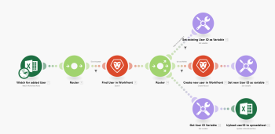

# Adobe Workfront Fusion licenses

>[!IMPORTANT]
>
>You're currently viewing the Adobe Workfront Classic version of this document. Adobe Workfront Classic is no longer supported. All Adobe Workfront Classic functionality, along with this documentation, will be removed in July 2022. Please transition to the the new Adobe Workfront experienceas soon as possible, and switch to the new Adobe Workfront experience version of this document.

Adobe Workfront Fusion offers two different licenses that determine the functionality you are able to access. Your organization chose one of these licenses when it purchased Workfront Fusion.

* [Workfront Fusion for Work Automation](#workfront-fusion-for-work-automation) 
* [Workfront Fusion for Work Automation and Integration](#workfront-fusion-for-work-automation-and-integration)

>[!NOTE]
>
>To find out what type of Workfront Fusion license your organization has, contact your Workfront Fusion administrator.

## Workfront Fusion for Work Automation {#workfront-fusion-for-work-automation}

* [Benefits of Workfront Fusion for Work Automation](#benefits-of-workfront-fusion-for-work-automation) 
* [Connectors and modules available for Workfront Fusion for Work Automation](#connectors-and-modules-available-for-workfront-fusion-for-work-automation) 
* [Example of Workfront Fusion for Work Automation](#example-of-workfront-fusion-for-work-automation)

### Benefits of Workfront Fusion for Work Automation {#benefits-of-workfront-fusion-for-work-automation}

A Workfront Fusion for Work Automation license allows you to automate your Workfront workflows. By using Fusion for Work Automation, you can create scenarios to automate your organization's unique work processes. There are many benefits to automating your Workfront processes.

* Automation is quicker and less prone to error
* Workflows that don't require any decisions, or that have decisions are based on simple logic such as if/then, are good candidates for automation
* Automation can address specific needs in workflows used by your organization that aren't directly addressed in the Workfront product

### Connectors and modules available for Workfront Fusion for Work Automation {#connectors-and-modules-available-for-workfront-fusion-for-work-automation}

With the Workfront Fusion for Automation license, you have access to the following:

* Adobe Workfront 
* Workfront Proof 
* Webhooks
* Tools and transformer modules such as:

   * PDF tools 
   * Archive 
   * CSV 
   * Data Stores
   * Image
   * JSON
   * Math
   * MIME
   * XML

### Example of Workfront Fusion for Work Automation {#example-of-workfront-fusion-for-work-automation}

``` ```**Example: **`````` The following example shows a workflow that:

1. Watches for a field change
1. Gets information about the object the field is attached to, including who the object is assigned to
1. Sends a notification about the field change to the user the object is assigned to


## Workfront Fusion for Work Automation and Integration {#workfront-fusion-for-work-automation-and-integration}

* [Benefits of Workfront Fusion for Work Automation and Integration](#benefits-of-workfront-fusion-for-work-automation-and-integration) 
* [Connectors and modules available for Workfront Fusion for Work Automation and Integration](#connectors-and-modules-available-for-workfront-fusion-for-work-automation-and-integration) 
* [Example of Workfront Fusion for Work Automation and Integration](#example-of-workfront-fusion-for-work-automation-and-integration)

### Benefits of Workfront Fusion for Work Automation and Integration {#benefits-of-workfront-fusion-for-work-automation-and-integration}

A Workfront Fusion for Work Automation and Integration license allows you access to all of the functionality of the Workfront Fusion for Automation license. In addition, this license lets you use other apps and services in your scenarios. For example, you can use Workfront Fusion to automate a process that imports Jira jobs, then turns them into tasks in Workfront. You can also use the HTTP or SFTP connectors to connect to almost any web service, even if Workfront Fusion does not have a dedicated connector for it.

Workfront Fusion for Work Automation and Integration offers your organization many benefits.

* Workfront Fusion for Work Automation and Integration includes all of the benefits associated with Workfront Fusion for Work Automation
* Integration reduces the need to jump into and out of various apps when completing a workflow.
* Automating data transfer between applications is quicker and less prone to error than manually transferring data

### Connectors and modules available for Workfront Fusion for Work Automation and Integration {#connectors-and-modules-available-for-workfront-fusion-for-work-automation-and-integration}

For a list of available dedicated connectors, see [Apps and their modules](../../workfront-fusion/apps-and-their-modules/apps-and-their-modules.md).

>[!IMPORTANT]
>
>Workfront Fusion can connect to almost any web service. If the app you want to work with does not have a dedicated connector, you can use the HTTP, SFTP, or JSON connectors to connect directly to the web service.

### Example of Workfront Fusion for Work Automation and Integration {#example-of-workfront-fusion-for-work-automation-and-integration}

``` ```**Example: **`````` The following example shows a workflow that:

1. Watches a spreadsheet for new users
1. Checks to see if the user exists in Workfront 
1. Creates the user in Workfront if the user did not exist
1. Uploads the Workfront user ID back to the spreadsheet.



