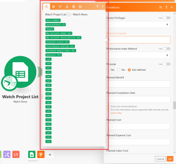

# The mapping panel

<!--

Finish this (original article)

-->

## Star tab

When the mapping panel displays, the star tab  is always open. This tab lists the items outputted from the preceding module or modules:

Note the following about this tab:

* Each item's color is the same as the color of the module it came from.
* 

  <!--
  <MadCap:conditionalText data-mc-conditions="QuicksilverOrClassic.Draft mode">
  You might see an example value displayed in grey next to an item.
  </MadCap:conditionalText>
  -->

* You can hover over an item to reveal additional information about it:

   * A tooltip displays to tell you what type of information it represents: text, date, number, array, and so on.

     

   * The module that the item came from pulses at its edges in the scenario editor.

* If the item happens to be the same color or type as another item in the list that is from a different app, you can tell what apps they are from by looking at the ID number diplayed in a grey box above the items.

  For example, in the mapping panel shown above, the number 6 displays, indicating that the items below it came from the sixth module in the scenario.

