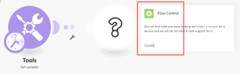
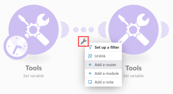
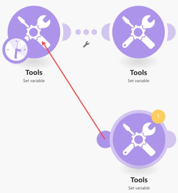
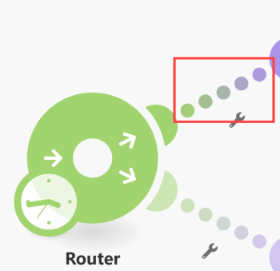
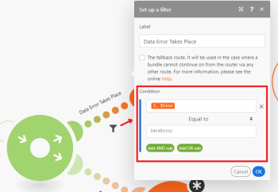
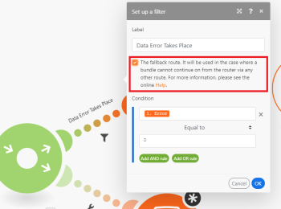
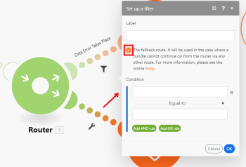

# Router module in Adobe Workfront Fusion

>[!IMPORTANT]
>
>You're currently viewing the Adobe Workfront Classic version of this document. Adobe Workfront Classic is no longer supported. All Adobe Workfront Classic functionality, along with this documentation, will be removed in July 2022. Please transition to the the new Adobe Workfront experienceas soon as possible, and switch to the new Adobe Workfront experience version of this document.

The Router module allows you to branch your flow into several routes and process the data within each route differently. Once a Router module receives a bundle, it forwards it to each connected route in the order the routes were attached to the Router module.

>[!NOTE]
>
>* To verify the order of the routes, you can click the Auto-align icon, which will arrange the routes according to the order from top to bottom.
>
>  To change the order, just remove the Router module and re-connect the routes in the desired order.
>
>* Routes are processed sequentially, not in parallel. A bundle is not sent to the next route until it has been completely processed by the previous route.
>

## Access requirements

You must have the following access to use the functionality in this article:

<table> 
 <col> 
 <col> 
 <tbody> 
  <tr> 
   <td role="rowheader">Adobe Workfront plan*</td> 
   <td> 
Pro or higher
 </td> 
  </tr> 
  <tr data-mc-conditions=""> 
   <td role="rowheader">Adobe Workfront license*</td> 
   <td> 
Plan, Work
 </td> 
  </tr> 
  <tr> 
   <td role="rowheader">Adobe Workfront Fusion license**</td> 
   <td> 
Workfront Fusion for Work Automation and Integration 
  </td> 
  </tr> 
  <tr> 
   <td role="rowheader">Product</td> 
   <td>Your organization must purchase Adobe Workfront Fusion as well as Adobe Workfront to use functionality described in this article.</td> 
  </tr> <!--
   <tr data-mc-conditions="QuicksilverOrClassic.Draft mode"> 
    <td role="rowheader">Access level configurations*</td> 
    <td> <!--
      
You must be a Workfront Fusion administrator for your organization.

     --> <!--
      
You must be a Workfront Fusion administrator for your team.

     --> </td> 
   </tr>
  --> 
 </tbody> 
</table>

&#42;To find out what plan, license type, or access you have, contact your Workfront administrator.

&#42;&#42;For information on Adobe Workfront Fusion licenses, see [Adobe Workfront Fusion licenses](../../workfront-fusion/get-started/license-automation-vs-integration.md)

## Adding a Router module to a scenario

A Router can be added to a scenario in one of the following ways:

* If you want to connect the Router module after a module, click on the module's right handle, start typing **router** to search for it, then choose **Flow Control** > **Router** in the list of modules that displays.

  

* If you want to insert the Router module between two modules, click on the wrench icon below the route connecting the two modules (or right-click the route) and choose **Add a router** from the menu.

  

* You can insert a Router module automatically. For example, in the image below, to connect the module in the lower-right corner to the one in the upper-left corner (which is already connected to the one in the upper-right corner), drag the left handle of the lower-right module and drop it onto the upper-left module.

  

## Filters

To place a filter on a route after the Router module to filter bundles as on any other route:

1. Click one of the dots in the route.

   

1. In the **Set up a filter** box that displays, add conditions, then click **OK** to save the filter setup.

For more information, see [Add a filter to a scenario in Adobe Workfront Fusion](../../workfront-fusion/scenarios/add-a-filter-to-a-scenario.md).

## The fallback route

The filter setup on a route after a Router module contains a special option: The fallback route:

When enabled, this route is used in the case when a bundle cannot continue on from the Router module via any other route because the filters on the other routes filtered it out.

The Fallback route is distinguished with a different arrow sign inside the Router module:

## If/Else

A typical use case of the fallback route is to continue the flow with one route if the condition is met and with another route if it is not, as in the following steps:

1. Insert a Router module in your scenario.
1. Connect both routes to the Router module .
1. Click on the first route and specify a condition:

   

1. Click on the second route and enable the fallback route option:

   

