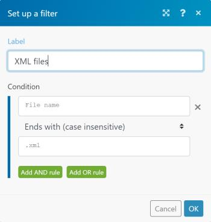
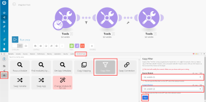

# Add a filter to a scenario

In some scenarios, you need to work only with bundles that meet specific criteria. Filters can help you select those bundles easily.

For example, you could create a scenario with the Watch records trigger for Salesforce to capture only records containing a specific word written by a specific author.

You can add a filter between two modules and check whether bundles received from the preceding modules fulfill specific filter conditions:

* If they do, the bundles pass on to the next module in the scenario. 
* If they don't, processing for the bundles terminates.

## Access requirements

You must have the following access to use the functionality in this article:

<table cellspacing="0"> 
 <col> 
 <col> 
 <tbody> 
  <tr> 
   <td role="rowheader">Adobe Workfront plan*</td> 
   <td> 
Pro or higher
 </td> 
  </tr> 
  <tr data-mc-conditions=""> 
   <td role="rowheader">Adobe Workfront license*</td> 
   <td> 
Plan, Work
 </td> 
  </tr> 
  <tr> 
   <td role="rowheader">Adobe Workfront Fusion license**</td> 
   <td> 
Workfront Fusion for Work Automation and Integration 
  </td> 
  </tr> 
  <tr> 
   <td role="rowheader">Product</td> 
   <td>Your organization must purchase Adobe Workfront Fusion as well as Adobe Workfront to use functionality described in this article.</td> 
  </tr> <!--
   <tr data-mc-conditions="QuicksilverOrClassic.Draft mode"> 
    <td role="rowheader">Access level configurations*</td> 
    <td> <!--
      
You must be a Workfront Fusion administrator for your organization.

     --> <!--
      
You must be a Workfront Fusion administrator for your team.

     --> </td> 
   </tr>
  --> 
 </tbody> 
</table>

&#42;To find out what plan, license type, or access you have, contact your Workfront administrator.

&#42;&#42;For information on Adobe Workfront Fusion licenses, see [Adobe Workfront Fusion licenses](../../workfront-fusion/get-started/license-automation-vs-integration.md)

## Prerequisites

You must add both modules to a scenario before you can add a filter between them.

## Add a filter between two modules:

1. Click Scenarios  in the left panel, then click the scenario to open it.
1. In the upper-right corner of the window, click **Edit**.
1. Click the connecting line between the modules. 
1. In the box that displays, type a **Label** for the filter.
1. Define a filter **Condition**.

   You can enter one or two operands in the two boxes. If you enter operands in both boxes, you can select an operator in the drop-down menu between them to specify the relation between them.

   >[!TIP]
   >
   >In the operand fields, you can enter values in the same way as you would map them, as described in [Map information from one module to another](../../workfront-fusion/mapping/map-information-between-modules.md).

   For example, if you wanted the filter to find files in Adobe Workfrontending with XML and pass them on to Dropbox, you would type **File name** in the first box and .**xml** in the second box. In the drop-down menu between them, you would select **Ends with (case insensitive)**. This filter would apply to incoming bundles from the first module (Workfront). Only bundles containing XML files would pass on to the next module (Dropbox).

   

1. Click **OK**.

## Copy a filter

Currently, the scenario editor doesn't include a feature for copying a filter.

>[!NOTE]
>
>If you copy the modules on either side of the filter, the filter is also copied. 
>
>For more information on copying modules, see [Copy modules or scenarios](../../workfront-fusion/scenarios/copy-modules-or-scenarios.md)

To copy a filter without copying modules, you can use Google Chrome for the following workaround:

1. Install the Adobe Workfront Fusion DevTool Chrome extension.
1. In Workfront Fusion, open the scenario.
1. Click the Chrome three-dot menu, then click **More tools** > **Developer tools**. 

1. In the Developer tools panel that displays, on the menu bar across the top, click the Workfront Fusion tab.

   

1. Click the **Tools** icon  in the left side bar.

1. Click **Copy Filter**, then configure the **Copy Filter** tool in the right side panel:

   1. Set the **Source Module** as the module right after the filter you want to copy.
   1. Set the **Target Module** as the module right before the filter you want to copy.

1. Click **Run**.

