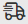

# Debug scenarios with the Adobe Workfront Fusion DevTool

>[!IMPORTANT]
>
>You're currently viewing the Adobe Workfront Classic version of this document. Adobe Workfront Classic is no longer supported. All Adobe Workfront Classic functionality, along with this documentation, will be removed in July 2022. Please transition to the the new Adobe Workfront experienceas soon as possible, and switch to the new Adobe Workfront experience version of this document.

The Adobe Workfront Fusion DevTool allows you to understand and troubleshoot scenarios. The DevTool adds an extra panel to the Chrome Developer Tools. Using this debugger panel, you can check all the manual runs of your scenario, review all the performed operations, and see the details of every API call performed. You can see which module, operation, or single response caused the error, and use that knowledge to refine your scenario.

## Access requirements

You must have the following access to use the functionality in this article:

<table> 
 <col> 
 <col> 
 <tbody> 
  <tr> 
   <td role="rowheader">Adobe Workfront plan*</td> 
   <td> <p>Pro or higher</p> </td> 
  </tr> 
  <tr data-mc-conditions=""> 
   <td role="rowheader">Adobe Workfront license*</td> 
   <td> <p>Plan, Work</p> </td> 
  </tr> 
  <tr> 
   <td role="rowheader">Adobe Workfront Fusion license**</td> 
   <td> <p>Workfront Fusion for Work Automation and Integration </p>  </td> 
  </tr> 
  <tr> 
   <td role="rowheader">Product</td> 
   <td>Your organization must purchase Adobe Workfront Fusion as well as Adobe Workfront to use functionality described in this article.</td> 
  </tr> <!--
   <tr data-mc-conditions="QuicksilverOrClassic.Draft mode"> 
    <td role="rowheader">Access level configurations*</td> 
    <td> <!--
      <p data-mc-conditions="QuicksilverOrClassic.Draft mode">You must be a Workfront Fusion administrator for your organization.</p>
     --> <!--
      <p data-mc-conditions="QuicksilverOrClassic.Draft mode">You must be a Workfront Fusion administrator for your team.</p>
     --> </td> 
   </tr>
  --> 
 </tbody> 
</table>

&#42;To find out what plan, license type, or access you have, contact your Workfront administrator.

&#42;&#42;For information on Adobe Workfront Fusion licenses, see [Adobe Workfront Fusion licenses](../../workfront-fusion/get-started/license-automation-vs-integration.md)

## Install the Chrome DevTool extension {#install-the-chrome-devtool-extension}

To use the Workfront Fusion DevTool, you first need to install it.

1. Click [this link](https://cdn.experience.workfront.com/Documentation/Workfront+Fusion/workfront-fusion-devtool.zip) to download the extension.
1. When the files have downloaded, extract them to a folder of your choice.
1. Open a tab in Chrome
1. In the search bar of the tab, enter 

   ```
   chrome://extensions
   ```

   .
1. Click the **Developer mode** toggle at the upper-right of the screen to enable Developer mode. If the toggle to the right, developer mode is enabled.
1. Click **Load unpacked**.
1. Select the folder containing the DevTool (where you extracted the files in step 2).

   Once unpacked, the DevTool appears among your other Chrome extensions.

## Locate the Workfront Fusion DevTool

To use the Workfront Fusion DevTool, you must add the Workfront Fusion DevTool extension to your Chrome browser, as described in [Install the Chrome DevTool extension](#install-the-chrome-devtool-extension).

1. Open your Workfront Fusion scenario.
1. Open Chrome Developer Tools:

   <table> 
    <col> 
    <col> 
    <tbody> 
     <tr> 
      <td role="rowheader">Mac</td> 
      <td>Command + Option + I</td> 
     </tr> 
     <tr> 
      <td role="rowheader">Windows</td> 
      <td> <p>Control + Shift + I</p> <p> Or </p> <p>F12</p> </td> 
     </tr> 
    </tbody> 
   </table>

   >[!TIP]
   >
   >We recommend docking the Chrome Developer Console to the bottom to maintain a better view of your modules.

1. Click the**Workfront Fusion** tab in Chrome Dev Tools.

## Use the Workfront Fusion DevTool

Workfront Fusion DevTool is divided into 3 main sections. You can find these in the left panel of your DevTool window.

* [Live Stream](#live-stream) 
* [Scenario Debugger](#scenario-debugger) 
* [Tools](#tools)

### Live Stream {#live-stream}

Live Stream displays what is happening in the background when you click Run once in your scenario.

1. Click the **Live Stream** icon  to open the Live Stream section.
1. Do any of the following:

   <table> 
    <col> 
    <col> 
    <thead> 
     <tr> 
      <th>Action</th> 
      <th>Instructions</th> 
     </tr> 
    </thead> 
    <tbody> 
     <tr> 
      <td role="rowheader">View request information</td> 
      <td> <p>You can view the following information for each module in your scenario</p> 
       <ul> 
        <li> <p>Request Headers (API endpoint URL, http method, time and date the request was called, request headers, and query string)</p> </li> 
        <li> <p>Request Body</p> </li> 
        <li> <p>Response Headers</p> </li> 
        <li> <p>Response Body</p> </li> 
       </ul> <p>To view this information, click the appropriate tab in the right panel of the Workfront Fusion DevTool.</p> </td> 
     </tr> 
     <tr> 
      <td role="rowheader"> <p>Search requests and responses</p> </td> 
      <td> <p>Enter the search term into the search field in the left panel of the Workfront Fusion DevTool to display only requests that contain the search term.</p> </td> 
     </tr> 
     <tr> 
      <td role="rowheader"> <p>Remove list of requests </p> </td> 
      <td> <p>Click the trash bin icon in the top-right corner of the DevTool's left panel to clear the list of requests recorded by the Workfront Fusion DevTool. </p> </td> 
     </tr> 
     <tr> 
      <td role="rowheader"> <p>Enable Console Logging</p> </td> 
      <td> <p>Click the computer icon  in the top-right corner of the DevTool's left panel.</p> <p>Logging in the console is enabled when the computer icon is green.</p> </td> 
     </tr> 
     <tr> 
      <td role="rowheader"> <p>Retrieve the Request in the Raw JSON Format or cURL</p> </td> 
      <td> 
       <ul> 
        <li> <p><strong>Raw JSON</strong> </p> <p>Click <strong>Copy RAW</strong> in the upper-right corner of the DevTool's right pane.</p> </li> 
        <li> <p><strong>cURL</strong> </p> <p>Click <strong>Copy cURL</strong> in the upper-right corner of the DevTool's right pane.</p> </li> 
       </ul> </td> 
     </tr> 
    </tbody> 
   </table>

### Scenario Debugger {#scenario-debugger}

The Scenario Debugger is useful for more complex scenarios. It displays the history of the scenario runs and enables you to search modules by their name or ID.

1. Click the **Scenario Debugger** icon  to open the Scenario Debugger.
1. (Optional) Enter the search term (name or module ID) in the search field in the left pane of Workfront Fusion DevTool in the Scenario Debugger section.
1. Double-click the module's name to open its settings in the scenario editor.
1. View request details by clicking the desired operation.

### Tools {#tools}

The Workfront Fusion DevTool features tools that make setting up your scenario easier.

1. Click the **Tools** icon  to open the Tools. 
1. Select the tool you want to use.
1. Configure the fields as detailed below.
1. Click **Run**.

Tools and their fields:

* [Focus a Module](#focus-a-module) 
* [Find Modules by Mapping](#find-modules-by-mapping) 
* [Get App Metadata](#get-app-metadata) 
* [Copy Mapping](#copy-mapping) 
* [Copy Filter](#copy-filter) 
* [Swap Connection](#swap-connection) 
* [Swap Variable](#swap-variable) 
* [Swap App](#swap-app) 
* [Base 64](#base-64) 
* [Copy Module Name](#copy-module-name) 
* [Remap Source](#remap-source) 
* [Highlight App](#highlight-app) 
* [Migrate GS](#migrate-gs)

#### Focus a Module {#focus-a-module}

Opens settings of the specified module by ID.

| Module ID | Enter the ID of the module for which you want to open settings. |
|---|---|

#### Find Modules by Mapping {#find-modules-by-mapping}

Allows you to search modules' values for a specified term. The output contains IDs of modules that contain the term you have searched for.

<table> 
 <col> 
 <col> 
 <tbody> 
  <tr> 
   <td role="rowheader">Keyword</td> 
   <td> <p> Enter the term you want to search for. </p> </td> 
  </tr> 
  <tr> 
   <td role="rowheader"> <p>Use Only Values</p> </td> 
   <td> <p>Enable this option to only search in module fields' values.</p> <p>Disable this option to also search in module fields' names.</p> <p>The search is performed through the name and label parameters.</p> </td> 
  </tr> 
 </tbody> 
</table>

#### Get App Metadata {#get-app-metadata}

Retrieves metadata of the app by the app's module name or ID. This is useful, for example, when you need to know the version of the app used in your scenario.

| Source Module |Select the module for which you want to retrieve metadata. |
|---|---|

#### Copy Mapping {#copy-mapping}

Copies values from the source module to the target module.

>[!CAUTION]
>
>Make sure you set the correct source and target modules. If you select a different type of module, values in the target module will be deleted.

<table> 
 <col> 
 <col> 
 <tbody> 
  <tr> 
   <td role="rowheader">Source Module</td> 
   <td> <p> Select the module or enter the ID of the module from which you want to copy field values.</p> </td> 
  </tr> 
  <tr> 
   <td role="rowheader"> <p>Target Module</p> </td> 
   <td> <p>Select the module or enter the ID of the module into which you want to insert the source module values.</p> <p>Important: Values in the target module will be overwritten.</p> </td> 
  </tr> 
 </tbody> 
</table>

#### Copy Filter {#copy-filter}

Copies the filter settings from the source module to the target module.

>[!NOTE]
>
>The copy action is performed on the filter placed on the left side of the selected module.

<table> 
 <col> 
 <col> 
 <tbody> 
  <tr> 
   <td role="rowheader">Source Module</td> 
   <td> <p> Select the module or enter the ID of the module from which you want to copy filter values.</p> </td> 
  </tr> 
  <tr> 
   <td role="rowheader"> <p>Target Module</p> </td> 
   <td> <p>Select the module or enter the ID of the module into which you want to insert the filter values from the source module.</p> <p>Important: Values in the target module will be overwritten.</p> </td> 
  </tr> 
  <tr> 
   <td role="rowheader"> <p>Preserve Fallback Route setting</p> </td> 
   <td> <p>The source filter is set as the fallback route. Enable this option to also set the the target filter is set as the fallback route.</p> </td> 
  </tr> 
 </tbody> 
</table>

#### Swap Connection {#swap-connection}

Duplicates a connection from the source module to every module in the scenario of the same app.

| Source Module | Select the module or enter the ID of the module from which you want to duplicate the connection.  |
|---|---|

#### Swap Variable {#swap-variable}

Searches for specified variables in the scenario and replaces them with a new variable.

<table> 
 <col> 
 <col> 
 <tbody> 
  <tr> 
   <td role="rowheader">Variable to Find</td> 
   <td> <p> Locate the variable pill that you want to replace from the module in your scenario and copy it to this (Variable to Find) field. In the field, it appears with double curly brackets. Example: <code>{{5.value}}</code>.</p> </td> 
  </tr> 
  <tr> 
   <td role="rowheader"> <p>Replace With</p> </td> 
   <td> <p>Locate the variable pill that you want to replace the variable with from the module in your scenario and copy it to this (Variable to Find) field. In the field, it appears with double curly brackets. Example: <code>{{5.value}}</code>.</p> </td> 
  </tr> 
  <tr> 
   <td role="rowheader"> <p>Module</p> </td> 
   <td> <p>Select the module in which you want to replace the variable. If no module is selected, the variable will be replaced in the entire scenario.</p> </td> 
  </tr> 
 </tbody> 
</table>

#### Swap App {#swap-app}

Replaces the selected app version in your scenario with another app version.

This can be used, for example, to upgrade Gmail and Email apps' modules to the latest version.

<table> 
 <col> 
 <col> 
 <tbody> 
  <tr> 
   <td role="rowheader">App to be Replaced</td> 
   <td> <p> Select the app that you want to replace.</p> </td> 
  </tr> 
  <tr> 
   <td role="rowheader"> <p>Replace with</p> </td> 
   <td> <p>Select the app that you want to replace it with.</p> </td> 
  </tr> 
 </tbody> 
</table>

#### Base 64 {#base-64}

Allows you to encode the entered data to Base64 or to decode Base64. Some requests are encoded to Base64. This tool can be useful when you want to search for particular data in the encoded request.

<table> 
 <col> 
 <col> 
 <tbody> 
  <tr> 
   <td role="rowheader">Operation </td> 
   <td> <p>Select whether you want to encode the data from the Raw Data field to Base64 or decode Base64 to Raw Data.</p> </td> 
  </tr> 
  <tr> 
   <td role="rowheader"> <p>Raw Data</p> </td> 
   <td> <p> Enter the data you want to encode to Base64, or Base64 if you want to decode to raw data, depending on the option selected in the Operation field above.</p> </td> 
  </tr> 
 </tbody> 
</table>

#### Copy Module Name {#copy-module-name}

Copies the name of the selected module to your clipboard.

<table> 
 <col> 
 <col> 
 <tbody> 
  <tr> 
   <td role="rowheader">Module </td> 
   <td> <p>Select the module that you want to copy the name of.</p> </td> 
  </tr> 
 </tbody> 
</table>

#### Remap Source {#remap-source}

Allows you to change the mapping source from one module to another.

You must first add the module you want to use as a source module to the route in your scenario.

<table> 
 <col> 
 <col> 
 <tbody> 
  <tr> 
   <td role="rowheader">Source Module </td> 
   <td> <p> Select the module you want to be replaced as the mapping source for other modules in your scenario.</p> </td> 
  </tr> 
  <tr> 
   <td role="rowheader"> <p>Target Module</p> </td> 
   <td> <p>Select the module you want to use as a new mapping source.</p> </td> 
  </tr> 
  <tr> 
   <td role="rowheader"> <p>Module to Edit</p> </td> 
   <td> <p>Select the module you want to change the mapping for if you don't want to change the mapping in the entire scenario. </p> </td> 
  </tr> 
 </tbody> 
</table>

#### Highlight App {#highlight-app}

Highlights modules of the specified app in your scenario.

<table> 
 <col> 
 <col> 
 <tbody> 
  <tr> 
   <td role="rowheader">App to be Highlighted </td> 
   <td> <p> Select the app you want to be highlighted in your scenario.</p> </td> 
  </tr> 
  <tr> 
   <td role="rowheader"> <p>Version </p> </td> 
   <td> <p>Select the version of the app you want to be highlighted.</p> </td> 
  </tr> 
  <tr> 
   <td role="rowheader"> <p>Highlight Color</p> </td> 
   <td> <p> Enter the color hex you want to use for highlighting modules.</p> </td> 
  </tr> 
 </tbody> 
</table>

#### Migrate GS {#migrate-gs}

This tool is made especially to upgrade Google Sheets (legacy) modules to the latest Google Sheets version. It adds a new version of the module just after the legacy version of the module in the scenario route.

This module does not require that you set any parameters.
