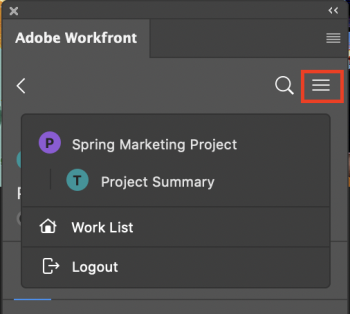
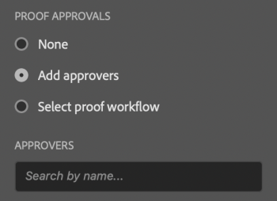
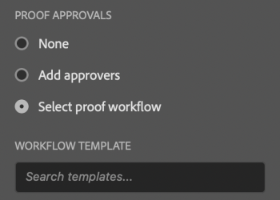
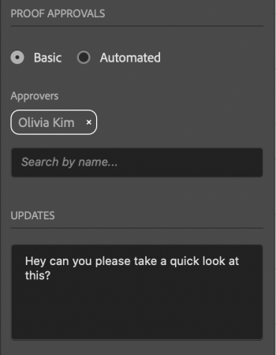
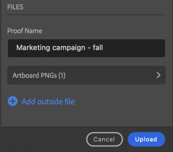

# Upload proofs from Adobe Photoshop

You can upload your art boards as proofs directly to Adobe Workfront for a thorough review and approval.

## Access requirements

You must have the following access to perform the steps in this article:

<table cellspacing="0"> 
 <col> 
 <col> 
 <tbody> 
  <tr> 
   <td role="rowheader">Adobe Workfront plan*</td> 
   <td> 
Current plan: Pro or Higher
 
or
 
Legacy plan: Premium
 
For more information about proofing access with the different plans, see <a href="../../administration-and-setup/manage-workfront/configure-proofing/access-to-proofing-functionality.md" class="MCXref xref">Access to proofing functionality in Workfront</a>.
 </td> 
  </tr> 
  <tr> 
   <td role="rowheader">Adobe Workfront license*</td> 
   <td> 
Current plan: Work or Proof
 
Legacy plan: Any (You must have proofing enabled for the user)
 </td> 
  </tr> 
  <tr> 
   <td role="rowheader">Product</td> 
   <td>You must have an Adobe Creative Cloud license in addition to a Workfront license.</td> 
  </tr> 
  <tr> 
   <td role="rowheader">Proof Permission Profile </td> 
   <td>Manager or higher</td> 
  </tr> 
  <tr> 
   <td role="rowheader">Object permissions</td> 
   <td> 
Edit access to Documents
 
For information on requesting additional access, see <a href="../../workfront-basics/grant-and-request-access-to-objects/request-access.md" class="MCXref xref">Request access to objects in Adobe Workfront</a>.
 </td> 
  </tr> 
 </tbody> 
</table>

&#42;To find out what plan, role, or Proof Permission Profile you have, contact your Workfront or Workfront Proof administrator.

## Prerequisites

* You must install the Workfront for Adobe Photoshop plugin before you can upload proofs from Adobe Photoshop.

  For instructions, see [Install Workfront for Adobe Photoshop](../../workfront-integrations-and-apps/adobe-workfront-for-creative-cloud/wf-cc-install.md).

## Upload a Proof

1. Click the **Menu** icon in the top-right corner, then select **Work List**. You can also use the menu to navigate to parent objects.

   

1. Go to the work item where you want to upload a proof.
1. Click the **Document** icon  in the navigation bar. 

1. Click **New File** near the bottom of the plugin.
1. Choose the **Asset Type** from the drop-down menu.  

1. In the **Proof Approvals** section, choose one of the following:&nbsp;

   | **Add Approvers** |Type the names of the users you want to tag for approval from the **Approvers** drop-down menu that appears. | 

   |
   |---|---|---|
   | **Select proof workflow** |Select the workflow from the **Workflow Template** drop-down menu that appears. | 

   |

1. (Optional) Type a comment in the **Updates** area.
1. Click **Upload**.  
   The document appears in the Documents area in the plugin and the desktop app.

<!--
<h2 data-mc-conditions="QuicksilverOrClassic.Draft mode">Upload a Basic Proof</h2>
-->

1. Click the **Menu** icon in the top-right corner, then select **Work List**. You can also use the menu to navigate to parent objects.

   

1. 

   <!--
   
Go to the work item where you want to upload a proof.

   -->

1. 

   <!--
   
Click the <strong>Document</strong> icon  in the navigation bar. 

   -->

1. 

   <!--
   
Click <strong>New File</strong> near the bottom of the plugin.

   -->

1. 

   <!--
   
Enable the <strong>Create a proof</strong> toggle.

   -->

1. 

   <!--
   
Choose the <strong>Asset Type</strong> from the drop-down menu.

   -->

   <!--
   
    

   -->

1. 

   <!--
   
In the <b>Proof Approvals</b> section, select <strong>Basic</strong>.

   -->

1. 

   <!--
   
(Optional) Add approvers.

   -->

1. 

   <!--
   
(Optional) Type a comment in the <strong>Updates</strong> area.

   -->

   <!--
   
  

   -->

1. 

   <!--
   
(Optional) Type a name for the proof in the<strong>Proof Name</strong>text box.

   -->

   <!--
   <li value="11" data-mc-conditions="QuicksilverOrClassic.Draft mode"> 
(Optional) Select <strong>Add outside file</strong> to add a file from your computer.
 </li>
   -->

1. 

   <!--
   
Click <strong>Upload</strong>.

   -->

   <!--
   
   The document appears in the Documents area in the plugin and the desktop app.

   -->

<!--
<h2 data-mc-conditions="QuicksilverOrClassic.Draft mode">Upload an Automated Proof</h2>
-->

<!--
<ol data-mc-conditions="QuicksilverOrClassic.Draft mode">
<li value="1"> 
Click the <strong>Menu</strong> icon in the top-right corner, then select <strong>Work List</strong>. You can also use the menu to navigate to parent objects.
 
    
 </li>
<li value="2">Go to the work item where you want to upload a proof.</li>
<li value="3">Click the <strong>Document</strong> icon  in the navigation bar. </li>
<li value="4">Click <strong>New File</strong> near the bottom of the plugin.</li>
<li value="5"> 
Enable the <strong>Create a proof</strong> toggle, then choose the <strong>Asset Type</strong> from the drop-down menu.
 
  
 </li>
<li value="6"> 
In the <b>Proof Approvals</b> section, select <strong>Automated</strong>.
 </li>
<li value="7"> 
(Optional) In the <strong>Workfrlow Template</strong> box, type the name of a proof workflow template.
 </li>
<li value="8"> 
(Optional) Type a comment in the <strong>Updates</strong> area.
 
  
 </li>
<li value="9"> 
(Optional) Type a name for the proof in the<strong>Proof Name</strong>text box.
 </li>
<li value="10"> 
(Optional) Select <strong>Add outside file</strong> to add a file from your computer.
 </li>
<li value="11"> <!--

Click <strong>Upload</strong>.

--> <!--

   The document appears in the Documents area in the plugin and the desktop app.

--> </li>
</ol>
-->

## Upload a new proof version

You can upload a new version of a proof. The plugin remembers the proofing workflow set on the previous version, but you can change this if you wish.

1. Click the **Menu** icon in the top-right corner, then select **Work List**. You can also use the menu to navigate to parent objects.

   

1. Go to the work item you need to upload a document to.
1. Click the **Document** icon in the navigation bar. 

1. Click **New Version** near the bottom of the plugin.
1. Choose the **Asset Type** from the drop-down menu.  

1. In the **Proof Approvals** section, choose one of the following:&nbsp;

   | **Add Approvers** |Type the names of the users you want to tag for approval from the **Approvers** drop-down menu that appears. | 

   |
   |---|---|---|
   | **Select proof workflow** |Select the workflow from the **Workflow Template** drop-down menu that appears. | 

   |

1. (Optional) Type a comment in the **Updates** area.
1. Click **Upload**.  
   The document appears in the Documents area in the plugin and the desktop app.

