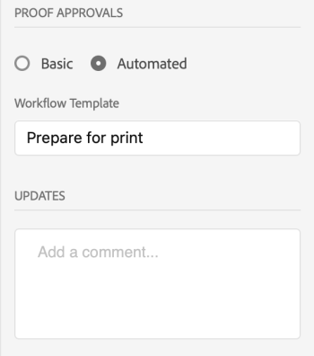
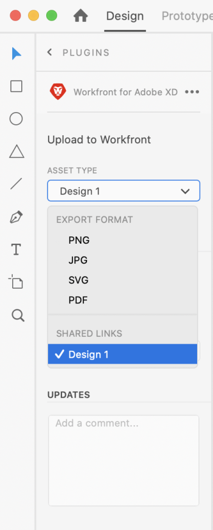
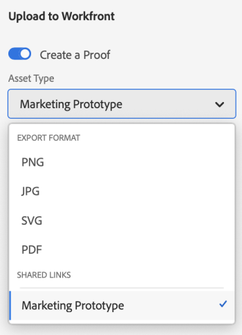

# Upload XD art boards as proofs to Workfront

>[!IMPORTANT]
>
>You're currently viewing the Adobe Workfront Classic version of this document. Adobe Workfront Classic is no longer supported. All Adobe Workfront Classic functionality, along with this documentation, will be removed in July 2022. Please transition to the the new Adobe Workfront experienceas soon as possible, and switch to the new Adobe Workfront experience version of this document.

You can upload your art boards as proofs directly to Adobe Workfront for a thorough review and approval.

## Access requirements

You must have the following access to perform the steps in this article:

<table> 
 <col> 
 <col> 
 <tbody> 
  <tr> 
   <td role="rowheader">Adobe Workfront plan*</td> 
   <td> <p>Current plan: Pro or Higher</p> <p>or</p> <p>Legacy plan: Premium</p> <p>For more information about proofing access with the different plans, see .</p> </td> 
  </tr> 
  <tr> 
   <td role="rowheader">Adobe Workfront license*</td> 
   <td> <p>Current plan: Work or Proof</p> <p>Legacy plan: Any (You must have proofing enabled for the user)</p> </td> 
  </tr> 
  <tr> 
   <td role="rowheader">Product</td> 
   <td>You must have an Adobe Creative Cloud license in addition to a Workfront license.</td> 
  </tr> 
  <tr> 
   <td role="rowheader">Proof Permission Profile </td> 
   <td>Manager or higher</td> 
  </tr> 
  <tr> 
   <td role="rowheader">Object permissions</td> 
   <td> <p>Edit access to Documents</p> <p>For information on requesting additional access, see <a href="../../workfront-basics/grant-and-request-access-to-objects/request-access.md" class="MCXref xref">Request access to objects </a>.</p> </td> 
  </tr> 
 </tbody> 
</table>

&#42;To find out what plan, role, or Proof Permission Profile you have, contact your Workfront or Workfront Proof administrator.

## Prerequisites

* You must install the Workfront for Adobe XD plugin before you can upload proofs in Adobe XD.

  For instructions, see [Install Workfront for Adobe XD](../../workfront-integrations-and-apps/adobe-workfront-for-xd/wf-adobe-xd-install.md).

## Upload a static Proof

1. Click the **Menu** icon in the top-right corner, then select **Work List**. You can also use the menu to navigate to parent objects.

   

1. Go to the work item where you want to upload a static proof.
1. Click the **Document** icon  in the navigation bar. 

1. Click **New File** near the bottom of the plugin.
1. Select the art boards you wish to upload.

   >[!TIP]
   >
   >To select more than one art board, click and drag the mouse over the art boards you want.

1. Enable **Create a Proof**.
1. Choose the export format from the **Asset Type** drop-down menu.

   

1. Choose the type of proof approval you want:

   <table> 
    <col> 
    <col> 
    <tbody> 
     <tr> 
      <td role="rowheader">Basic: </td> 
      <td> <p>Basic approval processes are ad-hoc and can include different reviewers as needed: </p> 
       <ul> 
        <li> <p>(Optional) Add <strong>Approvers</strong>in the box.</p> </li> 
       </ul> </td> 
     </tr> 
     <tr> 
      <td role="rowheader">Automated</td> 
      <td> <p>Automated approval processes are pre-built by administrators and include specific reviewers and stages. For more information, see <a href="../../review-and-approve-work/proofing/proofing-overview/automated-workflow.md" class="MCXref xref">Automated Workflow overview</a>.</p> 
       <ul> 
        <li> <p>Choose a Workflow Template from the drop-down menu.</p> </li> 
       </ul> </td> 
     </tr> 
    </tbody> 
   </table>

1. (Optional) Type a comment in the **Updates**area.

   

1. Click **Upload**.  
   The document appears in the Documents area in the plugin and the desktop app.

## Upload an interactive proof {#upload-an-interactive-proof}

You can create an interactive proof for your art boards with the Workfront for Adobe plugin. It is a 2-step process. First you need to create an interactive link, then you need to upload the proof to a work item.

### Create an interactive link for your art board  {#create-an-interactive-link-for-your-art-board}

1. Open your art board, then click **Share** in the top-left area of the screen.
1. Specify the link settings:

   1. Name the link.
   1. Choose a view setting.
   1. In the **Link Access** section, ensure **Anyone with this link** is selected.

      You must enable this type of access in order to generate an interactive proof. 
   
   1. Click **Create Link**.

1. Click back to **Design** in the top-left area of the screen. Continue to the [Upload an interactive proof](#upload-an-interactive-proof) section below.

   >[!NOTE]
   >
   >You may need to reopen the plugin panel in the bottom-left corner of the screen.

### Upload an interactive proof

1. Click the **Menu** icon in the top-right corner, then select **Work List**. You can also use the menu to navigate to parent objects.

   

1. Go to the work item where you want to upload an interactive proof.
1. Click the **Document** icon  in the navigation bar. 

1. Click **New File** near the bottom of the plugin.
1. Enable **Create a Proof**.
1. In the ```Asset Type``` drop-down menu, choose the link you just created under the **Shared links** tab. For more information, see [Create an interactive link for your art board](#create-an-interactive-link-for-your-art-board).  
   

   <!--
   
   -->

1. Choose the type of proof approval you want:

   <table> 
    <col> 
    <col> 
    <tbody> 
     <tr> 
      <td role="rowheader">Basic: </td> 
      <td> <p>Basic approval processes are ad-hoc and can include different reviewers as needed: </p> 
       <ul> 
        <li> <p>(Optional) Add <strong>Approvers</strong>in the box.</p> </li> 
       </ul> </td> 
     </tr> 
     <tr> 
      <td role="rowheader">Automated</td> 
      <td> <p>Automated approval processes are pre-built by administrators and include specific reviewers and stages. For more information, see <a href="../../review-and-approve-work/proofing/proofing-overview/automated-workflow.md" class="MCXref xref">Automated Workflow overview</a>.</p> 
       <ul> 
        <li> <p>Choose a Workflow Template from the drop-down menu.</p> </li> 
       </ul> </td> 
     </tr> 
    </tbody> 
   </table>

1. (Optional) Type a comment in the **Updates**area.

   

1. Click **Upload**.

   The document appears in the Documents area in the plugin and the desktop app.

   >[!IMPORTANT]
   >
   >Users must have access to the Desktop Proofing Viewer to review and approve interactive proofs. For more information, see [Install the Desktop Proofing Viewer](../../review-and-approve-work/proofing/use-the-desktop-proofing-viewer/installing-desktop-proofing-viewer.md).

## Upload a new proof version

You can upload a new version of a proof. The plugin remembers the proofing workflow set on the previous version, but you can change this if you wish.

1. Click the **Menu** icon in the top-right corner, then select **Work List**. You can also use the menu to navigate to parent objects.

   

1. Go to the work item you need to upload a document to.
1. Click the **Document** icon in the navigation bar. 

1. Click **New Version** near the bottom of the plugin.
1. Enable **Create a Proof**.
1. Select the art boards you wish to upload.

   >[!NOTE]
   >
   >If you want to upload a new version of an .svg, .png, or .jpg, you can upload only one art board.

1. Choose the export format from the **Asset Type** drop-down menu.

   

1. Choose the type of proof approval you want:

   <table> 
    <col> 
    <col> 
    <tbody> 
     <tr> 
      <td role="rowheader">Basic: </td> 
      <td> <p>Basic approval processes are ad-hoc and can include different reviewers as needed: </p> 
       <ul> 
        <li> <p>(Optional) Add <strong>Approvers</strong>in the box.</p> </li> 
       </ul> </td> 
     </tr> 
     <tr> 
      <td role="rowheader">Automated</td> 
      <td> <p>Automated approval processes are pre-built by administrators and include specific reviewers and stages. For more information, see <a href="../../review-and-approve-work/proofing/proofing-overview/automated-workflow.md" class="MCXref xref">Automated Workflow overview</a>.</p> 
       <ul> 
        <li> <p>Choose a Workflow Template from the drop-down menu.</p> </li> 
       </ul> </td> 
     </tr> 
    </tbody> 
   </table>

1. (Optional) Type a comment in the **Updates**area.

   

1. Click **Upload**.  
   The document appears in the Documents area in the plugin and the desktop app.

