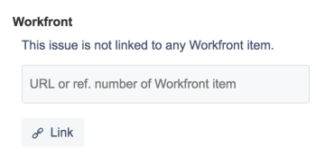
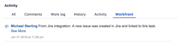
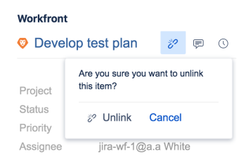

# Link items between Adobe Workfront and Jira

You can link Jira issues to Adobe Workfront tasks or issues either automatically or manually.&nbsp;

Only one item in Workfront can be linked to one item in Jira. You can never link one Workfront item to multiple Jira issues, nor one Jira issue to multiple Workfront items.

## Access requirements

You must have the following:

<table cellspacing="0"> 
 <col> 
 <col> 
 <tbody> 
  <tr> 
   <td role="rowheader"><a href="https://www.workfront.com/plans" target="_blank">Adobe Workfront plan</a>*</td> 
   <td> 
Pro or higher
 </td> 
  </tr> 
  <tr> 
   <td role="rowheader"><a href="../../administration-and-setup/add-users/access-levels-and-object-permissions/wf-licenses.md" class="MCXref xref">Adobe Workfront licenses overview</a>*</td> 
   <td> 
Plan
 </td> 
  </tr> 
  <tr> 
   <td role="rowheader">Jira access</td> 
   <td> 
System administrator access
 
Important:  We recommend that you create separate system administrator accounts in Jira and Workfront to dedicate to this integration, rather than using existing ones that might be attached to users.
 </td> 
  </tr> 
  <tr> 
   <td role="rowheader">Access level configurations*</td> 
   <td> 
You must be a Workfront administrator. For information on Workfront administrators, see <a href="../../administration-and-setup/add-users/configure-and-grant-access/grant-a-user-full-administrative-access.md" class="MCXref xref">Grant a user full administrative access</a>.
 
Note: If you still don't have access, ask your Workfront administrator if they set additional restrictions in your access level. For information on how a Workfront administrator can modify your access level, see <a href="../../administration-and-setup/add-users/configure-and-grant-access/create-modify-access-levels.md" class="MCXref xref">Create or modify custom access levels</a>.
 </td> 
  </tr> 
 </tbody> 
</table>

&#42;To find out what plan, license type, or access you have, contact your Workfront administrator.

## Prerequisites

Before you can link items between Workfront and Jira, you must

* Install Workfront for Jira

  For instructions on installing Workfront for Jira, see [Install Adobe Workfront for Jira](../../workfront-integrations-and-apps/use-workfront-with-jira/install-workfront-for-jira.md).

* Configure Workfront for Jira

  For instructions on configuring Workfront for Jira, see [Configure Adobe Workfront for Jira](../../workfront-integrations-and-apps/use-workfront-with-jira/configure-workfront-for-jira.md).

## Automatically link Workfront items to Jira issues {#automatically-link-workfront-items-to-jira-issues}

As a Workfront administrator, you can define triggers that can automatically create an issue in Jira every time certain conditions are met on a task or an issue in Workfront. The Workfront and Jira items become linked.

After you have completed the configuration of Workfront for Jira, when an item is either created or updated in Workfront to match your triggers, a new item is automatically created in Jira.   
Workfront users that create and update Workfront items do not need a Jira license to trigger the creation of items in Jira.

For more information about defining triggers for creating Jira issues automatically, see&nbsp; [Configure Adobe Workfront for Jira](../../workfront-integrations-and-apps/use-workfront-with-jira/configure-workfront-for-jira.md).

>[!NOTE]
>
>You can create Jira items automatically by attaching a template to a project. If the template contains tasks with assignments&nbsp;that meet the Jira triggers, the new tasks generate new Jira issues.&nbsp;

Automatically linking a Workfront issue to a Jira issue is identical to automatically linking a Workfront task to a Jira issue.

To automatically link a Workfront task to a Jira issue:

1. Ensure that your Jira system administrator has configured triggers for automatically creating Jira issues when Workfront items are assigned, then log in to Workfront with an access level that allows you to create a task.

   For more information about access to tasks, see [Grant access to tasks](../../administration-and-setup/add-users/configure-and-grant-access/grant-access-tasks.md).

1. Go to a project and select the **Tasks** tab.  

1. Click **New Task**

   Or

   Select an existing task, then click **Edit**.&nbsp;

1. Specify or update any of the fields available for the task.&nbsp;
1. Click **Assignments** and assign the task to a user, role, or team which is specified as a trigger in the Jira integration.  

1. Click **Save Changes**.

   A new task is created in Workfront.

   In the **Updates** tab of the new task, there is a comment to indicate that a new issue has also been created in Jira.

   

1. (Optional) Click the link to the Jira issue to open it in Jira.

   Or

   In the **Integrations** area on the Details panel of the task, click the **Go to Jira** link to open the Jira issue.

   Any Jira user can immediately start working on items automatically created from Workfront and their updates will transfer to Workfront without needing a license for Workfront to do so.

   Only the fields that you as a Workfront administrator configured during the setup of the Workfront add-on are updated.

   For more information about synchronizing fields between Workfront and Jira, see the&nbsp; [Configure Workfront for Jira](../../workfront-integrations-and-apps/use-workfront-with-jira/configure-workfront-for-jira.md#configuring-the-add-on-for-jira)&nbsp;section in&nbsp; [Configure Adobe Workfront for Jira](../../workfront-integrations-and-apps/use-workfront-with-jira/configure-workfront-for-jira.md).

   >[!NOTE]
   >
   >The Jira issue is not assigned to anyone in Jira when it is automatically created from Workfront.

## Manually link Jira issues to Workfront items

After items have been created in Jira and Workfront, independent of each other, you can manually link a Jira issue to an existing Workfront task or issue.  
You cannot manually link a Workfront item from Workfront to an existing Jira item.&nbsp;

>[!NOTE]
>
>If the Jira issue is not on a project which is not identified as a trigger in the Workfront Integration you cannot manually link it to a Workfront item when using the integration with Jira On-Premise.&nbsp;&nbsp;  
>For more information about setting up triggers for the Workfront to Jira workflow, see [Automatically link Workfront items to Jira issues](#automatically-link-workfront-items-to-jira-issues).

When Workfront and Jira items are linked, certain fields from one item can be automatically updated on the other.  
For more information about updating linked items, see [Update linked items between Jira and Adobe Workfront](../../workfront-integrations-and-apps/use-workfront-with-jira/update-linked-items-between-jira-wf.md).

To manually link Jira issues to Workfront items:

1. (Conditional) Log in to Workfront and find an issue or a task that you want to link to Jira issue.&nbsp;
1. (Conditional) From the address bar of the item, copy the **URL** of the item in Workfront.  
   Or

1. From the Details tab, copy the **Reference Number** of the item in Workfront.&nbsp;

   >[!NOTE]
   >
   >You must have a Workfront license to log in to Workfront. Otherwise, a Workfront user must supply this information to you.&nbsp;

1. In Jira, navigate to an issue that you want to manually link to the Workfront item.
1. In the Workfront right panel, paste the **URL** or the **Reference Number** of the Workfront item which you want to link to it.  
   

1. Click **Link**.

   The two items become linked and the Workfront right panel is populated with information from the Workfront item.

   The following Workfront fields are visible in Jira, by default, in the Workfront right panel:

   * The **Name** of the item: You can access the Workfront item by clicking the name in the panel.&nbsp;
   * **Project Name** 
   * The **Status** of the item
   * The **Priority** of the item
   * The date on which it was created in Workfront
   * The **Planned Hours** of the item
   * The **Reference Number**: You can access the Workfront item by clicking the Reference Number in the panel.

For more information about enabling additional fields to display in the right panel, see [Configure field synchronization between Jira and Workfront Items](../../workfront-integrations-and-apps/use-workfront-with-jira/configure-workfront-for-jira.md#setting-up-field-synchronization) section in [Configure Adobe Workfront for Jira](../../workfront-integrations-and-apps/use-workfront-with-jira/configure-workfront-for-jira.md). A comment from the Workfront administrator associated with the integration is posted in the **Workfront** tab of the Jira issue to confirm that a new Jira item has been created. The comment contains a link to the Jira issue.

## Unlink items between Jira and Workfront

Linked items between Jira and Workfront can be manually unlinked from Jira.  
You cannot unlink a Workfront item from their Jira counterpart in Workfront.&nbsp;

You need the following access to unlink manually linked item:

* You are the user who manually linked the items
* You are the Jira system administrator

Only a Workfront administrator can unlink items that were automatically linked.&nbsp;

To unlink a Jira issue from a Workfront item:

1. In Jira, navigate to an issue which is linked to a Workfront task or issue.
1. Go to the Workfront right panel, and click the **Unlink** icon, then click **Unlink**.  
     
   The previously linked Jira and Workfront items are now unlinked. Any fields, comments, or documents that might be updated on them individually in the future are not updated on their previous counterpart in the other application.&nbsp;

