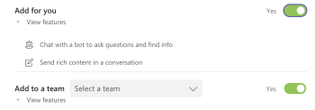
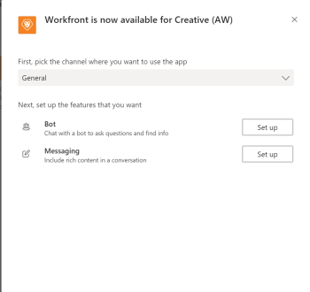
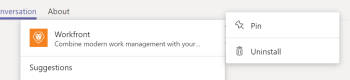
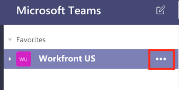
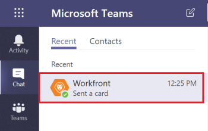

# Install Adobe Workfront for Microsoft Teams

>[!IMPORTANT]
>
>You're currently viewing the Adobe Workfront Classic version of this document. Adobe Workfront Classic is no longer supported. All Adobe Workfront Classic functionality, along with this documentation, will be removed in July 2022. Please transition to the the new Adobe Workfront experienceas soon as possible, and switch to the new Adobe Workfront experience version of this document.

The Adobe Workfront for Microsoft Teams app allows you to perform basic actions in Workfront without leaving your Microsoft Teams chat channels.

>[!NOTE]
>
>Microsoft Teams no longer supports Internet Explorer. To use the Adobe Workfront for Microsoft Teams integration, you must use a web browser other than Internet Explorer.

## Access requirements

You must have the following access to perform the steps in this article:

<table cellspacing="0"> 
 <col> 
 <col> 
 <tbody> 
  <tr> 
   <td role="rowheader">Adobe Workfront plan*</td> 
   <td> 
Any
 </td> 
  </tr> 
  <tr> 
   <td role="rowheader">Adobe Workfront license*</td> 
   <td> 
Work, Plan
 </td> 
  </tr> <!--
   <tr data-mc-conditions="QuicksilverOrClassic.Draft mode"> 
    <td role="rowheader">Access level configurations*</td> 
    <td> 
[Insert any access level configurations needed] <!--
       <MadCap:conditionalText data-mc-conditions="QuicksilverOrClassic.Draft mode">
        Example: Edit access to Documents
       </MadCap:conditionalText>
      -->
 
Note: If you still don't have access, ask your Workfront administrator if they set additional restrictions in your access level. For information on how a Workfront administrator can modify your access level, see <a href="../../administration-and-setup/add-users/configure-and-grant-access/create-modify-access-levels.md" class="MCXref xref">Create or modify custom access levels</a>.
 <!--
      
 You must be a Workfront administrator. For information on Workfront administrators, see <a href="../../administration-and-setup/add-users/configure-and-grant-access/grant-a-user-full-administrative-access.md" class="MCXref xref">Grant a user full administrative access</a>.

     --> <!--
      
You must be a group administrator. For more information on group administrators, see <a href="../../administration-and-setup/manage-groups/group-roles/group-administrators.md" class="MCXref xref">Group administrators</a>.

     --> </td> 
   </tr>
  --> <!--
   <tr data-mc-conditions="QuicksilverOrClassic.Draft mode"> 
    <td role="rowheader">Object permissions</td> 
    <td> 
[Insert permissions needed and specify the object] <!--
       <MadCap:conditionalText data-mc-conditions="QuicksilverOrClassic.Draft mode">
        Example: View access or higher on Documents
       </MadCap:conditionalText>
      -->
 
For information on requesting additional access, see <a href="../../workfront-basics/grant-and-request-access-to-objects/request-access.md" class="MCXref xref">Request access to objects </a>.
 </td> 
   </tr>
  --> 
 </tbody> 
</table>

&#42;To find out what plan, license type, or access you have, contact your Workfront administrator.

## Prerequisites

You must be a team owner in Microsoft Teams to install Workfront for Microsoft Teams.

## Install Workfront for Microsoft Teams {#install-workfront-for-microsoft-teams}

As a team owner in Microsoft Teams, you can install the Workfront for Microsoft Teams app for each of your teams either from the Microsoft Store or from a file provided by Workfront.

* [Install Workfront for Microsoft Teams from the Microsoft Store](#install-workfront-for-microsoft-teams-from-the-microsoft-store) 
* [Install Workfront for Microsoft Team from a private file](#install-workfront-for-microsoft-team-from-a-private-file)

### Install Workfront for Microsoft Teams from the Microsoft Store  {#install-workfront-for-microsoft-teams-from-the-microsoft-store}

1. Log in to Microsoft Teams as a team owner.
1. Select the team for whom you want to install the Workfront for Microsoft Teams app.&nbsp; 
1. Click **Store** on the side navigation bar.

   

1. In the **Search all** box, type *Workfront*.  

1. Click the **Workfront** card and follow the instructions in the wizard.
1. (Recommended) Select a team from the **Add to a team** drop-down menu and enable the **Yes** option to add the app to a team.

   

1. Select **General** to use the app in that channel for the selected team, then click Set up.

   

1. When the install completes,&nbsp;a notification that the install was successful appears in the General channel of the team you selected. All members of the team can see this notification.
1. (Optional) Pin your Workfront app for easier access:

   1. Click the **More** icon under the****message&nbsp;field in the General channel.
   
   1. Mouse over the Workfront app in the list, then click the **More** icon to the right of it.

      

   1. Click **Pin**.

      This adds a Workfront icon under the chat field. You can quickly access the Search area from here.

      For information about searching for Workfront items, see [Search for and share Adobe Workfront items in Microsoft Teams](../../workfront-integrations-and-apps/using-workfront-with-microsoft-teams/search-for-and-share-wf-items-in-ms-teams.md).

1. Click**Log in to Workfront** to access Workfront from Microsoft Teams.

   For information about logging in to Workfront, see the [Log in to Workfront from Microsoft Teams](#log-in-to-workfront-from-microsoft-teams) section in this article.&nbsp;

### Install Workfront for Microsoft Team from a private file {#install-workfront-for-microsoft-team-from-a-private-file}

If your organization restricts the access to downloading apps from the Microsoft Store, you must contact our Support Team and request a private file of the Workfront for Microsoft Teams app to install the app.

For information about contacting our Support Team, see [Contact Customer Support](../../workfront-basics/tips-tricks-and-troubleshooting/contact-customer-support.md).

To install Workfront for Microsoft Teams from a private file:

1. Save the private file that you have received from Workfront on your computer.
1. Log in to Microsoft Teams as a Microsoft team owner.
1. Click the **More** icon for the team for which you want to install Workfront for Microsoft Teams.

   

1. Click **Manage Team**.&nbsp;
1. Select the **Apps** tab, then click **Upload a custom app** in the lower-right corner of the screen.&nbsp;

1. Browse for the private file that you saved on your computer, then follow the installation steps to install Workfront for Microsoft Teams.
1. When the install completes, a notification that the install was successful appears in the General channel of the team you selected. All members of the team can see this notification.
1. (Optional) Click the **More** icon under the**Type your questions here** field.

1. (Optional) Mouse over the Workfront app in the list, then click the **More** icon to the right of it.

   

1. (Optional) Click **Pin**.

   This adds a Workfront icon under the Type your questions here field. You can quickly access the Search area from here.  
   For information about searching for Workfront items, see [Search for and share Adobe Workfront items in Microsoft Teams](../../workfront-integrations-and-apps/using-workfront-with-microsoft-teams/search-for-and-share-wf-items-in-ms-teams.md).

## Log in to Workfront from Microsoft Teams {#log-in-to-workfront-from-microsoft-teams}

As a Microsoft Teams team owner, you must install the Workfront for Microsoft Teams app for your team before you or anyone on the team can log in to Workfront from Microsoft Teams.

When you are logged in to Workfront from Microsoft Teams, you can receive Workfront notifications in the Workfront bot channel or you can perform certain actions in Workfront from Microsoft Teams.&nbsp;

For information about installing the Workfront app, see the [Install Workfront for Microsoft Teams](#install-workfront-for-microsoft-teams) section in this article.

For information about accessing Workfront from Microsoft Teams to perform certain actions, see [Access Adobe Workfront from Microsoft Teams](../../workfront-integrations-and-apps/using-workfront-with-microsoft-teams/access-workfront-from-ms-teams.md).

To log in to Workfront from Microsoft Teams:

1. Go to the **General** channel of the team where the Workfront for Microsoft Teams app has been installed and click**Log in to Workfront**.

   The Workfront bot chat channel is added to your Microsoft Teams chat channels.

   

1. Go to the Workfront bot chat channel in Microsoft Teams and type *log in* in the **Type your questions here** field.

   Or

   Click **Log in**.

   

   A new browser tab opens. 

1. Follow the prompts to log in to Workfront using Enhanced Authentication, OAuth 2.0, or your Security Assertion Markup Language (SAML) URL.

   >[!NOTE]
   >
   >
   >   
   >   
   >   * When you are prompted to enter the domain of your Workfront account, type it using this format: *yourCompany'sDomain.my.workfront.com*. Your company's domain is usually the name of your company.
   >   * Enhanced Authentication is not available until a Workfront administrator enables it for this integration. 
   >   
   >

1. Close the browser tab you used to log in and return to Microsoft Teams.

   A notification displays in the Workfront bot chat channel to confirm that you logged in to Workfront successfully.

