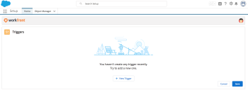
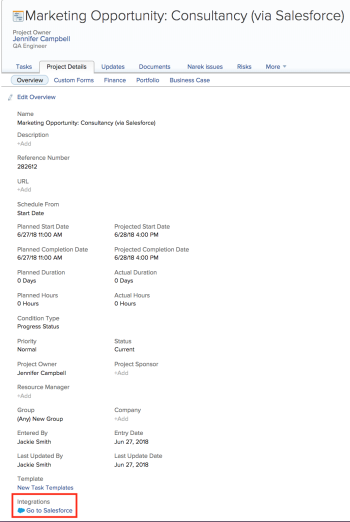

# Create Adobe Workfront projects from Salesforce objects

After installing Adobe Workfront for Salesforce, you can define triggers that create Workfront projects when certain criteria are met on Salesforce Opportunities and Accounts.

## Access requirements

You must have the following access to use the functionality described in this article:

<table cellspacing="0"> 
 <col> 
 <col> 
 <tbody> 
  <tr> 
   <td role="rowheader">Adobe Workfront plan*</td> 
   <td> 
Pro or higher
 </td> 
  </tr> 
  <tr> 
   <td role="rowheader">Adobe Workfront license*</td> 
   <td> 
Plan
 </td> 
  </tr> <!--
   <tr data-mc-conditions="QuicksilverOrClassic.Draft mode"> 
    <td role="rowheader">Access level configurations*</td> 
    <td> 
[Insert any access level configurations needed] <!--
       <MadCap:conditionalText data-mc-conditions="QuicksilverOrClassic.Draft mode">
        Example: Edit access to Documents
       </MadCap:conditionalText>
      -->
 
Note: If you still don't have access, ask your Workfront administrator if they set additional restrictions in your access level. For information on how a Workfront administrator can modify your access level, see <a href="../../administration-and-setup/add-users/configure-and-grant-access/create-modify-access-levels.md" class="MCXref xref">Create or modify custom access levels</a>.
 <!--
      
You must be a Workfront administrator. For information on Workfront administrators, see <a href="../../administration-and-setup/add-users/configure-and-grant-access/grant-a-user-full-administrative-access.md" class="MCXref xref">Grant a user full administrative access</a>.

     --> <!--
      
You must be a group administrator. For more information on group administrators, see <a href="../../administration-and-setup/manage-groups/group-roles/group-administrators.md" class="MCXref xref">Group administrators</a>.

     --> </td> 
   </tr>
  --> <!--
   <tr data-mc-conditions="QuicksilverOrClassic.Draft mode"> 
    <td role="rowheader">Object permissions</td> 
    <td> 
[Insert permissions needed and specify the object] <!--
       <MadCap:conditionalText data-mc-conditions="QuicksilverOrClassic.Draft mode">
        Example: View access or higher on Documents
       </MadCap:conditionalText>
      -->
 
For information on requesting additional access, see <a href="../../workfront-basics/grant-and-request-access-to-objects/request-access.md" class="MCXref xref">Request access to objects in Adobe Workfront</a>.
 </td> 
   </tr>
  --> 
 </tbody> 
</table>

&#42;To find out what plan, license type, or access you have, contact your Workfront administrator.

## Prerequisites

To submit a Workfront request from a Salesforce Opportunity or Account ensure that you have the following in your environment:

* Your Workfront administrator has installed Workfront for Salesforce.  
  For more information about installing Workfront for Salesforce, see [Install Adobe Workfront for Salesforce](../../workfront-integrations-and-apps/using-workfront-with-salesforce/install-workfront-for-salesforce.md)

* Your Workfront administrator has added the Workfront section to your Opportunity and Account page layouts.  
  For more information about adding the Workfront section to a page layout, see [Configure the Adobe Workfront section for Salesforce users](../../workfront-integrations-and-apps/using-workfront-with-salesforce/configure-wf-section-for-salesforce-users.md).

* You have a Workfront account and you can log in to it from the Workfront section inside your Opportunity or Account.

## Configuring the Creation of Workfront Projects from Salesforce

* [Understanding the Automatic Creation of Projects](#understanding-creating-projects) 
* [Configuring Triggers](#configure-triggers) 
* [Understanding Project Names](#project-names)

### Understanding the Automatic Creation of Projects

As the Salesforce system administrator, you can define triggers that can automatically create projects in Workfront when the following things happen in Salesforce:

* The Stage of an Opportunity is updated.
* The Type of an Account is updated.&nbsp;&nbsp;

Triggers can be configured only after you have installed Workfront for Salesforce.&nbsp;&nbsp;  
For information about installing Workfront for Salesforce, see [Install Adobe Workfront for Salesforce](../../workfront-integrations-and-apps/using-workfront-with-salesforce/install-workfront-for-salesforce.md).

Consider the following when configuring triggers to automatically create Workfront projects when Salesforce items are created or updated:

* You must be a Salesforce and a Workfront system administrator to configure triggers.&nbsp;
* After you configure the triggers, anyone who updates the Stage of an Opportunity or the Type of an Account can trigger the creation of a Workfront project. This includes Salesforce users who do not have a Workfront account.&nbsp;
* There is no limit to how many triggers you can have.
* You cannot create multiple triggers based on the same conditions. Triggers are unique by default.
* Once the project is created it is automatically linked to the opportunity or the account where it was generated.&nbsp;Once established, this link cannot be broken.
* One opportunity or account can be linked to multiple projects in Workfront when a triggered condition has been met multiple times in the life of the opportunity or the account.

  For example, if you define more then one Stage for an Opportunity to trigger a Project, a project is created for every defined stage that the opportunity reaches, for the life of that opportunity. Also, if you update the Stage of an Opportunity from one defined stage to another, and then update it back to the defined stage, a second project is created for the second time you update the Stage field to the same defined stage.&nbsp;

* One project in Workfront can be linked only to one opportunity or one account in Salesforce at any given time, but not to both at the same time.&nbsp;

### Configuring Triggers

Once you configure the triggers, the process of creating Workfront projects is enabled for both Salesforce Classic or Lightning Experience frameworks.

To configure triggers in Salesforce:

1. Log in to Salesforce as the system administrator.&nbsp;
1. (Conditional) In Salesforce Classic, click **Setup**, and under the **Build** section, expand **Lightning Bolt**.

   Or

   In Salesforce Lightning Experience, click the **Setup icon**, then **Setup**, and under **PLATFORM TOOLS** expand **Apps**.

1. Click **Installed Packages**.

   Notice that the **Workfront** package has been installed.

1. Click **Configure** next to**Workfront**.

1. Log in to Workfront as a system administrator.

   The **Triggers** page displays.

   

1. Click **New Trigger**.&nbsp;
1. From the **Salesforce Object**drop-down menu, select **Opportunity**.****This is a required field.

1. (Conditional) Specify the following:

   1. From the **Stage** drop-down menu, select a&nbsp;**Stage**.  
      When an opportunity reaches the Stage specified here, a project is created in Workfront. This is a required field.
   
   1. In the **Portfolio or Program** field, start typing the name of a Portfolio or Program where you want the project to be placed in Workfront, then select it when it appears in the list.  
      If you do not specify a Portfolio or a Program, the new project is created and added to the Projects I Own list of the user logged in to Workfront when configuring the triggers. That user is also the Project Owner for the new project.
   
   1. Start typing the name of a Template that you want to associate with the new Workfront project, then select it when it appears in the list.  
      This is a required field.&nbsp;

      >[!NOTE]
      >
      >If you have specified a Template Owner on the template that you are planning to use for this integration, that becomes the Project Owner of the new project. The new projects appear under the Projects I Own list of the user who is the owner of the new project, according to the template.

   1. (Optional) Select the **Create a new project for each sold product type field**, if you want to create a new project for every type of product that is sold under any one opportunity.&nbsp;
   1. (Conditional) Select a **Product** in the **Product** drop-down menu.

      This is a required field.
   
   1. (Conditional)&nbsp;Start typing the name of a **Template** that you want to associate with the new Workfront project if the specified Product is on the Opportunity. Select it when it appears in the list.

      This is a required field.

      The project created when a new product is added to the Salesforce opportunity is placed in the same Portfolio or Program selected for the opportunity.

      >[!IMPORTANT]
      >
      >The project is created only when the Stage is updated on the Opportunity. A unique project is created for each product specified when the Stage field is updated, and not as the products are added to Opportunities.

1. (Optional) Click **New Trigger**.&nbsp;
1. (Optional)&nbsp;From the **Salesforce Object**drop-down menu, select **Account**.

1. This is a required field.&nbsp;
1. (Conditional) Specify the following:&nbsp;

   1. Select a **Type** from the **Type** drop-down menu.  
      When any **Account** is designated as the **Type** specified here in Salesforce, a **Project** is created in Workfront.

      This is a required field.&nbsp;
   
   1. (Optional) Start typing the name of a **Portfolio** or **Program** where you want the project to be placed in Workfront in the **Portfolio or Program** field, then select it when it appears in the list.

      If you do not specify a Portfolio or a Program, the new project is created and added to the **Projects I Own** list of the user logged in to Workfront from Salesforce. The user is also the Project Owner for the new project.&nbsp;
   
   1. Start typing the name of a **Template** that you want to associate with the new Workfront project, then select it when it appears in the list.

      This is a required field.&nbsp;

      >[!NOTE]
      >
      >If you have specified a Template Owner on the template that you are planning to use for this integration, that becomes the Project Owner of the new project. The new projects appear under the **Projects I Own** list of the user who is the owner of the new project, according to the template.

   

1. Click **Save**.  
   Workfront projects are now generated every time any of the triggers are met.

### Understanding Project Names

Depending on which trigger generated the projects, the names of the projects in Workfront could follow either one of these patterns:

* If the project is created based on an opportunity or account trigger, the name of the project is: < * Salesforce object name>: <Project template name> (via Salesforce).*
* If the project is created based on an opportunity trigger that also includes the addition of a new Product, the name of the project is: < * Salesforce object name>: <Salesforce product name> (via Salesforce).*

## View Workfront projects

If your Workfront administrator added the Workfront section to your Opportunity or Account page layout, you can see the projects automatically created in the Projects tab of this section.  
For more information about adding the Workfront section to the page layout of an Opportunity or Account, see [Configure the Adobe Workfront section for Salesforce users](../../workfront-integrations-and-apps/using-workfront-with-salesforce/configure-wf-section-for-salesforce-users.md).

You must have a Workfront account and be logged in to Workfront to view the Projects tab.

To view projects created from an Opportunity or Account:&nbsp;

1. Go to an Opportunity or Account.
1. Go to the **Workfront** section.

   >[!NOTE]
   >
   >Depending on how your Workfront administrator configured this section, it might have a different name.

1. Select the **Projects** tab.

   All projects created by defined triggers are listed in this tab. Any user in Salesforce who also has a Workfront account and who might have permissions to see these projects in Workfront can also see them in Salesforce for the Opportunity or the Account that generated them.

   

   You can view the following information about the projects created by the integration:

   * Project Name&nbsp;
   * Reference Number
   * Entry Date
   * Name of the Owner
   * Status
   * Condition
   * Planned Completion Date
   * Percent Complete****When this information is updated in Workfront, you can see the fields updated in this list.&nbsp;

1. (Optional) Click the name of a project to open it in Workfront.&nbsp;
1. (Optional) Go to the **Project Details** tab, in the **Overview** subtab,&nbsp;and notice the indicator that this project originated in Salesforce and is currently linked to an item in Salesforce.

   

1. (Optional) Click **Go to Salesforce** to access the Opportunity or Account where the project originated.

   >[!NOTE]
   >
   >The Go to Salesforce link is visible to all Workfront users who can view the project. You must have a Salesforce account to be able to go to the Salesforce Opportunity or Account from where the project was generated.&nbsp;&nbsp;

