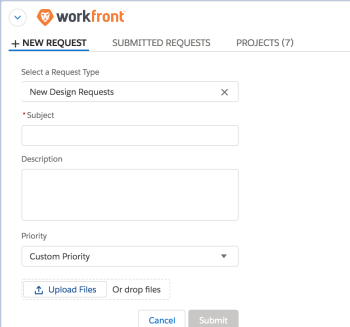
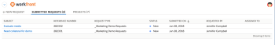
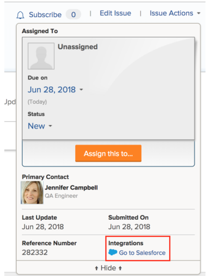

# Submit Adobe Workfront requests from Salesforce objects

>[!IMPORTANT]
>
>You're currently viewing the Adobe Workfront Classic version of this document. Adobe Workfront Classic is no longer supported. All Adobe Workfront Classic functionality, along with this documentation, will be removed in July 2022. Please transition to the the new Adobe Workfront experienceas soon as possible, and switch to the new Adobe Workfront experience version of this document.

After installing Adobe Workfront for Salesforce, you can submit Workfront requests from Salesforce Opportunities and Accounts. This functionality exists in both the Classic and Lightning Experience frameworks.

## Access requirements

You must have the following access to use the functionality described in this article:

<table> 
 <col> 
 <col> 
 <tbody> 
  <tr> 
   <td role="rowheader">Adobe Workfront plan*</td> 
   <td> 
Pro or higher
 </td> 
  </tr> 
  <tr> 
   <td role="rowheader">Adobe Workfront license*</td> 
   <td> 
Plan
 </td> 
  </tr> <!--
   <tr data-mc-conditions="QuicksilverOrClassic.Draft mode"> 
    <td role="rowheader">Access level configurations*</td> 
    <td> 
[Insert any access level configurations needed]
       <MadCap:conditionalText data-mc-conditions="QuicksilverOrClassic.Draft mode">
        Example: Edit access to Documents
       </MadCap:conditionalText>
      
 
Note: If you still don't have access, ask your Workfront administrator if they set additional restrictions in your access level. For information on how a Workfront administrator can modify your access level, see <a href="../../administration-and-setup/add-users/configure-and-grant-access/create-modify-access-levels.md" class="MCXref xref">Create or modify custom access levels</a>.
 
      
 You must be a Workfront administrator. For information on Workfront administrators, see <a href="../../administration-and-setup/add-users/configure-and-grant-access/grant-a-user-full-administrative-access.md" class="MCXref xref">Grant a user full administrative access</a>.

      
You must be a group administrator. For more information on group administrators, see <a href="../../administration-and-setup/manage-groups/group-roles/group-administrators.md" class="MCXref xref">Group administrators</a>.

     </td> 
   </tr>
   <tr data-mc-conditions="QuicksilverOrClassic.Draft mode"> 
    <td role="rowheader">Object permissions</td> 
    <td> 
[Insert permissions needed and specify the object]
       <MadCap:conditionalText data-mc-conditions="QuicksilverOrClassic.Draft mode">
        Example: View access or higher on Documents
       </MadCap:conditionalText>
      
 
For information on requesting additional access, see <a href="../../workfront-basics/grant-and-request-access-to-objects/request-access.md" class="MCXref xref">Request access to objects </a>.
 </td> 
   </tr>
  --> </tbody> 
</table>

&#42;To find out what plan, license type, or access you have, contact your Workfront administrator.

## Prerequisites

To submit a Workfront request from a Salesforce Opportunity or Account ensure that you have the following in your environment:

* Your Workfront administrator has installed Workfront for Salesforce.  
  For more information about installing Workfront for Salesforce, see [Install Adobe Workfront for Salesforce](../../workfront-integrations-and-apps/using-workfront-with-salesforce/install-workfront-for-salesforce.md)

* Your Workfront administrator has added the Workfront section to your Opportunity and Account page layouts.  
  For more information about adding the Workfront section to a page layout, see [Configure the Adobe Workfront section for Salesforce users](../../workfront-integrations-and-apps/using-workfront-with-salesforce/configure-wf-section-for-salesforce-users.md).

* You have a Workfront account and you can log in to it from the Workfront section inside your Opportunity or Account.   
  Once you log in, you can see the New Requests tab where you can start entering requests.

  <!--
  
&nbsp;

  -->

## Submit Workfront requests from Salesforce

1. Go to an Opportunity or Account in Salesforce. 
1. Go to the Workfront section.
1. In the **New Requests** tab, select a request type in the **Select a Request Type** drop-down menu.

   You can see the same request queues that you have access to see in Workfront.&nbsp;

1. Start filling out the available fields for your request.

   Submitting a request from Salesforce is identical to submitting a request in the Workfront web application.

   >[!NOTE]
   >
   >Uploading a document using the Workfront plugin in Salesforce is temporarily unavailable.

   Continue to follow the steps described in [Create and submit Adobe Workfront requests](../../manage-work/requests/create-requests/create-submit-requests.md).

1. Click **Submit**.

## View Workfront requests

1. Go to an Opportunity or Account in Salesforce.
1. Go to the **Workfront** section.

   >[!NOTE]
   >
   >Depending on how your Workfront administrator configured this section, it might have a different name.

1. Select the **Submitted Requests** tab.

   You can view all the requests that you or others have submitted from this Opportunity or Account in this tab.Requests that are submitted to this request queue in the web application do not display in this list in Salesforce.

   >[!NOTE]
   >
   >Requests that are submitted to this request queue in the web application do not display in this list in Salesforce.

   

   You can view the following information about the submitted requests:

   * Requests Name (in the Subject&nbsp;column)
   * Reference Number
   * Request&nbsp;Type
   * Status
   * Submitted on&nbsp;Date
   * Requested by Name
   * Assigned to Name  
     When this information is updated in Workfront, it is also updated in this list.&nbsp;

1. (Optional) Click the name of the request to open it in Workfront.&nbsp;

   On the Summary panel , notice the **Integrations** indicator that signifies that this issue originated in Salesforce and is currently linked to an item there.&nbsp;

   

1. (Optional) Click **Go to Salesforce** to access the Opportunity or Account where the issue originated.

   >[!NOTE]
   >
   >The Go to Salesforce link is visible to all Workfront users who can view the issue. You must have a Salesforce account to be able to go to the Salesforce Opportunity or Account where the issue was logged.&nbsp;

