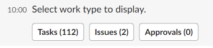
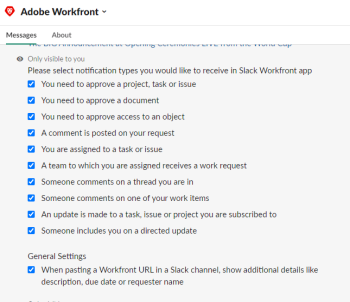

# Access Adobe Workfront from Slack

>[!IMPORTANT]
>
>You're currently viewing the Adobe Workfront Classic version of this document. Adobe Workfront Classic is no longer supported. All Adobe Workfront Classic functionality, along with this documentation, will be removed in July 2022. Please transition to the the new Adobe Workfront experienceas soon as possible, and switch to the new Adobe Workfront experience version of this document.

Integrating Adobe Workfront with Slack allows you to access Workfront from Slack, or perform certain actions in Workfront using a slash command. The integration can be used from any Slack environment, including the Slack mobile app.

You or your Slack administrator must install the Workfront app in your Slack instance before you can use Workfront from Slack. For more information, see [Configure Adobe Workfront for Slack](../../workfront-integrations-and-apps/using-workfront-with-slack/configure-workfront-for-slack.md).

## About slash commands {#about-slash-commands}

When using Slack, you type messages inside of a message field. When you start your message with a slash, it becomes a command and it behaves differently than a simple message. The command tells Slack to perform an action.

You can access your Workfront instance from Slack by typing a slash command in any Slack channel.

Remember the following when using a slash command in Slack to access Workfront:

* Slash commands are case sensitive. 
* The commands for Workfrontare only visible to you, regardless of which channel you are typing them in.
* The command should always start with the following:  
  <pre>/workfront</pre> Or&nbsp; <pre>/wf </pre> followed by a space and the name of an action you want to perform in Workfront.  
  This indicates that your command is meant for the Workfront app. The commands for Workfront work only when you have already configured the Workfront app with your Slack instance.

For a list of all the commands you can run from Slack for Workfront, see [Access Workfront from a slash command in Slack](#access-workfront-from-a-slash-command-in-slack).

## Log in to Workfront from Slack {#log-in-to-workfront-from-slack}

When you type any command in the message field in Slack, you will be asked to log in to Workfront first.   
For a complete list of Workfront commands from Slack, see&nbsp;the [Access Workfront from a slash command in Slack](#access-workfront-from-a-slash-command-in-slack) section in this article.&nbsp;

To log in to Workfront from Slack:

1. Log in to your Slack instance.
1. From any channel, type one of the following commands:  
   <pre>/workfront log in</pre> Or  
   <pre>/wf log in</pre>

1. Click the Workfront **Log In** link displayed in the response.  
   A new tab opens with fields for Workfront credentials.

1. Follow the prompts to log in to Workfront using Enhanced Authentication, OAuth 2.0, or your Security Assertion Markup Language (SAML) URL.

   >[!NOTE]
   >
   >
   >   
   >   
   >   * When you are prompted to enter the host of your Workfront account, type it using this format: *yourCompany'sDomain.my.workfront.com*. Your company's domain is usually the name of your company.
   >   * Enhanced Authentication is not available until a Workfront administrator enables it for this integration. 
   >   
   >

   The configuration page for Workfront notifications in Slack opens.

1. (Optional) Disable any Workfront notifications that you do not want to receive in Slack.  
   For information about configuring Workfront settings for Slack, see the [Configure settings](#configure-settings) section in this article

1. Navigate back to your Slack channel.  
   You are logged in to Workfront from your Slack instance.&nbsp;

## Access Workfront from Slack

* [About slash commands](#about-slash-commands) 
* [Access Workfront from a shared link in Slack](#access-workfront-from-a-shared-link-in-slack)

## Access Workfront from a slash command in Slack {#access-workfront-from-a-slash-command-in-slack}

1. Log in to your Slack instance and log in to Workfront from Slack.  
   For more information about logging in to Workfront from Slack, see [Log in to Workfront from Slack](#log-in-to-workfront-from-slack)

1. From any channel, start typing the following command in the message field:&nbsp;  
   <pre>/workfront help</pre> Or&nbsp;  
   <pre>/wf help</pre>

1. Select from the following commands:&nbsp;

   * <pre>/wf home</pre>Displays buttons from which you can access lists of your tasks, issues, and approvals. Clicking one of the buttons displays the first 20 items of each list in Slack.

     

     For more information about managing Workfront work items from Slack, see [Manage your work and approvals from Slack](../../workfront-integrations-and-apps/using-workfront-with-slack/manage-your-work-and-approvals-from-slack.md).
   
   * 
   
     ```   
     /wf add task <TaskName>
     ```

     Include the name of the task as it will appear in the Workfront interface.

     Adds a task to Workfront.  
     For more information about adding tasks to Workfront from Slack, see the "Creating Tasks from Slack" section in [Create tasks and issues from Slack](../../workfront-integrations-and-apps/using-workfront-with-slack/create-tasks-and-issues-from-slack.md).
   
   * 
   
     ```   
     /wf add issue <Issue Name>
     ```

     Include the name of the issue as it will appear in the Workfront interface.  
     Adds an issue to Workfront  
     For more information about adding issues to Workfront from Slack, see the "Creating Issues from Slack" section in [Create tasks and issues from Slack](../../workfront-integrations-and-apps/using-workfront-with-slack/create-tasks-and-issues-from-slack.md).
   
   * 
   
     ```   
     /wf favorites
     ```

     Displays the list of your Workfront Favorites.  
     For more information about accessing your Favorites from Slack, see the [Accessing Your Favorites List from Slack](../../workfront-integrations-and-apps/using-workfront-with-slack/access-favorites-and-recent-items-from-slack.md#accessing-favorites) section in the [Accessing Your Favorites and Recent Items from Slack](../../workfront-integrations-and-apps/using-workfront-with-slack/access-favorites-and-recent-items-from-slack.md) article.
   
   * 
   
     ```   
     /wf recent
     ```

     Displays the list of your most recently accessed items in Workfront.  
     For more information about accessing your Recent Items from Slack, see the [Accessing Your Recent Items List from Slack](../../workfront-integrations-and-apps/using-workfront-with-slack/access-favorites-and-recent-items-from-slack.md#accessing-recent-items) section in the [Access your favorites and recent items from Slack](../../workfront-integrations-and-apps/using-workfront-with-slack/access-favorites-and-recent-items-from-slack.md) article.

   * /   
   
     ```   
     wf tasks
     ```

     Displays a list of your tasks.

     For more information about managing your tasks from Slack, see the "Managing Your Tasks from Slack" section in [Managing Your Work and Approvals from Slack](../../workfront-integrations-and-apps/using-workfront-with-slack/manage-your-work-and-approvals-from-slack.md).

   * 
   
     ```   
     /wf issues
     ```

     Displays a list of your issues.

     For more information about managing your issues from Slack, see the "Managing Your Issues from Slack" section in [Managing Your Work and Approvals from Slack](../../workfront-integrations-and-apps/using-workfront-with-slack/manage-your-work-and-approvals-from-slack.md).

   * <pre>/wf approvals</pre> Displays your Workfront approvals.  
     For more information about managing your approvals from Slack, see the "Managing Your Approvals from Slack" section in [Manage your work and approvals from Slack](../../workfront-integrations-and-apps/using-workfront-with-slack/manage-your-work-and-approvals-from-slack.md).  
   
   * 
   
     ```   
     /wf search <keyword>
     ```   
   
     (include keyword)
     Search for a specific keyword. You can search for the following types objects:

      * Project 
      * Task&nbsp; 
      * Issue 
      * Report 
      * People 
      * Template 
      * Document 
      * Portfolio 
      * Program 
      * Dashboard 
      * Company 
      * Note &nbsp;  
        For more information about searching in Slack, see [Search for Adobe Workfront items from Slack](../../workfront-integrations-and-apps/using-workfront-with-slack/search-for-wf-items-from-slack.md).

   * <pre>/wf log in</pre> Logs you in to Workfront from Slack.&nbsp; 
   * <pre>/wf log out </pre> Logs you out of Workfront from Slack. You remain logged in to Workfront if you have a separate Workfront instance open in another browser tab on in another application.&nbsp; 
   * <pre>/wf settings</pre> Gives you access to configuring your Workfront settings in Slack.  
     For information about configuring Workfront settings in Slack, see [Configure settings](#configure-settings).
   
   * <pre>/wf help</pre> Displays a complete list of commands for Workfront.&nbsp; 
   * * Visit Workfront Help:&nbsp; * Opens the Slack section on the Workfront Help Site in a new browser tab.&nbsp;

1. (Optional) To delete the message of any command, mouse over the upper-right corner of the Slack message containing the command and click**Show message actions**, then click **Delete message**. 

1. (Optional and conditional) Click **Delete** to confirm you want to delete this message.&nbsp;

### Access Workfront from a shared link in Slack {#access-workfront-from-a-shared-link-in-slack}

You can access Workfront objects from a link to those objects that is shared with you in Slack.&nbsp;

For more information about accessing Workfront from a shared link, see [Access Adobe Workfront objects from a shared link in Slack](../../workfront-integrations-and-apps/using-workfront-with-slack/access-wf-objects-from-shared-linked-in-slack.md).

## Configure settings {#configure-settings}

1. Inside a Slack message field, type the following command:  
   <pre>/workfront settings</pre> Or  
   <pre>/wf settings</pre> 

   All settings are enabled by default.

1. Deselect from the following options, to disable your settings for Workfront:

   * In the **General Settings** area, disable the **When pasting a Workfront URL in a Slack channel, show additional description, due date, or requestor name.**setting if you do not want Slack to add additional information about your Workfront objects when you share a URL to the object in Slack.
   
   * In the **Notifications Settings** area, disable notifications that you want to stop receiving from Workfront.  
     For information about receiving Workfront notifications in Slack, see [Receive Adobe Workfront notifications in Slack](../../workfront-integrations-and-apps/using-workfront-with-slack/receive-workfront-notifications-in-slack.md).

## Log out of Workfront from Slack&nbsp;

1. Inside a Slack message field, type the following command:  
   <pre>/workfront log out</pre> Or  
   <pre>/wf log out</pre>  
   You receive a confirmation that you have been logged out of Workfront.  
   You remain logged in to Workfront if you have a separate Workfront instance open in another browser tab on in another application.&nbsp;

