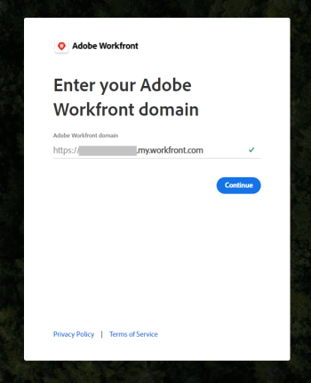
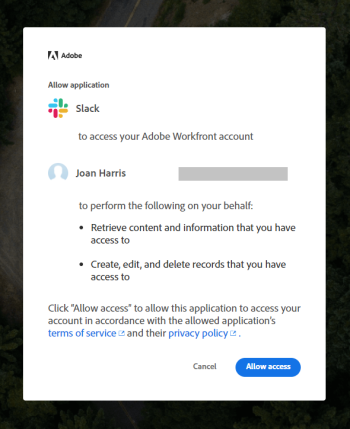

# Configure Adobe Workfront for Slack

>[!IMPORTANT]
>
>You're currently viewing the Adobe Workfront Classic version of this document. Adobe Workfront Classic is no longer supported. All Adobe Workfront Classic functionality, along with this documentation, will be removed in July 2022. Please transition to the the new Adobe Workfront experienceas soon as possible, and switch to the new Adobe Workfront experience version of this document.

Integrating Adobe Workfront with Slack allows you to do the following:

* Access your Workfront work items, approvals, favorites, recent items from Slack. 
* Subscribe for, approve, assign work from Slack. 
* Create tasks and issues from Slack. 
* Receive some Workfront notifications in Slack.

Depending on how your Slack environment is configured, you can install and configure Workfront for Slack yourself, or your Workfront administrator must install and configure it first before you can configure it for yourself.&nbsp;

When you integrate your Slack instance with Workfront users can use Workfront while collaborating within their Slack channels. The integration can be used from any Slack environment, including the Slack mobile app.&nbsp;

## Access requirements

You must have the following:

<table cellspacing="0"> 
 <col> 
 </col> 
 <col> 
 </col> 
 <tbody> 
  <tr> 
   <td role="rowheader"><a href="https://www.workfront.com/plans" target="_blank">Adobe Workfront plan</a>*</td> 
   <td> 
Pro or higher
 </td> 
  </tr> <!--
   <tr data-mc-conditions="QuicksilverOrClassic.Draft mode"> 
    <td role="rowheader"><a href="../../administration-and-setup/add-users/access-levels-and-object-permissions/wf-licenses.md" class="MCXref xref">Adobe Workfront licenses overview</a>*</td> 
    <td> 
Plan
 </td> 
   </tr>
  --> 
 </tbody> 
</table>

&#42;To find out what plan, license type, or access you have, contact your Workfront administrator.\

## Prerequisites for using Workfront with Slack

* You must have a Slack instance.&nbsp; 
* Your Slack system administrator must allow all Slack users to install Workfront for Slack.  
* You must have a Workfrontlicense to be able to use the integrated features in Workfront.

  >[!NOTE]
  >
  >Users with any Workfrontlicense type can access Workfrontfrom Slack. The actions that you can perform from Slack are limited to your Workfrontlicense and permission levels.

For more information about managing apps in Slack, see [Manage Apps for Your Workspace.](https://get.slack.help/hc/en-us/articles/222386767-Manage-apps-for-your-workspace)

## Install Workfront for Slack

Each Slack user must install the Workfront app themselves in order to use Workfront from Slack.

You can install the app in the following ways:

* [Install the Workfront app outside Slack](#install-the-workfront-app-outside-slack) 
* [Install the Workfront app within Slack](#install-the-workfront-app-within-slack)

### Install the Workfront app outside Slack {#install-the-workfront-app-outside-slack}

Follow the steps below to run the installation process and authorize Workfront for Slack on your Slack instance.&nbsp;

>[!IMPORTANT]
>
>When a new version of Workfront for Slack is released, you must re-authorize the app in order to continue using it.&nbsp;

1. Click the following button to begin the installation process.

   

1. Sign in to your workspace by specifying your Slack URL and clicking **Continue**.  
     

1. Examine the access that Slack is requesting. If you agree to this access, click **Allow Access** to authorize the Workfront app.

   

You can now access Workfront from Slack, as described in the [Access Workfront from Slack](../../workfront-integrations-and-apps/using-workfront-with-slack/access-workfront-from-slack.md#viewing-all-available-commands) section in [Access Adobe Workfront from Slack](../../workfront-integrations-and-apps/using-workfront-with-slack/access-workfront-from-slack.md).

### Install the Workfront app within Slack {#install-the-workfront-app-within-slack}

You can install the Workfront app directly from the Slack application:

1. Navigate to your Slack URL.

   For example: *<YourTeamName>.slack.com/apps*. Or

   Click the **Add Apps** icon in your Slack instance.

   

1. Start typing *Workfront* in the search field.
1. Press Enter.
1. Select the **Workfront** app.
1. Click **Settings**.&nbsp;****The App Directory page is displayed.

1. Click **Visit App Site**.
1. Click**Add to Slack**.
1. Follow the steps to finish the installation.&nbsp;
1. When the installation completes, you can access Workfront from Slack, as described in the [Access Workfront from Slack](../../workfront-integrations-and-apps/using-workfront-with-slack/access-workfront-from-slack.md#viewing-all-available-commands) section in [Access Adobe Workfront from Slack](../../workfront-integrations-and-apps/using-workfront-with-slack/access-workfront-from-slack.md).

