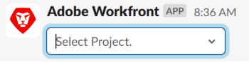

# Create tasks and issues from Slack

>[!IMPORTANT]
>
>You're currently viewing the Adobe Workfront Classic version of this document. Adobe Workfront Classic is no longer supported. All Adobe Workfront Classic functionality, along with this documentation, will be removed in July 2022. Please transition to the the new Adobe Workfront experienceas soon as possible, and switch to the new Adobe Workfront experience version of this document.

After you have installed and configured Adobe Workfront for Slack, you can create tasks and issues from Slack and associate them with projects in Workfront.

For more information about configuring Workfront with Slack, see [Configure Adobe Workfront for Slack](../../workfront-integrations-and-apps/using-workfront-with-slack/configure-workfront-for-slack.md).&nbsp;

You must have access to create tasks and issues in your Access Level and you must have Contribute permissions on the project that you are associating them with.&nbsp;

For more information about Access Levels, see [Access levels overview](../../administration-and-setup/add-users/access-levels-and-object-permissions/access-levels-overview.md). For more&nbsp;information about permissions to objects, see [Overview of sharing permissions on objects](../../workfront-basics/grant-and-request-access-to-objects/sharing-permissions-on-objects-overview.md).

## Access requirements

You must have the following:

<table> 
 <col> 
 </col> 
 <col> 
 </col> 
 <tbody> 
  <tr> 
   <td role="rowheader"><a href="https://www.workfront.com/plans" target="_blank">Adobe Workfront plan</a>*</td> 
   <td> <p>Pro or higher</p> </td> 
  </tr> <!--
   <tr data-mc-conditions="QuicksilverOrClassic.Draft mode"> 
    <td role="rowheader"><a href="../../administration-and-setup/add-users/access-levels-and-object-permissions/wf-licenses.md" class="MCXref xref">Adobe Workfront licenses overview</a>*</td> 
    <td> <p>Plan</p> </td> 
   </tr>
  --> 
 </tbody> 
</table>

&#42;To find out what plan, license type, or access you have, contact your Workfront administrator.\

## Prerequisites

Before you can create tasks and issues from Slack, you must

* Configure Workfront for Slack  
  For instructions on configuring Workfront for Slack, see [Configure Adobe Workfront for Slack](../../workfront-integrations-and-apps/using-workfront-with-slack/configure-workfront-for-slack.md).

## Create tasks from Slack

1. Log in to your Slack instance and log in to Workfront from Slack.  
   For more information about logging in to Workfront from Slack, see the "Logging In to Workfront from Slack" section in [Access Adobe Workfront from Slack](../../workfront-integrations-and-apps/using-workfront-with-slack/access-workfront-from-slack.md).

1. From any channel, start typing the following command in the message field:&nbsp;  
   *

   ```
   /workfront add task <Task Name>
   ```

   .*

   >[!NOTE]
   >
   >Commands are case sensitive. You can start your command with    >
   >
   >```   >
   >/wf
   >```   >
   >
   >instead of /   >
   >
   >```   >
   >workfront
   >```   >
   >
   >.  
   >The Task Name must be entered as it will appear in the Workfront interface, without brackets or quotation marks.  
   >

1. (Optional) Start typing the name of a project with which you want to associate the new task and select it when it appears in the list.  
   You receive a confirmation indicating that the task was added to the selected project.
1. (Optional) Click **Add to my work** to add the task to your Working On list, as an ad-hoc task.  
   You receive a confirmation indicating that the task was added to your personal project. The task appears in your Working On list.  
   For more information about adding ad-hoc items to Workfront, see [Create ad hoc work items](../../workfront-basics/using-home/my-work/create-ad-hoc-work-items-my-work.md).

1. (Optional) Click the name of the task in the confirmation message to open it in Workfront, in a new browser tab.

## Create issues from Slack

1. Log in to your Slack instance and log in to Workfront from Slack.  
   For more information about logging in to Workfront from Slack, see the "Logging In to Workfront from Slack" section in [Access Adobe Workfront from Slack](../../workfront-integrations-and-apps/using-workfront-with-slack/access-workfront-from-slack.md).

1. From any channel, start typing the following command in the message field:&nbsp;

   ```
   /workfront add issue <Issue Name>
   ```

   *.*

   >[!NOTE]
   >
   >Commands are case sensitive. You can start your command with '/wf' instead of '/workfront.'&nbsp;  
   >The Issue Name must be entered as it will appear in the Workfront interface, without brackets or quotation marks.  
   >

1. (Optional) Start typing the name of a project with which you want to associate the new issue and select it when it appears in the list.  
   You receive a confirmation indicating that the issue was added to the selected project.&nbsp;
1. (Optional) Click the name of the issue in the confirmation message to open it in Workfront, in a new browser tab.

