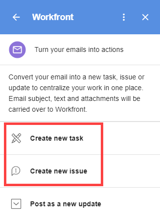

# Create a Adobe Workfront task in G Suite using email content

You can convert an external email (not generated by Adobe Workfront) to a Workfront task.

You can also convert an external email to an update on an existing task. For more information, see [Update a Adobe Workfront item from G Suite using email content](../../workfront-integrations-and-apps/workfront-for-g-suite/update-wf-item-using-email-content.md).

For information about using G Suite to work with notification emails sent by Workfront, see [Manage Adobe Workfront notification details from G Suite](../../workfront-integrations-and-apps/workfront-for-g-suite/manage-wf-email-notification-details-in-gsuite.md).

## Access requirements

You must have the following access to perform the steps in this article:

<table cellspacing="0"> 
 <col> 
 <col> 
 <tbody> 
  <tr> 
   <td role="rowheader">Adobe Workfront plan*</td> 
   <td> 
Any
 </td> 
  </tr> 
  <tr> 
   <td role="rowheader">Adobe Workfront license*</td> 
   <td> 
Work, Plan
 </td> 
  </tr> <!--
   Access level configurations* [Insert any access level configurations needed] Example: Edit access to Documents Note: If you still don't have access, ask your Workfront administrator if they set additional restrictions in your access level. For information on how a Workfront administrator can modify your access level, see Create or modify custom access levels. You must be a Workfront administrator. For information on Workfront administrators, see Grant a user full administrative access. You must be a group administrator. For more information on group administrators, see Group administrators.
  --> <!--
   Object permissions [Insert permissions needed and specify the object] Example: View access or higher on Documents For information on requesting additional access, see Request access to objects in Adobe Workfront.
  --> 
 </tbody> 
</table>

&#42;To find out what plan, license type, or access you have, contact your Workfront administrator.

## Prerequisites

Before you can create a Workfront task in G Suite, you must

* Install Workfront for G suite  
  For instructions, see [Install Adobe Workfront for G Suite](../../workfront-integrations-and-apps/workfront-for-g-suite/install-workfront-for-gsuite.md).

## Create a Adobe Workfront task in G Suite using email content

1. If the Workfront for G Suite panel is not displayed, click the&nbsp;Workfront icon  in the G Suite add-ons sidebar at the far-right of the page. 
1. With the email message open in G Suite, click an option in Workfront for G Suite to convert the email to a new Workfront task.

   

1. Select a `Create new` option to indicate whether the task is going to be part of a project or a personal task that is independent of a project.
1. If you want to attach the task to a parent project, click `Project name`, start typing the name of the project where you want the task, then click the project name when it appears in the list below.
1. Make any of these changes:

   | Task name |Edit any part of this text, which is taken from the email's subject line. |
   |---|---|
   | Description |Edit any part of this text, which is taken from the body of the email. |

1. Click `Create Task`.

   The `Details` tab for the new task displays in the Workfront for G Suite panel. You can click `Updates` and start communicating with collaborators right away without leaving your in box.

   At the bottom of the `Details` tab, you can also click `View in Workfront` to go to the new task in Workfront.

   When you refresh your browser, a message with a link at the bottom of the Workfront for G Suite panel confirms that you have converted the email to an task:

   

   You can click the link to go to the Details view, within the Workfront for G Suite panel, for the task you've created.

   You can repeat these steps to convert the same email to multiple tasks. When you refresh your browser or return to the email at another time, all links you have created for the email are listed at the bottom of the Workfront for G Suite panel.

1. (Optional) Continue to work with the task in the Workfront for G Suite panel by doing any of the following:

  * To add an update on the `Updates` tab, click `Start a new update` and type the update. 
  
  * To reply to an update on the `Updates` tab, click `Reply` and type your reply.

    For both of the above actions, you can notify particular users about your comment. Click  `Notify`, begin typing the name of a user, then click the name when it appears in the drop-down list. Repeat this process for other users you want to notify, then click `Post`.
  
  * Click the `Documents` tab to see any documents saved with the task.

You can repeat these steps to convert the same email to multiple tasks. When you refresh your browser or return to the email at another time, all links you have created for the email are listed at the bottom of the Workfront for G Suite panel.
