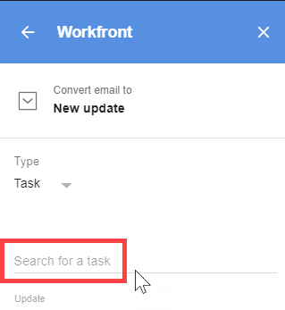

# Update an Adobe Workfront item from G&nbsp;Suite using email content

>[!IMPORTANT]
>
>You're currently viewing the Adobe Workfront Classic version of this document. Adobe Workfront Classic is no longer supported. All Adobe Workfront Classic functionality, along with this documentation, will be removed in July 2022. Please transition to the the new Adobe Workfront experienceas soon as possible, and switch to the new Adobe Workfront experience version of this document.

You can update an existing project, task, or issue with information from a non-Adobe Workfront email.

## Access requirements

You must have the following access to perform the steps in this article:

<table cellspacing="0"> 
 <col> 
 <col> 
 <tbody> 
  <tr> 
   <td role="rowheader">Adobe Workfront plan*</td> 
   <td> 
Any
 </td> 
  </tr> 
  <tr> 
   <td role="rowheader">Adobe Workfront license*</td> 
   <td> 
Work, Plan
 </td> 
  </tr> <!--
   <tr data-mc-conditions="QuicksilverOrClassic.Draft mode"> 
    <td role="rowheader">Access level configurations*</td> 
    <td> 
[Insert any access level configurations needed]
       <MadCap:conditionalText data-mc-conditions="QuicksilverOrClassic.Draft mode">
         Example: Edit access to Documents 
       </MadCap:conditionalText>
      
 
Note: If you still don't have access, ask your Workfront administrator if they set additional restrictions in your access level. For information on how a Workfront administrator can modify your access level, see <a href="../../administration-and-setup/add-users/configure-and-grant-access/create-modify-access-levels.md" class="MCXref xref">Create or modify custom access levels</a>.

      
 You must be a Workfront administrator. For information on Workfront administrators, see <a href="../../administration-and-setup/add-users/configure-and-grant-access/grant-a-user-full-administrative-access.md" class="MCXref xref">Grant a user full administrative access</a>.

      
You must be a group administrator. For more information on group administrators, see <a href="../../administration-and-setup/manage-groups/group-roles/group-administrators.md" class="MCXref xref">Group administrators</a>.

     </td> 
   </tr>
   <tr data-mc-conditions="QuicksilverOrClassic.Draft mode"> 
    <td role="rowheader">Object permissions</td> 
    <td> 
[Insert permissions needed and specify the object]
       <MadCap:conditionalText data-mc-conditions="QuicksilverOrClassic.Draft mode">
         Example: View access or higher on Documents 
       </MadCap:conditionalText>
      
 
For information on requesting additional access, see <a href="../../workfront-basics/grant-and-request-access-to-objects/request-access.md" class="MCXref xref">Request access to objects </a>.
 </td> 
   </tr>
  --> 
 </tbody> 
</table>

&#42;To find out what plan, license type, or access you have, contact your Workfront administrator.

## Prerequisites

Before you can update a Workfront item using email content from G Suite, you must

* Install Workfront for G suite  
  For instructions, see [Install Adobe Workfront for G Suite](../../workfront-integrations-and-apps/workfront-for-g-suite/install-workfront-for-gsuite.md).

## Update a Workfront item using email content from G Suite

1. If the Workfront for G Suite panel is not displayed, click the&nbsp;Workfront icon  in the G Suite add-ons sidebar at the far-right of the page. 
1. With the email message open in G Suite, click **Post as a new update** in the G Suite panel.
1. Under **Type**, click the drop-down arrow, then click the type of object where you want to add the update.
1. Click the **Search for** option, start typing the name of the object where you want to add the update, then select the item when it appears in the list below.

   

   This option varies, depending on what you selected in step 3. It might be **Search for a project**, **Search for a task**, or **Search for an issue**.

   >[!NOTE]
   >
   >When you are typing the name of a task, ad hoc personal tasks are excluded from the list of name that appears below.

   <!--
   ><MadCap:conditionalText data-mc-conditions="QuicksilverOrClassic.Draft mode">   >
   >For information about ad hoc personal tasks, see   >
   ><a href="https://experience.workfront.com/s/article/Creating-Ad-Hoc-Work-Items-in-the-new-Workfront-experience-254064726">Creating Ad Hoc Work Items in the new Workfront experience</a>   >
   ><MadCap:conditionalText data-mc-conditions="QuicksilverOrClassic.Draft mode">   >
   >Creating Ad Hoc Work Items in the new Adobe Workfront experience   >
   ></MadCap:conditionalText>   >
   ></MadCap:conditionalText>   >
   -->

1. Make any of these optional changes: 

   <table cellspacing="0"> 
    <col> 
    <col> 
    <tbody> 
     <tr> 
      <td role="rowheader">Update</td> 
      <td>Edit any part of this text, which is taken from the email's subject line and body text.</td> 
     </tr> 
     <tr data-mc-conditions=""> 
      <td role="rowheader">Include email attachments</td> 
      <td>
(Available only if the email contains at least one attachment.) Click this option to save attachments in the email to the Documents tab for the task or issue. 

If you do not want to save an attachment, click the X to the right of its name. 

If the email contains links to documents in Google Drive, the links are saved to the Overview tab of the task or issue you are creating. 

Important: In order for this to work, your Workfront administrator must authorize Google Drive to work with Workfront

      <!--
         <MadCap:conditionalText data-mc-conditions="QuicksilverOrClassic.Draft mode"> 
          , as described in 
          <a href="../../administration-and-setup/configure-integrations/configure-document-integrations.md" class="MCXref xref">Configure document integrations</a>. 
         </MadCap:conditionalText>
        -->
      
If you enable this option, it remains enabled for other emails you convert to tasks, issues, and updates.
</td> 
     </tr> 
     <tr data-mc-conditions=""> 
      <td role="rowheader">Notify</td> 
      <td>Click <strong>Notify</strong>, click the <strong>Search for a user or team</strong> option that appears, then start typing the name of the person or team and click it when it appears in the list below. Repeat this for each person and team you want to add, then click <strong>Save</strong>.</td> 
     </tr> 
    </tbody> 
   </table>

1. Click **Update**.

   When you refresh your browser, a message with a link at the bottom of the Workfront for G Suite panel confirms that you have converted the email to an update:

   

   You can click the link to go to the Updates tab in Workfront for the object you specified in step 4.

   You can repeat these steps to convert the same email to updates, task, and issues (see [Create an Adobe Workfront issue in G Suite using email content](../../workfront-integrations-and-apps/workfront-for-g-suite/create-wf-issue-in-g-suite-using-email-content.md)). When you refresh your browser or return to the email at another time, all links you have created for the email are listed at the bottom of the Workfront for G Suite panel.

1. (Optional) Continue to work with the update in the Workfront add-on panel by doing any of the following:

   * To add another update on the **Updates** tab, click **Start a new update** and type the information. 
   
   * To reply to an update on the **Updates** tab, click **Reply** and type your reply.

     For both of the options above, you can click **Notify** to specify recipients for the reply as in step 5. When you are ready, click **Post** to add the update or reply. 
   
   * Click the **Details** tab to view the details for the new project, task, or issue.

