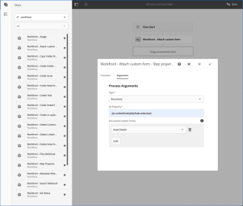

# ```Workfront Tools for AEM User Guide : Attach Custom Forms```  {#title-heading}

>[!IMPORTANT]
>
>You're currently viewing the Adobe Workfront Classic version of this document. Adobe Workfront Classic is no longer supported. All Adobe Workfront Classic functionality, along with this documentation, will be removed in July 2022. Please transition to the the new Adobe Workfront experienceas soon as possible, and switch to the new Adobe Workfront experience version of this document.

This workflow step will allow a user to attach a custom form to a Workfront artifact. This workflow step can be added to any workflow model. The Workfront artifact this step affects will be looked up using a relative path from the payload.

## Access requirements

You must have the following access to perform the steps in this article:

<table cellspacing="0"> 
 <col> 
 </col> 
 <col> 
 </col> 
 <tbody> 
  <tr> 
   <td role="rowheader">Adobe Workfront plan*</td> 
   <td> <p>Pro or higher</p> </td> 
  </tr> <!--
   <tr data-mc-conditions="QuicksilverOrClassic.Draft mode"> 
    <td role="rowheader">Adobe Workfront license*</td> 
    <td> <p>Work or higher</p> </td> 
   </tr>
  --> 
  <tr> 
   <td role="rowheader">Product</td> 
   <td>You must have a license to Adobe Experience Manager</td> 
  </tr> 
  <tr> 
   <td role="rowheader">Object permissions</td> 
   <td> <p>Manage permissions to the object</p> <p>For information on requesting additional access, see <a href="../../workfront-basics/grant-and-request-access-to-objects/request-access.md" class="MCXref xref">Request access to objects </a>.</p> </td> 
  </tr> 
 </tbody> 
</table>

&#42;To find out what plan, license type, or access you have, contact your Workfront administrator.

## Prerequisites

* You must install Workfront Tools for Adobe Experience Manager before you can use it to attach a custom form.

  For instructions, see [Workfront Tools for AEM User Guide: Installation Guide 1.x.x](../../workfront-integrations-and-apps/workfront-integration-for-aem/installation-guide.md)

## Attach a custom form



