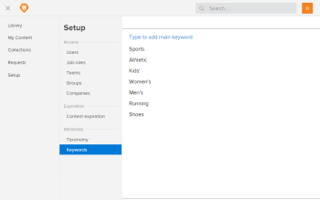

# Add keywords to metadata in Workfront Library

>[!IMPORTANT]
>
>You're currently viewing the Adobe Workfront Classic version of this document. Adobe Workfront Classic is no longer supported. All Adobe Workfront Classic functionality, along with this documentation, will be removed in July 2022. Please transition to the the new Adobe Workfront experienceas soon as possible, and switch to the new Adobe Workfront experience version of this document.

Keyword metadata consists of terms that describe the attributes and content of an asset. Users select keywords from the picklist when they upload content to Workfront Library. Only keywords in the keyword picklist can be added to content's metadata. For more information about keywords, see [Overview of keyword metadata in Workfront Library](../../../workfront-library/administration-and-setup/metadata/keyword-metadata-overview.md)

As a Workfront Library administrator, you can keep your organization's keyword metadata consistent by configuring a keyword picklist.

1. In Workfront, click the **Workfront Library** icon on the Global Navigation Bar to open Workfront Library in a new browser tab.
1. In the upper-left corner of Workfront Library, click the **Menu** icon .
1. In the left panel, click **Setup**> **Keywords**.
1. Click **Type to add main keyword,** type the term you want to add, then press **Enter**.

   

   You cannot enter a term that is already in the keyword list. 

1. (Optional) To add a child keyword:

   1. Hover over the main keyword and select the Add Keyword icon.
   1. Click **Type to add keyword under**, type the child keyword, then press **Enter**.
   
   1. Repeat Step 5 to add additional child keywords to the main keyword.

   >[!TIP]
   >
   >You can further refine the keyword structure by adding child keywords to the child keywords, and so on.

When you exit the keyword setup area, the keywords rearrange to display in alphabetical order.
