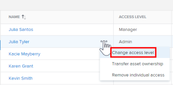
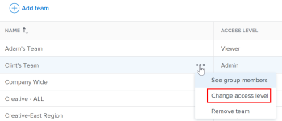

# Change a user's access to Workfront Library

As a Workfront Library administrator, you can change a user's access level in order to increase or decrease the permissions they have to content in Workfront Library. If a user has multiple access sources, their access level is determined by the highest access level they've been assigned. For information on the permissions allowed in each access level, see [Permissions in Workfront Library](../../../workfront-library/administration-and-setup/user-access/permissions-in-workfront-library.md). For information on user access, see [Overview of user access to Workfront Library](../../../workfront-library/administration-and-setup/user-access/user-access-overview.md)

## Change individual access

When you change a user's individual access to Workfront Library, any access that the user has through a user grouping is not affected.

1. In Workfront, click the Workfront Library icon on the Global Navigation Bar to open Workfront Library in a new browser tab. 
1. In the upper-left corner of Workfront Library, click the `Menu` icon.
1. In the left panel, click `Setup` > `Users`.
1. Hover over a user's row, click the More menu next to the user's name, and select `Change access level` from the drop-down list that appears.

   

1. In the `Change individual access` drop-down menu, select the access level you want to assign the user, then click `Change access`.

## Change user grouping access

When you change the access level of a user grouping, you change the access of the users who are members of the grouping.

1. In Workfront, click the Workfront Library icon on the Global Navigation Bar to open Workfront Library in a new browser tab. 
1. In the upper-left corner of , clickWorkfront Library the `Menu` icon.
1. In the left panel, click `Setup`, then in the `Access` section, select the type of user grouping that you want to change access for:

  * Job Roles
  * Teams
  * Groups
  * Companies

   A list of the user groupings in Workfront Library displays.

1. Hover over the user grouping's row, click the More menu, and select `Change access level` from the drop-down list that appears.

   

1. In the drop-down menu, select the access level you want to assign the user grouping, then click `Change access`.

   The access level of the user grouping updates.

