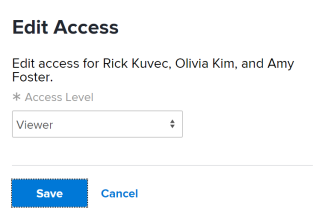

# Give users access to a Workfront Library portal

Before users can open a Workfront Library portal, they must be given access to the portal. As a user with Manage access or higher to a portal, you can grant users the following types of access to the portal.

* `Individual`: Access that you grant to individual users
* `User grouping`: Access that users receive through their membership in a user grouping that you've added to the portal

When you add individual users and user groupings to a portal, you assign them an access level, which defines the activities that users can perform on content in the portal. For information on the permissions allowed for each access level, see [Permissions in Workfront Library](../../../workfront-library/administration-and-setup/user-access/permissions-in-workfront-library.md).

For information on setting up a portal, see [Set up a portal in Workfront Library](../../../workfront-library/administration-and-setup/workfront-library-setup/set-up-a-portal-in-library.md).

## Add users to a portal

1. In Workfront, click the Workfront Library icon on the Global Navigation Bar to open Workfront Library in a new browser tab. 
1. In the upper-left corner of Workfront Library, click the `Menu` icon.
1. In the left panel, click `Portals`.

   

1. Select the portal to which you want to add users.

   The portal opens.

1. Click the `Menu` icon in the upper-left corner of the portal, then click `Setup` > `Users`.
1. Click `Add`.
1. In the `Search` box, begin typing the name of the user to whom you want to give access, then select the user's name when it displays in the dropdown menu.
1. Repeat step 7 until you have selected all the users you want to add.

   Users are automatically assigned Viewer access to the portal.

1. (Optional) Assign a different access level to the users.

  1. Select the user or users for whom you want to change access, then click `Edit`.

     The Edit Access dialog box opens.

     

  1. In the `Access Level` drop-down menu, select the desired access level.

1. Click `Save.`

   The users are added to the portal.

   Workfront Library sends the users an email with a link to the portal.

## Add user groupings to a portal

Users can inherit access to a portal through a Workfront user grouping that you've added to the portal.

You can add the following Workfront user groupings to a portal:

* Job roles
* Teams
* Groups
* Companies

When you add a user grouping, all members of that grouping are given access to the portal.

Any user grouping that you add to the portal must first exist and be populated with users in Workfront.

1. In Workfront, click the Workfront Library icon on the Global Navigation Bar to open Workfront Library in a new browser tab. 
1. In the upper-left corner of Workfront Library, click the `Menu` icon.
1. In the left panel, click `Portals`.

   

1. Select the portal to which you want to add a user grouping.

   The portal opens.

1. Click the `Menu` icon in the upper-left corner of the portal, then click `Setup`. 
1. Click the type of user grouping you want to give access to, then click `Add`.
1. In the `Search` box, begin typing the name of the user grouping you want to add and select the grouping name when it displays in the drop-down menu.

   The user grouping now has access to the portal and is automatically assigned Viewer access. All members of the grouping receive an email inviting them to see the content shared with them through the portal.

1. (Optional) Assign a different access level to the user grouping.

  1. Select the user grouping that you want to change access to, then click `Edit`.
  1. In the `Access Level` dropdown menu, select the desired access level.
  1. Click `Save`.

1. (Optional) To view who is in a user grouping, select the desired grouping, then click the arrow next to the grouping's name.

