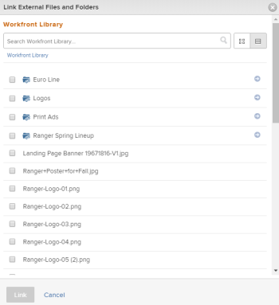

# Add a Workfront Library asset to Workfront

>[!IMPORTANT]
>
>You're currently viewing the Adobe Workfront Classic version of this document. Adobe Workfront Classic is no longer supported. All Adobe Workfront Classic functionality, along with this documentation, will be removed in July 2022. Please transition to the the new Adobe Workfront experienceas soon as possible, and switch to the new Adobe Workfront experience version of this document.

You can add a document that resides in your My Content area to a project, task, or issue in Workfront. In order to add a document to Workfront from Workfront Library, you must have the following permissions:

* Manage access to the document in Workfront Library
* Access to the Workfront object to which you want to add the document

When you add a document from Workfront Library to Workfront, Workfront creates a copy of the document. This copy is not linked to the document in Workfront Library, and changes made to one copy of the document are not updated in the other copy. Additionally, if you send a new version of a document that is already in Workfront, the new version is uploaded as a separate file with the same name as the original version.

To learn how to send a document from Workfront to Workfront Library, see [Send documents from Workfront to Workfront Library](../../workfront-library/content-management/send-documents-from-wf-to-library.md).

1. In Workfront, navigate to the Documents tab of the object where you want to add a document from Workfront Library.
1. Click **Add New**.

   

1. In the drop-down menu, click **From Workfront Library**.

   

1. In the **Link External Files and Folders** dialog box, navigate to the document you want to add to Workfront, and select it.
1. Repeat Step 4 to add multiple documents to a Workfront object.
1. Click **Link**.

   Workfront adds the document to the Workfront object. On the Documents tab for the Workfront object, any documents added from Workfront Library display the Workfront icon.

