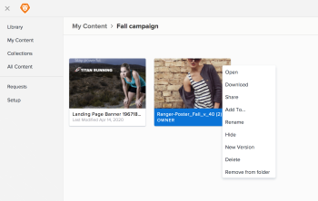

# Remove an asset from a folder

If you have manage access to an asset, you can remove it from a folder.

1. In Workfront, click the **Workfront Library** icon on the Global Navigation Bar to open Workfront Library in a new browser tab. 
1. In either the **Library** or **My Content** area, find the folder and double click to open it.

1. Find the asset you want to remove, then right click and select **Remove from folder**.  
   

1. In the dialog box, click **Remove**.

   >[!NOTE]
   >
   >If the asset exists in one place, removing from the folder also removes it from the Library.

