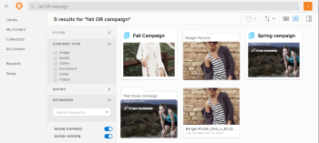

# Search for items in Workfront Library

>[!IMPORTANT]
>
>You're currently viewing the Adobe Workfront Classic version of this document. Adobe Workfront Classic is no longer supported. All Adobe Workfront Classic functionality, along with this documentation, will be removed in July 2022. Please transition to the the new Adobe Workfront experienceas soon as possible, and switch to the new Adobe Workfront experience version of this document.

If your Workfront Library administrator set up content metadata, you can quickly find the content you want by searching for names and metadata. For more information about metadata, see [Overview of metadata in Workfront Library](../../../workfront-library/administration-and-setup/metadata/metadata-overview.md).

## Understand searching for content

You can search Workfront Library and the entire Workfront platform for items to which you have permissions. Portal users can search only for items in the portal.

You can search for the following items:

* Content
* Folders
* Collections

When you search for items, you can query for different types of metadata, such as file name, subject matter, and keywords. You can also search for folder names and collection names.

>[!NOTE]
>
>If your Workfront Library administrator has not configure metadata for content in Workfront Library, then Workfront Library searches only for asset names, folder names, and collection names.

If you are searching for content that has multiple versions, you can search only for the metadata associated with the active (or current) version of the content. Metadata for older versions is not searchable. For more information about content versions, see [Overview of content versioning in Workfront Library](../../../workfront-library/content-management/content-versioning/content-versioning-overview.md).

Users with Viewer access to Workfront Library or to a portal can search for:

* Content shared with them

Users with Manager access to Workfront Library or to a portal can search for:

* Content shared with them
* Content that they uploaded
* With the Show Expired filter enabled, expired content that they have permissions to
* With the Show Hidden filter enabled, hidden content that they have permissions to

Workfront Library looks for matches based on the following relevance order:&nbsp;

1. File names: Because the file name is searched for first, we recommend that your organization use a consistent file naming convention.&nbsp; 
1. Keywords: For more information about keywords, see [Overview of keyword metadata in Workfront Library](../../../workfront-library/administration-and-setup/metadata/keyword-metadata-overview.md).
1. Taxonomy fields: For more information about taxonomy, see [Overview of taxonomy metadata in Workfront Library](../../../workfront-library/administration-and-setup/metadata/taxonomy-metadata-overview.md).

The returned search results usually consists of content with metadata that exactly matches your query terms and with items that have file names that are partial matches.

For example, if you enter the word "map" in a search query, you get the following results:

* Items with the letters "map" in the file name, such as a collection named Red Maple Dress Campaign
* Content associated with the keyword "map"
* Content with the word "map" in its taxonomy

Content with metadata that contain "maps" (plural) are not included in the search results because they are not an exact match. You can use operators to refine your search returns and filters to narrow the results. For more information, see [Use search operators to refine a search](#use-search-operators-to-refine-a-search).

## Use search operators to refine a search {#use-search-operators-to-refine-a-search}

You can expand or refine your search in Workfront Library or in a portal by using search operators.

The following table lists the available search operators.

<table cellspacing="15"> 
 <col> 
 <col> 
 <thead> 
  <tr> 
   <th>Operator</th> 
   <th>Description</th> 
  </tr> 
 </thead> 
 <tbody> 
  <tr> 
   <td>* (Asterisk)</td> 
   <td> 
Use to find partial matches. The operator must be placed at the end of the search term.
 
Example: map* 
 
Returns items with the letters "map" in the name or metadata, such as <strong>map</strong>s, <strong>map</strong>le, photo<strong>map</strong>ping.
 </td> 
  </tr> 
  <tr> 
   <td>AND</td> 
   <td> 
Use to return results that contain multiple search terms. 
 
Example: dress AND Hawaiian
 
Returns items with both "dress" and "Hawaiian" in the name or metadata. The terms can be in any order. 
 </td> 
  </tr> 
  <tr> 
   <td>OR</td> 
   <td> 
Use to return results that contain one or more of the search terms.&nbsp;
 
Example: casual OR formal
 
Returns items with either "casual" or "formal", or both "casual" and "formal" in the name or metadata.
 </td> 
  </tr> 
  <tr> 
   <td>NOT</td> 
   <td> 
Use to return results that do not contain the search terms.
 
Example: dress NOT formal
 
Returns items with "dress", but without "formal" in the name or metadata.
 </td> 
  </tr> 
  <tr> 
   <td>Phrase</td> 
   <td> 
Use to search for content with metadata containing a specific phrase encased by double quote marks.&nbsp;
 
Example: "summer sale ad"
 
Returns items with "summer sale ad" in the name or metadata.
 </td> 
  </tr> 
 </tbody> 
</table>

## Search for items in Workfront Library

1. In Workfront, click the **Workfront Library** icon on the Global Navigation Bar to open Workfront Library in a new browser tab.
1. In the upper-left corner of Workfront Library, click the **Menu** icon .
1. Select the area where you want to search.

   Depending on your access level to Workfront Library, you might be able to search from the following areas:

   * **Library**: Search for items shared with you
   * **My Content**: Search for items that you uploaded to Workfront Library
   * **Collections**: Search for items in collections that you created or that were shared with you

   Workfront searches through all the files, folders, and sub-folders in the area you select for the search.

1. (Optional) To search within a folder or collection, navigate to and open the folder or collection.
1. In the **Search** box in the upper-right corner, type the search terms and any applicable search operators.

   Search terms are not case-sensitive.

1. (Optional) To perform the same search in Workfront, click **Search Workfront** in the Search list.

   Workfront opens in a new browser window. For more information on performing a search Workfront, see [Search Adobe Workfront](../../../workfront-basics/navigate-workfront/search/search-workfront.md).

1. Press **Enter** to start the search.

   The search results display.

1. (Optional) Filter the search results.

   1. Click the **Filter** icon in the upper-right area of the screen.

      

      The Filter panel opens and displays facets and keywords that allow you to filter the search results based metadata applied to the content.
   
   1. In the Filter panel, select the filters and keywords you want to apply.

      

      The filtered results display.

1. (Optional) To close the Filter panel, click the **X** at the upper-right corner of the panel.

## Search for items in a portal

1. Open the portal. For information on opening a portal, see [Open a Workfront Library portal](../../../workfront-library/content-management/basics/open-a-portal.md).
1. (Optional) To search within a folder or collection, navigate to and open the folder or collection.
1. In the **Search** box in the upper-right corner, type the search terms and any applicable search operators, then press **Enter**.

   Search terms are not case-sensitive.

1. (Optional) To filter the search results:

   1. Click the **Filter** icon in the upper-left corner of the results area.

      The Filter panel opens and displays facets and keywords that allow you to filter the search results based metadata applied to the content.
   
   1. Select the filters and keywords you want to apply.

1. (Optional) To close the Filter panel, click the **X** at the upper-right corner of the panel.

