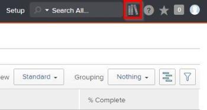
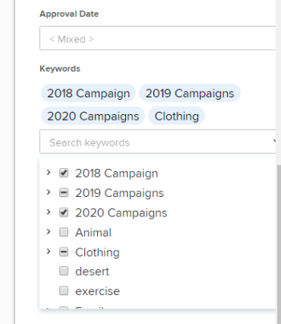

# Bulk edit metadata in Workfront Library

Metadata consists of information that describes the attributes and content of an asset. Users can edit the metadata of multiple assets at once. For more information about metadata, see [Overview of Metadata in Workfront Library](../../workfront-library/administration-and-setup/metadata/metadata-overview.md).

To bulk edit metadata:

1. In Workfront, click the **Workfront Library** icon on the Global Navigation Bar to open Workfront Library in a new browser tab.

   

   In Workfront, click the **Workfront Library** icon on the Global Navigation Bar to open Workfront Library in a new browser tab.

1. In the upper-left corner of Workfront Library, click the **Menu** icon.
1. Select the area where the asset is located:

   * **Library** 
   * **My Content** 
   * **Collections**

1. On your keyboard, hold the **CTRL** key—or **COMMAND** key for Mac users—and click on each thumbnail of the asset you would like to edit metadata for.
1. After selecting all assets, click the **Details Slideout** icon in the upper-right corner to display the metadata details for the selected assets.
1. In the Details slideout, click **Edit**.

   Any changes you make during these edits are applied to all selected assets. If the selections for a field vary between assets, the text “Mixed” appears in the field.

1. (Optional) Enter a new **Expiration Date** or click the **No Date** checkbox. When the assets reach the expiration date, users with View access can no longer see the content.
1. Make changes to the remainder of the metadata fields to update all selected assets.

   >[!NOTE]
   >
   >Depending on the type of field you're updating, you make changes differently.    >
   >   
   >   
   >   * **Date**: To change a date, click the field and select a date from the pop-up that appears.
   >   * **Multi-select**: To add a new option, click the field, then select each desired option from the drop-down menu. To remove already selected options, click the X. The selected options for an asset display in the field with the number of assets these options apply to.
   >   * **Single-select**: To add a new option, click the field, then select the desired option.
   >   * **Text Field**: To add a new option, enter text in the field.
   >   
   >

1. In the **Keywords** area, the keywords for all selected assets display. Click the drop-down to select or deselect keywords for all selected assets.

   If a keyword is applied to all assets, a check mark appears in the checkbox. If a keyword is applied to only some of the selected assets, a dash appears in the checkbox.

   

1. When finished, scroll to the top of the Details slideout and click **Save**.

