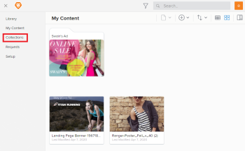
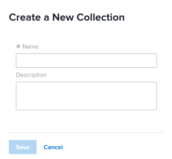

# Edit a Workfront Library collection

>[!IMPORTANT]
>
>You're currently viewing the Adobe Workfront Classic version of this document. Adobe Workfront Classic is no longer supported. All Adobe Workfront Classic functionality, along with this documentation, will be removed in July 2022. Please transition to the the new Adobe Workfront experienceas soon as possible, and switch to the new Adobe Workfront experience version of this document.

You can make the following changes to a collection that you have Manage access to:

* Name of the collection
* Description
* Cover image

```<li> <p data-mc-conditions="QuicksilverOrClassic.Classic">In Workfront, click the <strong>Workfront Library</strong> icon on the Global Navigation Bar to open Workfront Library in a new browser tab.</p> </li>``` For information on changing a collection's cover image, see [Change the cover image on an item in Workfront Library](../../../workfront-library/content-management/change-cover-image-of-folder.md).

When you edit a collection that is shared with other users in Workfront Library, the collection's name is automatically updated in all the shared instances. Users are not notified of edits made to a collection.

1. In the upper-left corner of Workfront Library, click the **Menu** icon .
1. Click **Collections** in the left panel.

   

1. Click **New Collection** in the upper-left corner.

   

1. In the **Name** box, type a name for the collection.
1. (Optional) In the **Description** box, type a description of the collection.
1. Click **Save**.

