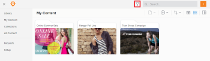
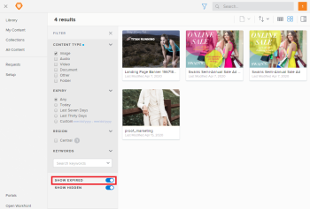

# Filter for expired content in Workfront Library

>[!IMPORTANT]
>
>You're currently viewing the Adobe Workfront Classic version of this document. Adobe Workfront Classic is no longer supported. All Adobe Workfront Classic functionality, along with this documentation, will be removed in July 2022. Please transition to the the new Adobe Workfront experienceas soon as possible, and switch to the new Adobe Workfront experience version of this document.

Depending on how your Workfront Library administrator setup the Expiration feature, you might be able to view expired content by enabling the Show Expired filter. For more information on expired content, see [Set up content expiration in Workfront Library](../../../workfront-library/administration-and-setup/workfront-library-setup/set-up-content-expiration-in-library.md).

1. In Workfront, click the **Workfront Library** icon on the Global Navigation Bar to open Workfront Library in a new browser tab.
1. Click the **Filter** icon.  
   

   >[!TIP]
   >
   >Depending on the view you have activated, the name displayed on the Content View drop-down menu can be either Name, Relevant, or Last Modified.

1. In the **Filter** menu, enable the **Show Expired** toggle.

   

   You can now view expired content. The Show Expired filter affects only your instance of Workfront Library and does not make expired items visible for other users.

