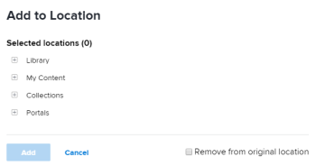

# Relocate assets in Workfront Library

>[!IMPORTANT]
>
>You're currently viewing the Adobe Workfront Classic version of this document. Adobe Workfront Classic is no longer supported. All Adobe Workfront Classic functionality, along with this documentation, will be removed in July 2022. Please transition to the the new Adobe Workfront experienceas soon as possible, and switch to the new Adobe Workfront experience version of this document.

When you no longer want an item in a folder or in your My Content area, you can relocate it by first adding it to a new location and then removing it from its original location. You can relocate only items to which you have Manage access.

1. In Workfront, click the **Workfront Library** icon on the Global Navigation Bar to open Workfront Library in a new browser tab.
1. In the upper-left corner of Workfront Library, click the **Menu** icon .
1. Select the area where the item you want to remove is located.

   You can choose My Content or Collections.

   

1. (Conditional) If you are in the list view, click the **Show grid view** icon  to switch to the grid view.
1. Navigate to the item, hover over it and click the **More** icon in the upper-right corner of the item.
1. Select **Add To** in the drop-down menu.

   

1. Click the plus sign next to the location where you want to relocate the item.
1. (Optional) Continue to open folders until you locate where you want to move the item.
1. Click **Remove from original location** to remove the item from where you accessed it in Step 4.
1. Click **Move**.

   The item is added to the new location and removed from the original location.

   >[!NOTE]
   >
   >If the item you relocated was used as the cover image on a folder or a collection, it remains as the cover image even though the item is relocated.

