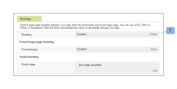
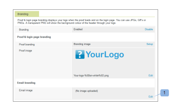
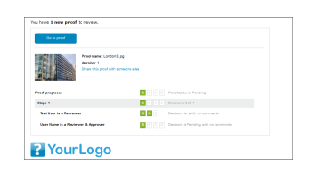

# Brand the Workfront Proof site

>[!IMPORTANT]
>
>This article refers to functionality in the standalone product Workfront Proof. For information on proofing inside Adobe Workfront, see [Proofing](../../../review-and-approve-work/proofing/proofing.md).

As a Workfront Proof administrator, you can brand your Workfront Proof account to give you and your users a more customized experience.

Basic account branding is available on all plans at no additional cost.

For information about advanced branding, which includes branding the header, menu bar, dashboard, and more, see [Brand the Workfront Proof site - advanced](../../../workfront-proof/wp-acct-admin/branding/brand-wp-site-advanced.md).&nbsp;Advanced branding is available only on Select and Premium plans

See the following sections for information about how to brand various aspects of the Workfront Proof site:&nbsp;

## Enabling Branding on the Workfront Proof Login Page

To enable branding on your account:

1. Log in to Workfront Proof as the Workfront Proof administrator.
1. Click **Account Settings** in the upper-right corner of the Workfront Proof interface.

   For more information about the various account settings you can configure, see&nbsp; [Account settings.](https://support.workfront.com/hc/en-us/sections/115000912147-Account-Settings)

1. Click the **Settings** tab.
1. In the **Branding** section, click&nbsp;**Enable**. (1)

   

   The branding image now appears on your login page.

   >[!NOTE]
   >
   >The branding image does not appear on your login page if you access via the main Workfront Proof login URL. For example, https://www.proofhq.com/login. It shows only if you access the login page via your custom sub-domain or your fully branded domain.&nbsp;To access your custom login page, just type your account URL into your browser. For example, http://<yoursubdomain>.proofhq.com. For more information about fully branded domains, see "Fully Branded Domains" in the article [Configure a branded domain in Workfront Proof](../../../workfront-proof/wp-acct-admin/branding/configure-branded-domain-in-wp.md).

   

## Enabling Branding on Proofs

To add your own branding image to the proof loading page of every proof created in your account:

1. Log in to Workfront Proof as the Workfront Proof administrator.
1. Click **Account Settings** in the upper-right corner of the Workfront Proof interface.

   For more information about the various account settings you can configure, see&nbsp; [Account settings.](https://support.workfront.com/hc/en-us/sections/115000912147-Account-Settings)

1. Click the **Settings** tab.
1. In the **Branding** section, click **Setup** next to **Proof branding**. (1)

   

1. From the drop-down menu select **Branding image**.  
   If you select **Disable**, the Workfront Proof logo appears on the proof loading page

1. Click **Save**. (3)

   

1. Click **Edit** to select the branding image (4).

   You can use&nbsp;JPGs, GIFs, or PNGs. Transparency is supported. The recommended image size is 150x300px. Your image on the login and logout pages will be resized to these dimensions.

   

1. Select the image you want to upload. (5)
1. Click **Save**.

   Your branding image now shows on the proof loading page of every proof created in your account.

   

## Branding Email Notifications

You can configure your branding image to be included on email notifications sent to reviewers. This image is resized to the maximum size of&nbsp;90x550px.

To set up email branding:

1. Log in to Workfront Proof as the Workfront Proof administrator.
1. Click **Account Settings** in the upper-right corner of the Workfront Proof interface.

   For more information about the various account settings you can configure, see&nbsp; [Account settings.](https://support.workfront.com/hc/en-us/sections/115000912147-Account-Settings)

1. Click the **Settings** tab.
1. In the **Branding** section, click **Edit** next to the Email application image (1).  
   

1. Select the image you want to use for branding the emails. (2)

   If you have an email branding already configured and you want to disable it, click **Clear**. (4)

   

1. Click **Save.**

   The image now appears on all proof notifications emails. (3)

   

<!--
<h2 data-mc-conditions="QuicksilverOrClassic.Draft mode">Custom Sub-Domains</h2>
-->

<!--

You can add your brand name to your Workfront Proof account URL. For example, your URL might look like this:

-->

<!--

<strong>http://yoursubdomain.proofhq.com</strong> 

-->

<!--

This customization is also included in all your proof links, as well as in the 'From' email address for your proof notifications.

-->

<!--

For more information on how to set up a branded sub-domain, see <a href="../../../workfront-proof/wp-acct-admin/branding/configure-branded-domain-in-wp.md" class="MCXref xref">Configure a branded domain in Workfront Proof</a>

-->

## Suppression of Buttons and Links via the API

If you create a proof via the Workfront Proof API, you can suppress buttons and links and create your own custom links.

See [Workfront Proof API](http://api.proofhq.com/) for more information.
