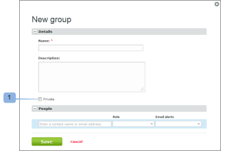
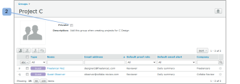

# Make Groups Private using Workfront Proof

>[!IMPORTANT]
>
>You're currently viewing the Adobe Workfront Classic version of this document. Adobe Workfront Classic is no longer supported. All Adobe Workfront Classic functionality, along with this documentation, will be removed in July 2022. Please transition to the the new Adobe Workfront experienceas soon as possible, and switch to the new Adobe Workfront experience version of this document.

>[!IMPORTANT]
>
>This article refers to functionality in the standalone product Workfront Proof. For information on proofing inside Adobe Workfront, see [Proofing](../../../review-and-approve-work/proofing/proofing.md).

Making your group private means that only you will be able to view, use, edit or delete the group. If the group is not private, then all users in your account can see and use the group.

## Setting a New Group to Private

To make a new group private:

1. Go to **Groups** on the left side of the screen.
1. Select the **Private** option on the New group page when setting up the group. (1)

## Setting an Existing Group to Private

To make an existing group private:

1. Go to **Groups** on the left side of the screen.
1. Enable the **Private** option on the Group details page. (2)

