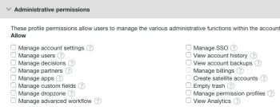
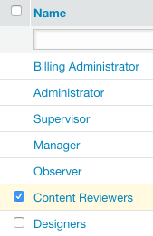

# Create and Manage Custom Profiles using Workfront Proof

>[!IMPORTANT]
>
>You're currently viewing the Adobe Workfront Classic version of this document. Adobe Workfront Classic is no longer supported. All Adobe Workfront Classic functionality, along with this documentation, will be removed in July 2022. Please transition to the the new Adobe Workfront experienceas soon as possible, and switch to the new Adobe Workfront experience version of this document.

>[!IMPORTANT]
>
>This article refers to functionality in the standalone product Workfront Proof. For information on proofing inside Adobe Workfront, see [Proofing](../../../review-and-approve-work/proofing/proofing.md).

Billing Administrators and Administrators can create and manage custom profiles to specify what users can do in your organization's account and in Account settings.&nbsp;

This feature is available only on&nbsp;Premium accounts.

## Module Permissions {#module-permissions}

Module permissions let you decide what access you want your users to have over their own items and over items owned by other users in the account.

Basic access&nbsp;section determines if users can Read, Create, Edit, and Delete their own items in the account.

The Data administration section determines rights users have over items owned by other users in the account.

Both sections allow you to grant rights over the following items in the account:

* Proofs  
  For more information, see [Generate Proofs in Workfront Proof](../../../workfront-proof/wp-work-proofsfiles/create-proofs-and-files/generate-proofs.md).

* Files  
  For more information, see [Upload Files and Web Content to Workfront Proof](../../../workfront-proof/wp-work-proofsfiles/create-proofs-and-files/upload-files-web-content.md).

* Public Folders  
  For more information, see&nbsp; [Understand Folder Permissions in Workfront Proof](../../../workfront-proof/wp-work-proofsfiles/organize-your-work/folder-permissions.md).

* Private Folders  
  For more information, see [Understand Folder Permissions in Workfront Proof](../../../workfront-proof/wp-work-proofsfiles/organize-your-work/folder-permissions.md).

* Contacts  
  For more information, see&nbsp; [Contacts.](https://support.workfront.com/hc/en-us/sections/115000920808-Contacts)

* Groups  
  For more information, see&nbsp; [Groups.](https://support.workfront.com/hc/en-us/sections/115000920828-Groups)

* Tags  
  For more information, see [Create and Manage Tags in Workfront Proof](../../../workfront-proof/wp-work-proofsfiles/organize-your-work/create-and-manage-tags.md).

* Custom Views  
  For more information, see [Create and Manage Custom Views in Workfront Proof Proof](../../../workfront-proof/wp-work-proofsfiles/manage-your-work/create-and-manage-custom-views.md).


## Administrative Permissions {#administrative-permissions}

In this section you are able to grant Administrative permissions to your users. Some permissions link and, when selected, automatically enable other permissions needed to carry out the task. For example, allowing the user to manage permission profiles automatically enables managing users in the account.

You can grant the following permissions:

* Manage Account Settings&nbsp;  
  For information, see&nbsp; [Account settings.](https://support.workfront.com/hc/en-us/sections/115000912147-Account-settings)

* Manage Users   
  For information, see [Users.](https://support.workfront.com/hc/en-us/sections/115000911887-Users)

* Manage Decisions   
  For information, see&nbsp; [Make a decision on a proof in the proofing viewer](../../../review-and-approve-work/proofing/reviewing-proofs-within-workfront/make-a-decision-on-a-proof/make-decisions-on-proof.md).

* Manage partners   
  For information, see [Partners.](https://support.workfront.com/hc/en-us/sections/115000912107-Partner-accounts)

* Manage apps   
  For information, see [Integrations.](https://support.workfront.com/hc/en-us/categories/115000588707-Integrations)

* Manage custom fields   
  For information, see&nbsp; [Create and manage custom fields in Workfront Proof](../../../workfront-proof/wp-acct-admin/account-settings/create-and-manage-custom-fields.md).

* Manage dropzone  
  For information, see&nbsp; [The Dropzone](../../../workfront-proof/wp-work-proofsfiles/create-proofs-and-files/dropzone.md).

* Manage advanced workflow  
  For information, see [Automated Workflow overview](../../../review-and-approve-work/proofing/proofing-overview/automated-workflow.md)."

* Manage SSO   
  For information, see&nbsp; [Single Sign-On in Workfront Proof](../../../workfront-proof/wp-acct-admin/managing-security/single-sign-on-overview.md).

* View account history   
  For information, see&nbsp; [Understanding the Workfront Proof Activity Audit Trail](../../../workfront-proof/wp-work-proofsfiles/basic-features/activity-audit-trail.md).

* View account backups   
  For information, see&nbsp; [Back Up Your Workfront Proof Data](../../../workfront-proof/wp-work-proofsfiles/organize-your-work/back-up-data.md).

* Manage billings  
  For information, see&nbsp; [Manage your billing.](https://support.workfront.com/hc/en-us/sections/115000912187-Managing-your-billing)

* Create satellite accounts  
  For information, see&nbsp; [Configure a satellite account in Workfront Proof](../../../workfront-proof/wp-acct-admin/satellite-accounts/configure-sat-acct-in-wp.md)

* Empty trash  
  For information, see [Restore and Empty the Trash in Workfront Proof](../../../workfront-proof/wp-work-proofsfiles/manage-your-work/restore-and-empty-trash.md).

* Manage permission profiles  
  For information, see&nbsp; [Proof Permissions Profiles in Workfront Proof](../../../workfront-proof/wp-acct-admin/account-settings/proof-perm-profiles-in-wp.md).

* View Analytics



## Creating a New Custom Profile

1. Navigate to **Account Settings,**&nbsp;then click the **Profiles** tab.&nbsp;

1. Click **Create****New profile.**

1. In the **Profile Details**section:

   1. In the **Name** field, specify a name for the custom profile.&nbsp;
   1. Select&nbsp;**Enable profile.** 

1. In the&nbsp;**Module permissions** section:

   1. Select permissions for&nbsp;**Basic access.**
   1. &nbsp;**Data administration.**For more information, see&nbsp; [Module Permissions](#module-permissions)

1. In the&nbsp;**Administrative permissions**section, select permissions for administrative functions.

   For more information, see&nbsp; [Administrative Permissions](#administrative-permissions).

1. Click **Create**.  
   The new profile is now available on the **Users** tab.

1. (Optional)&nbsp;Assign the new profile to new and existing user accounts.  
   For more information, see " [Proof Permissions Profiles in Workfront Proof](../../../workfront-proof/wp-acct-admin/account-settings/proof-perm-profiles-in-wp.md).

## Enabling and Disabling a Profile {#enabling-and-disabling-a-profile}

1. Navigate to **Account Settings, then**&nbsp;click on the **Profiles** tab.&nbsp;

1. Select the profile you want to enable or disable.   
   Or  
   To enable or disable multiple profiles simultaneously, select the profiles manually, or select&nbsp;**Name**to select all custom profiles.  
   

1. Click the **More**drop-down menu, then click either of the following options, depending on whether you want to enable or disable the profile:&nbsp;&nbsp;

   * **Enable profiles:** The profile becomes active and visible in the Workfront Proof menus.
   * **Disable profiles:** A&nbsp;confirmation box appears. Select&nbsp;**Yes**to confirm. The profile becomes inactive and is removed from the Workfront Proof menus.

     >[!NOTE]
     >
     >A disabled profile can no longer be assigned to users in the account. If users with that profile exist in the account, select a different profile for them before the profile is disabled.

     

## Copying a Profile

Create copies of an existing profile to set up multiple profiles with similar permissions.&nbsp;

1. Navigate to **Account Settings**, then&nbsp;click the **Profiles** tab.

1. ``` Click the name of the profile and click the&nbsp;**Copy profile**button.  
     
   The copied profile now appears on the profiles list. It has the original profiles name with the word "Copy" before it.  
     
   ``` 
1. (Optional) To enable the copied profile, see [Enabling and Disabling a Profile](#enabling-and-disabling-a-profile).
1. (Optional) To make edits to the copied profile, see [Editing a Profile](#editing-a-profile).

## Editing a Profile {#editing-a-profile}

If you edit a profile, updates are applied to all users who this profile is currently assigned to.&nbsp;

1. Navigate to&nbsp;**Account settings**, then&nbsp;click the&nbsp;**Profiles**tab.&nbsp;

1. Click the profile name you want to edit.
1. Make any needed changes to the name or permissions on the profile. These changes save and update automatically.  
   For more information about permissions, see [Module Permissions](#module-permissions) and [Administrative Permissions](#administrative-permissions).

>[!NOTE]
>
>&nbsp;Default Workfront Proof profiles are visible in the list of profiles but cannot be modified.

## Deleting a Profile

1. Navigate to **Account settings**, then&nbsp;click the **Profiles** tab.&nbsp;

1. Select the profile or profiles you want to delete.
1. Click the&nbsp;**Trash**icon at the top of the page.  
   

1. Click&nbsp;**Yes**in the&nbsp;**Confirm dialog**box that appears.

1. If the profile is assigned to a user, use the drop-down menu in the dialog box to select a different profile to assign to this user. Click&nbsp;**Yes**to confirm.  
   

>[!NOTE]
>
>&nbsp;It is not possible to delete standard profiles from the account. It is possible to disable standard profiles if you don't want to use them in your account.

For more information on disabling profiles, see [Enabling and Disabling a Profile](#enabling-and-disabling-a-profile).
