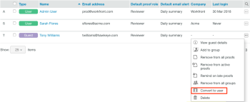

# Create Users using Workfront Proof

>[!IMPORTANT]
>
>You're currently viewing the Adobe Workfront Classic version of this document. Adobe Workfront Classic is no longer supported. All Adobe Workfront Classic functionality, along with this documentation, will be removed in July 2022. Please transition to the the new Adobe Workfront experienceas soon as possible, and switch to the new Adobe Workfront experience version of this document.

>[!IMPORTANT]
>
>This article refers to functionality in the standalone product Workfront Proof. For information on proofing inside Adobe Workfront, see [Proofing](../../../review-and-approve-work/proofing/proofing.md).

As a Workfront Proof administrator, you can create new users.

For information about administrator rights, see [Proof Permissions Profiles in Workfront Proof](../../../workfront-proof/wp-acct-admin/account-settings/proof-perm-profiles-in-wp.md).

>[!NOTE]
>
>We do not recommend adding third parties to your own account.

You can create a user from scratch or you can convert a Guest to a licensed user.&nbsp;

## Creating a User

1. Do any of the following to begin creating a user:

   * Click the drop-down menu arrow next to&nbsp;**New proof**,&nbsp;then click&nbsp;**New user**.
   
   * Click **Settings** > **Account Settings**, then click **+New User**.
   
   * Click&nbsp;**Contacts**in the left navigation menu,&nbsp;click**+**&nbsp;**New**, then click&nbsp;**New user**.* 
     *The New User dialog box displays.

1. In the **New User** box that appears, type the person's information and set configuration options as described in&nbsp; [Configure User Information using Workfront Proof](../../../workfront-proof/wp-mnguserscontacts/users/configure-user-info.md).

1. Click&nbsp;**Create.**

## Converting a Guest to a User

Guests are users who do not have a licensed Workfront Proof account. If a Guest upgrades to a licensed user account, you need to manually convert a Guest account into a licensed user.&nbsp;

For more information on Guests and users, see [Understand Users, Members, and Guests in Workfront Proof](../../../workfront-proof/wp-mnguserscontacts/contacts/use-members-guests.md).&nbsp;

1. Click **Contacts** in the left navigation menu.
1. Click the&nbsp;**More**&nbsp;icon to the right of the Guest who you want to convert to a user, then click&nbsp;**Convert to user**.  
     

1. In the **New User** dialog box that displays, set configuration options for the user, as described in&nbsp; [Configure User Information using Workfront Proof](../../../workfront-proof/wp-mnguserscontacts/users/configure-user-info.md).

1. Click&nbsp;**Convert to User.**&nbsp;

