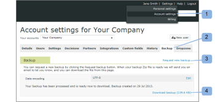

# Back Up Your Workfront Proof Data

>[!IMPORTANT]
>
>You're currently viewing the Adobe Workfront Classic version of this document. Adobe Workfront Classic is no longer supported. All Adobe Workfront Classic functionality, along with this documentation, will be removed in July 2022. Please transition to the the new Adobe Workfront experienceas soon as possible, and switch to the new Adobe Workfront experience version of this document.

>[!IMPORTANT]
>
>This article refers to functionality in the standalone product Workfront Proof. For information on proofing inside Adobe Workfront, see [Proofing](../../../review-and-approve-work/proofing/proofing.md).

## Introduction to backups

You can request a backup of all of your data in Workfront Proof using the backup function. &nbsp;

The backup is delivered to you as a .zip file. It includes an XML export of all of your data (including comments and responses for all versions of all proofs); however, it does not include the original files that you uploaded as proofs.

Each backup .zip file created for you to download has a unique file name, such as:

9789_05_05_2011_61703.zip

The filename in this example provides the following information:

* 9789 is your Workfront Proof account identifier
* 05_05_2011 is the creation date, 5 May 2011
* 61703 is a random system-assigned number

This naming convention makes it easy for you to store all your backup .zip files in a single location on your computer and to know exactly when each backup was created for you.

The Backup function lets you decide how to use your resources:

* Allows you to free up storage space without losing your active or archived proofs. You can request a backup, delete the proofs, and then empty the [Restore and Empty the Trash in Workfront Proof](../../../workfront-proof/wp-work-proofsfiles/manage-your-work/restore-and-empty-trash.md).
* Allows you to access any files that you originally uploaded to Workfront Proof. You can download them using the download original file function before deleting the proofs.

>[!NOTE]
>
>Consider the following when using backups: 
>
>* Backups are available on Enterprise and Unlimited plans. Please contact our [sales team](mailto:sales@proofhq.com) for a quote. 
>* The data encoding type is set to the UTF-8 by default and we do recommend this setting. This is the encoding type most commonly used by Internet applications. 
>* You can request only one backup at a time. When your backup .zip file is being processed, the Request new backup link on the Backups tab will not appear, and the message shown remains unchanged. For information on requesting a backup, see [Request a new data backup in Workfront Proof](../../../workfront-proof/wp-acct-admin/account-settings/request-new-data-backup-in-wp.md). 
>

## Backing up your data

1. Click **Account settings** in the upper-right corner of the Workfront Proof interface. (1)
1. Click the **Backups** tab.&nbsp;(2)
1. Click the **Request new backup** link (3)

When your backup is ready, the following occurs:

* You receive an email from Workfront Proof notifying you of this ("Your Workfront Proof backup is ready"). The email contains a download link for your backup data.
* The [Account settings](https://support.workfront.com/hc/en-us/sections/115000912147-Account-settings) Backup tab displays a download link for your backup data.
* The Request new backup link (3) reappears on the Backups tab

Your data will be ready to download as a zip file. You can download the backup .zip file either from the notification email or in the account settings, as described in the following sections:

* [Downloading your backup .zip file from your email notification](#downloading-your-backup-zip-file-from-your-email-notification) 
* [Downloading your backup .zip file from the account settings](#downloading-your-backup-zip-file-from-the-account-settings)

## Downloading your backup .zip file from your email notification {#downloading-your-backup-zip-file-from-your-email-notification}

When your backup .zip file is ready to download, you receive an email from Workfront Proof with the subject line 'Your Workfront Proof backup is ready.'

To download the backup .zip file from the email:

1. Click the download link in the email.  
     
   If you are not currently logged in to Workfront Proof, a new browser window opens and displays the login page.

## Downloading your backup .zip file from the account settings {#downloading-your-backup-zip-file-from-the-account-settings}

When your backup .zip file is ready to download, the Backup tab indicates this by displaying a download link. In addition, the Request new backup link appears again.

1. Click **Account settings** in the upper-right corner of the Workfront Proof interface. (1)
1. Click the **Backups** tab.&nbsp;(2)  
   If no users in your account have requested any backups, the Backups tab indicates that you have no backups. If a user has requested a backup, the tab&nbsp;displays the creation date and download link for the last backup.

1. Click the **Download backup** link. (3)  
   A File Download screen appears, asking if you want to Open or Save the download file.

1. Click **Save**, then select the location on your computer where you want to save the backup .zip file.  
   The message identifying the date of your most recent backup remains displayed at the bottom of the Backup page until the next time you request a backup. The Download backup link applies to that last backup. Whenever the Request new backup link is displayed, you can click it to request another backup.

## Understanding the files in your backup .zip file

Your backup .zip file contains seven CSV (comma-separated value or comma delimited) files that include information from your active and archived proofs up to the time your data was backed up:

* comments.csv - includes comments on proofs
* comment_replies.csv - includes responses to comments on proofs organisation.csv - includes numeric identifier and name of your organization (your account)
* contacts.csv - includes numeric identifier, name, and organization for each contact
* files.csv - includes information from the Proof Details page or the File Details page on proofs or files uploaded to Workfront Proof
* recipients.csv - includes numeric identifier, role, and decisions of each person specified as a reviewer, reviewer and approver, etc., when proofs are uploaded for review on Workfront Proof
* users.csv - includes numeric identifiers and names of all users in the account

You can extract these files from the backup .zip file with whatever zip utility you use, then store them in the location of your choice on your computer. After you save the zip file and extract the individual CSV files, you can manipulate the information as desired for your internal record keeping.

Each backup .zip file created at your request has a distinctive name that includes the backup creation date, but the CSV files included in each backup .zip file always have the same names. You might want to use one of the following methods to ensure your backup files are distinct from each other:

* Create a new folder for each backup .zip file and the CSV files you extract from it.
* Rename each individual CSV file to include the backup date when you extract it from the zip file.

>[!NOTE]
>
>&nbsp;If Microsoft Excel is installed on your computer, your extract utility might list the file type for the individual CSV files as Microsoft Office Excel Comma Separated Values File.&nbsp;You can open an extracted CSV file using Excel and save the file as an Excel workbook (&#42;.xlsx) or some other file type.

