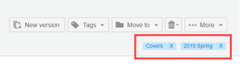
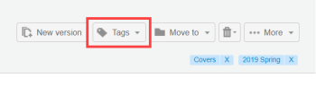
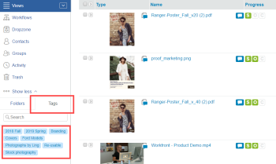

# Create and Manage Tags in Workfront Proof

>[!IMPORTANT]
>
>You're currently viewing the Adobe Workfront Classic version of this document. Adobe Workfront Classic is no longer supported. All Adobe Workfront Classic functionality, along with this documentation, will be removed in July 2022. Please transition to the the new Adobe Workfront experienceas soon as possible, and switch to the new Adobe Workfront experience version of this document.

>[!IMPORTANT]
>
>This article refers to functionality in the standalone product Workfront Proof. For information on proofing inside Adobe Workfront, see [Proofing](../../../review-and-approve-work/proofing/proofing.md).

You can create and edit tags and apply them to your proofs and files. This is great for when you have lots of different Workfront Proof items, such as projects, divisions, and clients, and you want to identify and find them easily.&nbsp;

You can apply tags to new or existing proofs, new files, new versions, and copies on any of the list view pages.

>[!TIP]
>
>It can be useful to use multiple tags when more than one category applies to one item.&nbsp;You can apply an unlimited number of tags any item.&nbsp;

Your profile and permission setting affects the tag functionality available to you:

* Billing administrators, administrators, and supervisors can use all the functions described on this page.
* Managers&nbsp;can&nbsp;create and edit tags only for their items.
* Observers cannon apply or edit tags on items, but they can view tags applied to items by other users and they can view the Tags tab in Personal settings.

For more information about these profiles and permissions, see&nbsp; [Proof Permissions Profiles in Workfront Proof](../../../workfront-proof/wp-acct-admin/account-settings/proof-perm-profiles-in-wp.md).

## Creating, Editing, or Deleting a Tag in Your Account

1. Click **Settings** > **Personal settings**.

1. Open the **Tags** tab at the top of the **Personal settings** page.  
   Do one of the following:

   * To create a tag, click **New tag**, type a name for the tag, then press **Enter**.  
     Tag names must include at least one alphanumeric character and no more than than 30 characters.  
     To edit an existing tag, click the name of the tag, type new text, then press **Enter**.
   
   * To delete a tag, click the trash can icon at the end of the row where the tag is listed.

## Viewing Information About Your Tags

1. Click **Settings** > **Personal settings**.

1. Open the **Tags** tab at the top of the **Personal settings** page.  
   The **Tags** tab gives you the following information about your tags:

   * **Name**
   * **Total items** which the tag has been applied to
   * **Items that you have permission to see** to which the tag has been applied

1. (Optional) If you want to view all the items which have had a particular tag applied to them,&nbsp;click on the number next to that tag under **Items that you have permission to see**.  
   The Search results page that appears lists&nbsp;all items you are allowed to see to which the tag is applied.

## Creating Tags for One or More Items

1. On a list view or the Dashboard, select the item or items for which you want to create or manage tags.
1. Click **Tags** > **New tag** just above the list, type a name for the tag, then click **Create**.

1. Select the new tag, then click **Add tag(s)**.

## Managing Tags for One or More Items

1. On a list view or the Dashboard, select the item or items for which you want to create or manage tags.
1. Click **Tags** > **Manage Tags** just above the list.

1. On the Tags tab that appears, manage your tags as described above in [Creating, Editing, or Deleting a Tab.](https://support.workfront.com/knowledge/articles/115004379508/en-us?brand_id=662728&return_to=%2Fhc%2Fen-us%2Farticles%2F115004379508#CreatingEditingDeletingTag)  
   A tag is applied to all the selected items when the check in the check box next to the tag is dark grey. If it's light grey, only some of the items in a selected batch are tagged with it. If you want to remove a tag from all of the selected items make sure the tick-box next to the tag is empty.  
   

## Managing Tags From Proof Details or File Details

The tags applied to a proof or a file display on the Proof Details page and the File Details page, respectively. On this page, you can view, change, and remove tags. For more information, see [Manage Proof Details in Workfront Proof](../../../workfront-proof/wp-work-proofsfiles/manage-your-work/manage-proof-details.md) and [Manage Files in Workfront Proof](../../../workfront-proof/wp-work-proofsfiles/manage-your-work/manage-files.md).

1. Open the Proof Details page for a proof, as described in [Manage Proof Details in Workfront Proof](../../../workfront-proof/wp-work-proofsfiles/manage-your-work/manage-proof-details.md).  
   Or  
   Open the File Details page for a file, as described in [Manage Files in Workfront Proof](../../../workfront-proof/wp-work-proofsfiles/manage-your-work/manage-files.md).  
   Any tags applied to the item appear near the upper-right corner.  
   

1. (Optional) To remove tags from the proof or file, click the x next to it.
1. In the upper-right corner, click **Tags**.  
   

1. In the box that appears, select the tags you want to apply to the item (or deselect tags you want to remove), then click **Add tag(s)**.

## Searching for an Item Using a Tag Name

You can search for an item using the name of a tag that you know is applied to the item.If you share an item with somebody, they will be able to search for that item the same way.To see a list of all items which have had the tag applied to them:

1. In any list view or on the Dashboard, open the **Tags** tab in the left sidebar, then click the tag in the list of tags that appear.  
     
   The tag name appears in the search field in the upper-right corner of Workfront Proof. You can refine your search by selecting additional tags&nbsp;or by typing further keywords into the search field.&nbsp;You can remove a tag from the search field by clicking the x icon next to the tag name.

