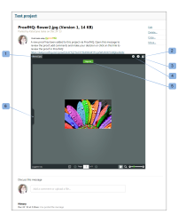

# Embed a Mini proof

>[!IMPORTANT]
>
>You're currently viewing the Adobe Workfront Classic version of this document. Adobe Workfront Classic is no longer supported. All Adobe Workfront Classic functionality, along with this documentation, will be removed in July 2022. Please transition to the the new Adobe Workfront experienceas soon as possible, and switch to the new Adobe Workfront experience version of this document.

>[!IMPORTANT]
>
>This article refers to functionality in the standalone product Workfront Proof. For information on proofing inside Adobe Workfront, see [Proofing](../../../review-and-approve-work/proofing/proofing.md).

The Miniproof is a widget that lets you embed a proof in a web page, blog, or wiki. The Miniproof shows the proof and all existing comments and mark-ups. You can use it to&nbsp;work on the proof as if you were in Workfront Proof.

Here is an example of a Miniproof embedded in a Basecamp project:

* Name of the proof (1)
* Fullscreen (2) - it will open the proof in the Proof Viewer (outside of the environment the Miniproof was embedded in)
* Help links (3)
* Actions menu (4)
* View comments in sidebar (5)

To embed a Miniproof in a web page, blog, or wiki:

1. Go to the **Proof details** page of a proof (see "The Proof Details Page" in&nbsp; [Manage Proof Details in Workfront Proof](../../../workfront-proof/wp-work-proofsfiles/manage-your-work/manage-proof-details.md)).

1. Click&nbsp;**More sharing options** to expand that section.
1. Next to **Embed code**, make sure&nbsp;**Enable** is selected.

1. Click **Copy code** to copy the embed code to your clipboard.&nbsp; 
1. Paste the code into the website, blog, or wiki where you want to embed the Miniproof.

