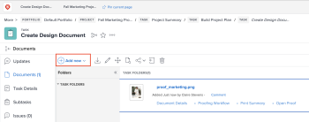

# Add documents to *`Adobe Workfront`* from your file system {#add-documents-to-adobe-workfront-from-your-file-system}

You can add documents to projects, tasks, or issues in the following areas in *`Adobe Workfront`*:

* The global Documents area 
* The Documents area for a *`Workfront`* object

You can also upload new versions of documents and add links to documents from third-party cloud vendors, such as Google Drive, Dropbox, and Microsoft OneDrive. For information about adding new versions of documents, see [Upload a new version of a document](upload-new-document-version.md). For information about adding documents from third-party cloud vendors, see [Link documents from external applications](link-documents-from-external-apps.md).

There are no restrictions on the types and sizes of files that you can upload to *`Workfront`*. However, in order to be successful, the upload must be completed within five minutes and you must have adequate storage space available.

If you need information about uploading new versions of a document to *`Workfront`*, see [Upload a new version of a document](upload-new-document-version.md).

## Access requirements {#access-requirements}

You must have the following:

<table style="width: 100%;margin-left: 0;margin-right: auto;mc-table-style: url('../../Resources/TableStyles/TableStyle-List-options-in-steps.css');" class="TableStyle-TableStyle-List-options-in-steps" cellspacing="0"> 
 <col class="TableStyle-TableStyle-List-options-in-steps-Column-Column1"> 
 <col class="TableStyle-TableStyle-List-options-in-steps-Column-Column2"> 
 <tbody> 
  <tr class="TableStyle-TableStyle-List-options-in-steps-Body-LightGray"> 
   <td class="TableStyle-TableStyle-List-options-in-steps-BodyE-Column1-LightGray" role="rowheader">Adobe Workfront plan*</td> 
   <td class="TableStyle-TableStyle-List-options-in-steps-BodyD-Column2-LightGray"> 
 Any
 </td> 
  </tr> 
  <tr class="TableStyle-TableStyle-List-options-in-steps-Body-MediumGray"> 
   <td class="TableStyle-TableStyle-List-options-in-steps-BodyE-Column1-MediumGray" role="rowheader">Adobe Workfront licenses*</td> 
   <td class="TableStyle-TableStyle-List-options-in-steps-BodyD-Column2-MediumGray"> 
Request or higher
 </td> 
  </tr> 
  <tr class="TableStyle-TableStyle-List-options-in-steps-Body-LightGray"> 
   <td class="TableStyle-TableStyle-List-options-in-steps-BodyB-Column1-LightGray" role="rowheader">Access level configurations*</td> 
   <td class="TableStyle-TableStyle-List-options-in-steps-BodyA-Column2-LightGray"> 
Edit access to Documents
 
Note: If you still don't have access, ask your Workfront administrator if they set additional restrictions in your access level. For information on how a Workfront administrator can modify your access level, see <a href="create-modify-access-levels.md" class="MCXref xref">Create or modify custom access levels</a>.
 </td> 
  </tr> 
 </tbody> 
</table>

&#42;To find out what plan, license type, or access you have, contact your *`Workfront administrator`*.

## Add documents to *`Workfront`* {#add-documents-to-workfront}

You can add new documents to *`Workfront`* from the file system on your workstation. You can also link documents from third-party applications such as Google Drive and SharePoint.

1. Go to the project, task, or issue where you want to add a new document.
1.  Click the `Documents` tab, then click the `Add New` drop-down menu.

   

1.  Depending on the type of document you want to add, do any of the following: 

<table style="width: 100%;mc-table-style: url('../../Resources/TableStyles/TableStyle-List-options-in-steps.css');" class="TableStyle-TableStyle-List-options-in-steps" cellspacing="0"> 
 <col class="TableStyle-TableStyle-List-options-in-steps-Column-Column1"> 
 <col class="TableStyle-TableStyle-List-options-in-steps-Column-Column2"> 
 <tbody> 
  <tr class="TableStyle-TableStyle-List-options-in-steps-Body-LightGray"> 
   <td class="TableStyle-TableStyle-List-options-in-steps-BodyE-Column1-LightGray" role="rowheader">Upload documents from your file system on your workstation</td> 
   <td class="TableStyle-TableStyle-List-options-in-steps-BodyD-Column2-LightGray"> 
    <ol> 
     <li value="1">From the Add New drop-down menu, select&nbsp;Document.</li> 
     <li value="2"> 
Browse to and select the document that you want to add from the file system on your workstation. 
 
You can select multiple documents by pressing the Shift key as you select additional files.
 </li> 
     <li value="3">Click Open.</li> 
    </ol> </td> 
  </tr> 
  <tr class="TableStyle-TableStyle-List-options-in-steps-Body-MediumGray"> 
   <td class="TableStyle-TableStyle-List-options-in-steps-BodyE-Column1-MediumGray" role="rowheader">Upload documents from&nbsp;a third-party application such as Google Drive or SharePoint</td> 
   <td class="TableStyle-TableStyle-List-options-in-steps-BodyD-Column2-MediumGray"> 
    <ol> 
     <li value="1"> 
From the Add New drop-down menu, select&nbsp;From &lt;<em>name_of_third-party_application&gt;</em>.
 
For example, to upload a document from Google Drive, click From Google Drive.
 </li> 
     <li value="2"> 
Follow the prompts to select the document in the third-party application. 
 
For more information about linked documents, see <a href="link-documents-from-external-apps.md" class="MCXref xref">Link documents from external applications</a>.
 </li> 
    </ol> </td> 
  </tr> 
  <tr class="TableStyle-TableStyle-List-options-in-steps-Body-LightGray"> 
   <td class="TableStyle-TableStyle-List-options-in-steps-BodyB-Column1-LightGray" role="rowheader">Request a document from another Workfront user</td> 
   <td class="TableStyle-TableStyle-List-options-in-steps-BodyA-Column2-LightGray"> 
    <ol> 
     <li value="1">From the Add New drop-down menu, select&nbsp;Request a Document.</li> 
     <li value="2">In the Who are you requesting it from box, type the name of the user from whom you are requesting the document.</li> 
     <li value="3">In the Tell them what you're requesting box, type the name of the document.</li> 
     <li value="4"> 
Click Send Request.
 
Your request displays on your Documents tab.
 
  
 
For more information about requesting documents, see <a href="request-a-document.md" class="MCXref xref">Request a Document</a>.
 </li> 
    </ol> </td> 
  </tr> 
 </tbody> 
</table>

## Document security {#document-security}

The *`Workfront`* site prevents viruses and other malicious content from entering the site via documents&nbsp;in the following ways: 

* [How Workfront detects corrupted files](#understanding-how-workfront-detects-corrupted-files) 
* [File name restrictions](#understanding-file-name-restrictions) 

### How *`Workfront`* detects corrupted files {#how-workfront-detects-corrupted-files}

*`Workfront`* scans for viruses when a document is uploaded. If you attempt to upload a corrupted document, *`Workfront`* discontinues the upload process and a message appears indicating the file is corrupt. You also receive an email notification when *`Workfront`* detects potentially malicious content and the file is slated for removal.  
All corrupted files are removed within 24 hours of detection unless you remove it manually. If you delete a corrupted file, *`Workfront`* tracks this action as an update. If you allow *`Workfront`* to remove it, then no updates are recorded.

### File name restrictions {#file-name-restrictions}

Files that are uploaded to *`Workfront`* cannot contain certain&nbsp;characters in file names. If a file contains any of the following characters in the file name, the characters are removed from the file name when the file is uploaded:
`<pre>< > { }</pre>`  