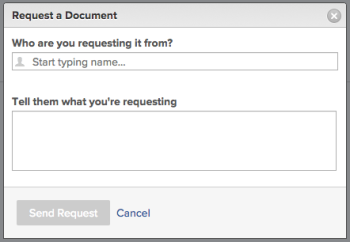

# Request a Document {#request-a-document}

You can request a document on any object that supports Documents.

## Access requirements {#access-requirements}

You must have the following:

<table style="width: 100%;margin-left: 0;margin-right: auto;mc-table-style: url('../../Resources/TableStyles/TableStyle-List-options-in-steps.css');" class="TableStyle-TableStyle-List-options-in-steps" cellspacing="0"> 
 <col class="TableStyle-TableStyle-List-options-in-steps-Column-Column1"> 
 <col class="TableStyle-TableStyle-List-options-in-steps-Column-Column2"> 
 <tbody> 
  <tr class="TableStyle-TableStyle-List-options-in-steps-Body-LightGray"> 
   <td class="TableStyle-TableStyle-List-options-in-steps-BodyE-Column1-LightGray" role="rowheader">Adobe Workfront plan*</td> 
   <td class="TableStyle-TableStyle-List-options-in-steps-BodyD-Column2-LightGray"> 
 Any
 </td> 
  </tr> 
  <tr class="TableStyle-TableStyle-List-options-in-steps-Body-MediumGray"> 
   <td class="TableStyle-TableStyle-List-options-in-steps-BodyE-Column1-MediumGray" role="rowheader">Adobe Workfront licenses*</td> 
   <td class="TableStyle-TableStyle-List-options-in-steps-BodyD-Column2-MediumGray"> 
Request or higher
 </td> 
  </tr> 
  <tr class="TableStyle-TableStyle-List-options-in-steps-Body-LightGray"> 
   <td class="TableStyle-TableStyle-List-options-in-steps-BodyB-Column1-LightGray" role="rowheader">Access level configurations*</td> 
   <td class="TableStyle-TableStyle-List-options-in-steps-BodyA-Column2-LightGray"> 
Edit access to Documents
 
Note: If you still don't have access, ask your Workfront administrator if they set additional restrictions in your access level. For information on how a Workfront administrator can modify your access level, see <a href="create-modify-access-levels.md" class="MCXref xref">Create or modify custom access levels</a>.
 </td> 
  </tr> 
 </tbody> 
</table>

&#42;To find out what plan, license type, or access you have, contact your *`Workfront administrator`*.

1. Go to the area where you want the document you are requesting to reside.
1. Click the `Documents`&nbsp;tab.&nbsp;
1.  Click the  `Add New` drop-down menu.  

1.  Click `Request a Document`.

   The Request a Document dialog box is displayed.

   

1.  Begin typing the name of the user who you are requesting the document from, then select it when it appears in the drop-down list. Only licensed *`Adobe Workfront`* users appear as options in the drop-down list.

   >[!NOTE]
   >
   >If you have the [Adobe Workfront licenses overview](wf-licenses.md) enabled on your account, you can send a request to any email address. There is a setting in the [Configure system security preferences](configure-security-preferences.md) that determines whether or not these external email users need to create a password before interacting with *`Workfront`*.&nbsp;

1. Describe the reason you are requesting the document.
1.  Click `Send Request`.

   When you make a request to a user, a placeholder is added in the documents area. You can remind the user or cancel the request from this placeholder. The user receives a *`Workfront`* notification and an email about the request. 

   The user receives an email notification if this preference is enabled, as well as an in-app notification. For more information on email notifications, see [Activate or deactivate your own event notifications](activate-or-deactivate-your-own-event-notifications.md).

   You can click the link found in the email notification, and then upload the document. Or you can click the in-app notification. Each option routes you to the user profile page where you can upload the requested document.

   You can also reply directly to the email and attach the requested documents (if you are configured to support email responses). To configure email responses, see .

1.  After you upload the document, the person who requested it can access the document in their personal `Documents`&nbsp;area.

   You can access your personal `Documents` area by clicking your user profile picture in the upper-right corner of any *`Workfront`* page, clicking your name, then clicking the `Documents`&nbsp;tab.

