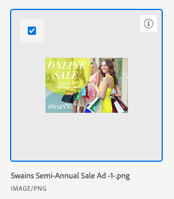

# Link assets and folders from *`Experience Manager Assets Essentials`* {#link-assets-and-folders-from-experience-manager-assets-essentials}

You can link an asset or folder from *`Experience Manager Assets Essentials`* to any *`Adobe Workfront`* object that supports documents. Assets sent from *`Assets Essentials`* don't count towards your overall document storage in *`Workfront`*. Documents uploaded and sent from *`Workfront`* to *`Assets Essentials`* do count towards overall storage.

## Access requirements {#access-requirements}

You must have the following:

<table style="width: 100%;margin-left: 0;margin-right: auto;mc-table-style: url('../../Resources/TableStyles/TableStyle-List-options-in-steps.css');" class="TableStyle-TableStyle-List-options-in-steps" cellspacing="0"> 
 <col class="TableStyle-TableStyle-List-options-in-steps-Column-Column1"> 
 <col class="TableStyle-TableStyle-List-options-in-steps-Column-Column2"> 
 <tbody> 
  <tr class="TableStyle-TableStyle-List-options-in-steps-Body-LightGray"> 
   <td class="TableStyle-TableStyle-List-options-in-steps-BodyE-Column1-LightGray" role="rowheader">Adobe Workfront plan*</td> 
   <td class="TableStyle-TableStyle-List-options-in-steps-BodyD-Column2-LightGray"> 
 Any
 </td> 
  </tr> 
  <tr class="TableStyle-TableStyle-List-options-in-steps-Body-MediumGray"> 
   <td class="TableStyle-TableStyle-List-options-in-steps-BodyE-Column1-MediumGray" role="rowheader">Adobe Workfront licenses*</td> 
   <td class="TableStyle-TableStyle-List-options-in-steps-BodyD-Column2-MediumGray"> 
Request or higher
 </td> 
  </tr> 
  <tr class="TableStyle-TableStyle-List-options-in-steps-Body-LightGray"> 
   <td class="TableStyle-TableStyle-List-options-in-steps-BodyE-Column1-LightGray" role="rowheader">Product</td> 
   <td class="TableStyle-TableStyle-List-options-in-steps-BodyD-Column2-LightGray">You must have Experience Manager Assets Essentials.</td> 
  </tr> 
  <tr class="TableStyle-TableStyle-List-options-in-steps-Body-MediumGray"> 
   <td class="TableStyle-TableStyle-List-options-in-steps-BodyE-Column1-MediumGray" role="rowheader">Access level configurations*</td> 
   <td class="TableStyle-TableStyle-List-options-in-steps-BodyD-Column2-MediumGray"> 
Edit access to Documents
 
Note: If you still don't have access, ask your Workfront administrator if they set additional restrictions in your access level. For information on how a Workfront administrator can modify your access level, see <a href="create-modify-access-levels.md" class="MCXref xref">Create or modify custom access levels</a>.
 </td> 
  </tr> 
  <tr class="TableStyle-TableStyle-List-options-in-steps-Body-LightGray"> 
   <td class="TableStyle-TableStyle-List-options-in-steps-BodyB-Column1-LightGray" role="rowheader">Object permissions</td> 
   <td class="TableStyle-TableStyle-List-options-in-steps-BodyA-Column2-LightGray"> 
View access or higher
 
For information on requesting additional access, see <a href="request-access.md" class="MCXref xref">Request access to objects in Adobe Workfront</a>.
 </td> 
  </tr> 
 </tbody> 
</table>

&#42;To find out what plan, license type, or access you have, contact your *`Workfront administrator`*.

## Link an asset from *`Experience Manager Assets Essentials`* {#link-an-asset-from-experience-manager-assets-essentials}

You can link an asset from *`Experience Manager Assets Essentials`* to *`Workfront`*. Once the asset is linked you can

*  [Proof a linked asset for Experience Manager Assets Essentials](proof-linked-asset-aem.md) 
*  [Upload a new version of a document](upload-new-document-version.md) 

1. Go to the `Documents` area in *`Workfront`* where you want to add the document.

1.  Select `Add New`, then select the *`Assets Essentials`* integration your administrator set up.

   >[!NOTE]
   >
   >The *`Workfront administrator`* can choose any name for this integration, so it may not specifically mention *`Assets Essentials`*.

1.  Select the assets you want.

   

1.  Click `Select`.

## Link a folder from *`Experience Manager Assets Essentials`* {#link-a-folder-from-experience-manager-assets-essentials}

Permissions to view individual assets inside of a folder rely on *`Experience Manager Assets Essentials`* permissions. 

1.  Go to the `Documents` area in *`Workfront`* where you want the folder.
1.  Select `Add New`, then select the *`Assets Essentials`* integration your administrator set up.

   >[!NOTE]
   >
   >The *`Workfront administrator`* can choose any name for this integration, so it might not specifically mention *`Assets Essentials`*.

1.  Select the folders you want.

   

1.  Click `Select`.

## Link a new version from *`Experience Manager Assets Essentials`* {#link-a-new-version-from-experience-manager-assets-essentials}

You can pull a new asset over from *`Assets Essentials`* and add it to an existing asset as a new version. If the document is already linked and a new version is added in *`Assets Essentials`*, the new version appears automatically in *`Workfront`*.

To link a new version from *`Assets Essentials`*:

1. Go to the `Documents` area in *`Workfront`* where you want to add the document.

1.  Select the asset you want to replace with a new version. You can't create a new version of an asset in a linked folder. 
1.  Select `Add New` > `Version`, then select the *`Assets Essentials`* integration your administrator set up.

   >[!NOTE]
   >
   >The *`Workfront administrator`* can choose any name for this integration, so it might not specifically mention *`Assets Essentials`*.

1.  Select the asset you want.

   

1.  Click `Select`. 

>[!TIP] {type="tip"}
>
>You can view all versions of an asset if you go to `Document Details` > `Versions`. 

