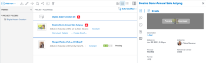

# View or download a linked asset from *Experience Manager Assets Essentials*

You can view or download an asset in *Adobe Workfront* that is linked from *Experience Manager Assets Essentials*.

## Access requirements

You must have the following:

<table cellspacing="0"> 
 <col> 
 <col> 
 <tbody> 
  <tr> 
   <td role="rowheader"><em>Adobe Workfront</em> plan*</td> 
   <td> 
 Any
 </td> 
  </tr> 
  <tr> 
   <td role="rowheader"><em>Adobe Workfront</em> licenses*</td> 
   <td> 
<em>Request</em> or higher
 </td> 
  </tr> 
  <tr> 
   <td role="rowheader">Product</td> 
   <td>You must have an <em>Experience Manager Assets Essentials</em> instance.</td> 
  </tr> 
  <tr> 
   <td role="rowheader">Access level configurations*</td> 
   <td> 
Edit access to Documents
 
Note: If you still don't have access, ask your <em>Workfront administrator</em> if they set additional restrictions in your access level. For information on how a <em>Workfront administrator</em> can modify your access level, see <a href="../../administration-and-setup/add-users/configure-and-grant-access/create-modify-access-levels.md" class="MCXref xref">Create or modify custom access levels</a>.
 </td> 
  </tr> 
  <tr> 
   <td role="rowheader">Object permissions</td> 
   <td> 
View access or higher
 
For information on requesting additional access, see <a href="../../workfront-basics/grant-and-request-access-to-objects/request-access.md" class="MCXref xref">Request access to objects in Adobe Workfront</a>.
 </td> 
  </tr> 
 </tbody> 
</table>

&#42;To find out what plan, license type, or access you have, contact your *Workfront administrator*.

## View or download a linked asset

<ol> 
 <li value="1"> 
Locate the document that you want to view or download. 
 </li> 
 <li value="2"> 
From the document list, select the document. 
 </li> 
 <li value="3"> 
In the Document Summary on the right, hover over the thumbnail at the top and choose Preview or Download. 
 
  
 </li> 
</ol>

&nbsp;

&nbsp;
