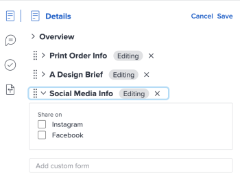

# Add or edit a custom form to a document {#add-or-edit-a-custom-form-to-a-document}

You can add a custom form to a document or to a document version to capture additional information or metadata specific to your assets.

## Access requirements {#access-requirements}

You must have the following:

<table style="width: 100%;margin-left: 0;margin-right: auto;mc-table-style: url('../../Resources/TableStyles/TableStyle-List-options-in-steps.css');" class="TableStyle-TableStyle-List-options-in-steps" cellspacing="0"> 
 <col class="TableStyle-TableStyle-List-options-in-steps-Column-Column1"> 
 <col class="TableStyle-TableStyle-List-options-in-steps-Column-Column2"> 
 <tbody> 
  <tr class="TableStyle-TableStyle-List-options-in-steps-Body-LightGray"> 
   <td class="TableStyle-TableStyle-List-options-in-steps-BodyE-Column1-LightGray" role="rowheader">Adobe Workfront plan*</td> 
   <td class="TableStyle-TableStyle-List-options-in-steps-BodyD-Column2-LightGray"> 
 Any
 </td> 
  </tr> 
  <tr class="TableStyle-TableStyle-List-options-in-steps-Body-MediumGray"> 
   <td class="TableStyle-TableStyle-List-options-in-steps-BodyE-Column1-MediumGray" role="rowheader">Adobe Workfront licenses*</td> 
   <td class="TableStyle-TableStyle-List-options-in-steps-BodyD-Column2-MediumGray"> 
Request or higher
 </td> 
  </tr> 
  <tr class="TableStyle-TableStyle-List-options-in-steps-Body-LightGray"> 
   <td class="TableStyle-TableStyle-List-options-in-steps-BodyE-Column1-LightGray" role="rowheader">Access level configurations*</td> 
   <td class="TableStyle-TableStyle-List-options-in-steps-BodyD-Column2-LightGray"> 
Edit access to Documents
 
Note: If you still don't have access, ask your Workfront administrator if they set additional restrictions in your access level. For information on how a Workfront administrator can modify your access level, see <a href="create-modify-access-levels.md" class="MCXref xref">Create or modify custom access levels</a>.
 </td> 
  </tr> 
  <tr class="TableStyle-TableStyle-List-options-in-steps-Body-MediumGray"> 
   <td class="TableStyle-TableStyle-List-options-in-steps-BodyB-Column1-MediumGray" role="rowheader">Object permissions</td> 
   <td class="TableStyle-TableStyle-List-options-in-steps-BodyA-Column2-MediumGray"> 
Manage access to the Document
 
For information on requesting additional access, see <a href="request-access.md" class="MCXref xref">Request access to objects in Adobe Workfront</a>.
 </td> 
  </tr> 
 </tbody> 
</table>

&#42;To find out what plan, license type, or access you have, contact your *`Workfront administrator`*.

## Prerequisites {#prerequisites}

*  The custom form must be shared with you

## Add a custom form`<MadCap:conditionalText data-mc-conditions="QuicksilverOrClassic.Quicksilver">  in the Production environment</MadCap:conditionalText>` {#add-a-custom-form-in-the-production-environment}

To add a custom form to a document:

1. In a document list that contains the document , click on the document .
1. Click the `Summary` icon , then scroll down to the `Custom Forms` section. 

1. Click `Add one here`. If you already have a form uploaded and wish to upload another one, click `Custom Forms`.

1.  Select the custom form you want to attach from the `Make a Selection` drop-down menu.

   Only active custom forms display in the drop-down menu. You can add up to 10 custom forms per document. If you need to create a custom form, see [Create or edit a custom form](create-or-edit-a-custom-form.md).

  

1.  Click `Edit Custom Form` to enter information into the fields.

  

1.  Click `Save` to keep the information entered. Click `Cancel` to remove the information entered.

   Or

   Click `Remove this form` to remove the form from the document.

## Add a custom form in the Preview environment {#add-a-custom-form-in-the-preview-environment}

To add a custom form to a document:

1.  In a document list that contains the document , click on the document .
1.  Click the `Summary` icon , then find the `Details`section. 
1.  In the `Add custom form` box, begin typing and select a *`custom form`*. The form saves automatically to the document. 

   >[!NOTE]
   >
   >Only active custom forms display in the drop-down menu. You can add up to 10 custom forms per document. If you need to create a custom form, see [Create or edit a custom form](create-or-edit-a-custom-form.md).

1.  (Optional) To delete a custom form, click `Edit`in the top-right corner of Summary, remove the desired form, then click `Save`.

## Edit a *`custom form`* in the Preview environment {#edit-a-custom-form-in-the-preview-environment}

1.  In a document list that contains the document , click on the document .
1.  Click the `Summary` icon , then find the `Details`section near the top. 
1.  Click `Edit`in the top-right corner, then expand the desired form.
1.  Make the needed changes, then click `Save`.

   

