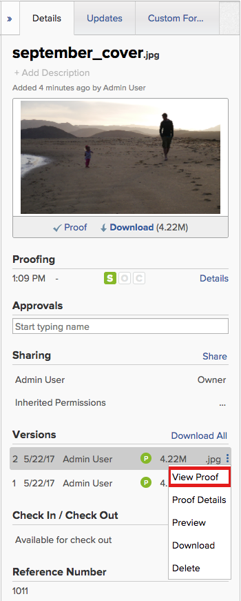
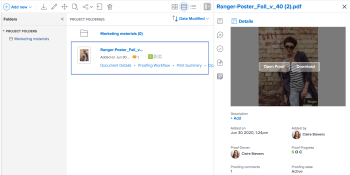

# Manage document versions

You can manage multiple versions of a document in *Workfront*.

## Access requirements

You must have the following:

<table cellspacing="0"> 
 <col> 
 <col> 
 <tbody> 
  <tr> 
   <td role="rowheader"><em>Adobe Workfront</em> plan*</td> 
   <td> 
 Any
 </td> 
  </tr> 
  <tr> 
   <td role="rowheader"><em>Adobe Workfront</em> licenses*</td> 
   <td> 
<em>Request</em> or higher
 </td> 
  </tr> 
  <tr> 
   <td role="rowheader">Access level configurations*</td> 
   <td> 
View access to Documents
 
Note: If you still don't have access, ask your <em>Workfront administrator</em> if they set additional restrictions in your access level. For information on how a <em>Workfront administrator</em> can modify your access level, see <a href="../../administration-and-setup/add-users/configure-and-grant-access/create-modify-access-levels.md" class="MCXref xref">Create or modify custom access levels</a>.
 </td> 
  </tr> 
  <tr> 
   <td role="rowheader">Object permissions</td> 
   <td> 
View access to the Document
 
For information on requesting additional access, see <a href="../../workfront-basics/grant-and-request-access-to-objects/request-access.md" class="MCXref xref">Request access to objects in Adobe Workfront</a>.
 </td> 
  </tr> 
 </tbody> 
</table>

&#42;To find out what plan, license type, or access you have, contact your *Workfront administrator*.

## Prerequisites

* This article assumes that the document has multiple versions.

  If you need information about uploading new versions of a document to *Workfront*, see [Upload a new version of a document](../../documents/managing-documents/upload-new-document-version.md).

## Manage document versions

<!--

If you need information about uploading new versions of a document to <em>Workfront</em>, see <a href="../../documents/managing-documents/upload-new-document-version.md" class="MCXref xref">Upload a new version of a document</a>.

-->

If you need information about uploading new versions of a document to *Workfront*, see [Upload a new version of a document](../../documents/managing-documents/upload-new-document-version.md).

## View a list of all versions of a 

<!--
<MadCap:conditionalText data-mc-conditions="SnippetConditions_proof_and_document.Document">
document
</MadCap:conditionalText>
-->

`<MadCap:conditionalText data-mc-conditions="SnippetConditions_proof_and_document.Document"> document </MadCap:conditionalText>`

   <!--
   <li value="1" data-mc-conditions="QuicksilverOrClassic.Quicksilver"> 
In the Summary, scroll to the view the All Versions section. Here you can view all of the versions of the <draft-comment>
   <MadCap:conditionalText data-mc-conditions="SnippetConditions_proof_and_document.Document">
   document
   </MadCap:conditionalText>
   </draft-comment><MadCap:conditionalText data-mc-conditions="SnippetConditions_proof_and_document.Document">
   document
   </MadCap:conditionalText>.
 </li>
   -->

1. In the Summary, scroll to the view the `All Versions` section. Here you can view all of the versions of the `<MadCap:conditionalText data-mc-conditions="SnippetConditions_proof_and_document.Document"> document</MadCap:conditionalText>`.

<!--
<h2 data-mc-conditions="QuicksilverOrClassic.Quicksilver">View and manage details for a previous <draft-comment>
<MadCap:conditionalText data-mc-conditions="SnippetConditions_proof_and_document.Document">
document
</MadCap:conditionalText>
</draft-comment><MadCap:conditionalText data-mc-conditions="SnippetConditions_proof_and_document.Document">
document
</MadCap:conditionalText>version</h2>
-->

## View and manage details for a previous `<MadCap:conditionalText data-mc-conditions="SnippetConditions_proof_and_document.Document"> document </MadCap:conditionalText>`version

<ol> 
 <li value="1"> 
Near the top of the Document Details page, click the drop-down menu next to the name, then click the name of the version you want to view and manage.
 
  
 
Along with viewing the version's Details, you can make changes to the version, such as its name, metadata, and <em>proofing</em> settings (if it's a document <em>proof</em>). 
 </li> 
</ol>

<!--

<h2>Download a single <draft-comment>
<MadCap:conditionalText data-mc-conditions="SnippetConditions_proof_and_document.Document">
document
</MadCap:conditionalText>
</draft-comment><MadCap:conditionalText data-mc-conditions="SnippetConditions_proof_and_document.Document">
document
</MadCap:conditionalText>version</h2>
<ol>
<li value="1"> 
 In the Summary, under Versions, click the click the More menu  to the right of the version, then click Download in the drop-down list that appears. 
 
    
 </li>
</ol>

-->

## Download a single `<MadCap:conditionalText data-mc-conditions="SnippetConditions_proof_and_document.Document"> document </MadCap:conditionalText>`version

<ol> 
 <li value="1"> 
 In the Summary, under Versions, click the click the More menu  to the right of the version, then click Download in the drop-down list that appears. 
 
    
 </li> 
</ol>

## Download all versions of a 

<!--
<MadCap:conditionalText data-mc-conditions="SnippetConditions_proof_and_document.Document">
document
</MadCap:conditionalText>
-->

`<MadCap:conditionalText data-mc-conditions="SnippetConditions_proof_and_document.Document"> document </MadCap:conditionalText>`

   <!--
   <li value="1" data-mc-conditions="QuicksilverOrClassic.Quicksilver">Click Document Details, then select All Versions in the left panel.</li>
   -->

1. Click `Document Details`, then select `All Versions` in the left panel.

   <!--
   <li value="2" data-mc-conditions="QuicksilverOrClassic.Quicksilver">Click Download All at the top of the list.</li>
   -->

1. Click `Download All` at the top of the list.

## Delete a 

<!--
<MadCap:conditionalText data-mc-conditions="SnippetConditions_proof_and_document.Document">
document
</MadCap:conditionalText>
-->

`<MadCap:conditionalText data-mc-conditions="SnippetConditions_proof_and_document.Document"> document </MadCap:conditionalText>`version

If you upload a version of a 

<!--
<MadCap:conditionalText data-mc-conditions="SnippetConditions_proof_and_document.Document">
document
</MadCap:conditionalText>
-->

`<MadCap:conditionalText data-mc-conditions="SnippetConditions_proof_and_document.Document"> document </MadCap:conditionalText>`by mistake, or a version is no longer needed, you can delete the version and maintain the original document.

>[!IMPORTANT]
>
>You can't recover a >
><!-->
><MadCap:conditionalText data-mc-conditions="SnippetConditions_proof_and_document.Document">>
>document>
></MadCap:conditionalText>>
>-->
>`<MadCap:conditionalText data-mc-conditions="SnippetConditions_proof_and_document.Document"> document </MadCap:conditionalText>`version that you delete individually.

Keep the following in mind when you consider deleting a document version:

* Only one version can be deleted at a time. If a version is deleted, this action appears in the `Updates` on the 

  <!--
  <MadCap:conditionalText data-mc-conditions="SnippetConditions_proof_and_document.Document">
  document
  </MadCap:conditionalText>
  -->

  `<MadCap:conditionalText data-mc-conditions="SnippetConditions_proof_and_document.Document"> document </MadCap:conditionalText>`. 

* If you upload a new version after deleting a version, the new version receives the next sequential number. For example, if there are 3 versions of a 

  <!--
  <MadCap:conditionalText data-mc-conditions="SnippetConditions_proof_and_document.Document">
  document
  </MadCap:conditionalText>
  -->

  `<MadCap:conditionalText data-mc-conditions="SnippetConditions_proof_and_document.Document"> document </MadCap:conditionalText>`and you delete version 3, the next 

  <!--
  <MadCap:conditionalText data-mc-conditions="SnippetConditions_proof_and_document.Document">
  document
  </MadCap:conditionalText>
  -->

  `<MadCap:conditionalText data-mc-conditions="SnippetConditions_proof_and_document.Document"> document </MadCap:conditionalText>`uploaded will be version 4.

* System updates and comments made on a version are retained in Workfront after the version is deleted.

  <!--
  <li data-mc-conditions="QuicksilverOrClassic.Draft mode">Deleting a document version in <em>Workfront</em> does not delete the Proof version.&nbsp;</li>
  -->

* Deleting a document version in *Workfront* does not delete the Proof version.&nbsp;

To delete a 

<!--
<MadCap:conditionalText data-mc-conditions="SnippetConditions_proof_and_document.Document">
document
</MadCap:conditionalText>
-->

`<MadCap:conditionalText data-mc-conditions="SnippetConditions_proof_and_document.Document"> document </MadCap:conditionalText>`version:

<ol> 
 <li value="1">Go to the project, task, or issue that contains the document, then select Documents.Find the document you need.</li> 
 <li value="2"> 
 <draft-comment>
    <MadCap:conditionalText data-mc-conditions="QuicksilverOrClassic.Quicksilver">
     In the 
     Version area in the Summary, click the version, then click 
    </MadCap:conditionalText>
   </draft-comment><MadCap:conditionalText data-mc-conditions="QuicksilverOrClassic.Quicksilver">
    In the 
    Version area in the Summary, click the version, then click 
   </MadCap:conditionalText>Delete in the drop-down list that appears. The Delete option is visible only if there are at least two versions. 
 <draft-comment>
   
If the document is linked to an outside source, that link is deleted and the document is no longer accessible through <em>Workfront</em>.

  </draft-comment>
If the document is linked to an outside source, that link is deleted and the document is no longer accessible through <em>Workfront</em>.
 
 <draft-comment>
    
   </draft-comment> 
 </li> 
</ol>

<!--
<h2 data-mc-conditions="SnippetConditions_proof_and_document.Document">Manage a document version of a proofed document</h2>
-->

## Manage a document version of a proofed document

<!--

You can view <em>proofs</em> from previous&nbsp;versions of a proofed document within the <em>Workfront</em> interface. Users with a <em>proofing</em> license can also view the <em>proof</em> details for previous versions of a proofed document. For more information, see <a href="../../review-and-approve-work/proofing/managing-proofs-within-workfront/manage-proof-versions.md" class="MCXref xref">Manage proof versions</a>.

-->

You can view *proofs* from previous&nbsp;versions of a proofed document within the *Workfront* interface. Users with a *proofing* license can also view the *proof* details for previous versions of a proofed document. For more information, see [Manage proof versions](../../review-and-approve-work/proofing/managing-proofs-within-workfront/manage-proof-versions.md).

<!--
<ul data-mc-conditions="QuicksilverOrClassic.Draft mode">
<li><a href="#viewing-the-proof-for-previous-versions" class="MCXref xref">View a previous proof version</a> </li>
<li><a href="#viewing-the-proof-details-for-previous-versions" class="MCXref xref">View the proofing details for a previous version</a> </li>
</ul>
-->

* [View a previous proof version](#viewing-the-proof-for-previous-versions) 
* [View the proofing details for a previous version](#viewing-the-proof-details-for-previous-versions)

<!--
<h3 data-mc-conditions="QuicksilverOrClassic.Draft mode">View a previous <em>proof</em> version</h3>
-->

### View a previous *proof* version

<!--

Any user in <em>Workfront</em> with View access to the document can view past versions of a proofed document. It is not required that the user have a <em>proofing</em> license.

-->

Any user in *Workfront* with View access to the document can view past versions of a proofed document. It is not required that the user have a *proofing* license.

<!--

To view the <em>proof</em> for a previous version of a proofed document:

-->

To view the *proof* for a previous version of a proofed document:

<ol> <draft-comment>
  <li value="1" data-mc-conditions="QuicksilverOrClassic.Draft mode">Go to the project, task, or issue that contains the document, then select Documents.</li>
 </draft-comment>
 <li value="1" data-mc-conditions="QuicksilverOrClassic.Draft mode">Go to the project, task, or issue that contains the document, then select Documents.</li> <draft-comment>
  <li value="2" data-mc-conditions="QuicksilverOrClassic.Draft mode">Find the <em>proof</em> you need.</li>
 </draft-comment>
 <li value="2" data-mc-conditions="QuicksilverOrClassic.Draft mode">Find the <em>proof</em> you need.</li> 
 <li value="3"> <draft-comment>
   
 <draft-comment>
     <MadCap:conditionalText data-mc-conditions="QuicksilverOrClassic.Quicksilver">
      Open the Summary and hover over the image thumbnail, then click 
     </MadCap:conditionalText>
    </draft-comment><MadCap:conditionalText data-mc-conditions="QuicksilverOrClassic.Quicksilver">
     Open the Summary and hover over the image thumbnail, then click 
    </MadCap:conditionalText> <draft-comment>
     <MadCap:conditionalText data-mc-conditions="QuicksilverOrClassic.Quicksilver">
      Open 
     </MadCap:conditionalText>
    </draft-comment><MadCap:conditionalText data-mc-conditions="QuicksilverOrClassic.Quicksilver">
     Open 
    </MadCap:conditionalText> Proof.

  </draft-comment>
 <MadCap:conditionalText data-mc-conditions="QuicksilverOrClassic.Quicksilver">
    Open the Summary and hover over the image thumbnail, then click 
   </MadCap:conditionalText> <MadCap:conditionalText data-mc-conditions="QuicksilverOrClassic.Quicksilver">
    Open 
   </MadCap:conditionalText> Proof.
 <draft-comment>
   
  

  </draft-comment>
  
 <draft-comment>
   
 
     
   

  </draft-comment>
  
 
    
  
 </li> 
</ol>

<!--
<h3 data-mc-conditions="QuicksilverOrClassic.Draft mode">View the <em>proofing</em> details for a previous version</h3>
-->

### View the *proofing* details for a previous version

<!--

Users must have a <em>proofing</em> license in order to view the <em>proof</em> details of a past version of a proofed document.

-->

Users must have a *proofing* license in order to view the *proof* details of a past version of a proofed document.

<!--
<ol data-mc-conditions="QuicksilverOrClassic.Draft mode">
<li value="1">Go to the project, task, or issue that contains the document, then select Documents.</li>
<li value="2">Find the <em>proof</em> you need. </li>
<li value="3"> <draft-comment>
<MadCap:conditionalText data-mc-conditions="QuicksilverOrClassic.Quicksilver">
In the
Version area in the Summary, click the version, then click
</MadCap:conditionalText>
</draft-comment><MadCap:conditionalText data-mc-conditions="QuicksilverOrClassic.Quicksilver">
In the
Version area in the Summary, click the version, then click
</MadCap:conditionalText> Details in the drop-down list that appears. </li>
<li value="4"> <draft-comment>
<MadCap:conditionalText data-mc-conditions="QuicksilverOrClassic.Quicksilver">
On the Document Details page, click
Proofing Workflow in the left panel to do any of the following:
</MadCap:conditionalText>
</draft-comment><MadCap:conditionalText data-mc-conditions="QuicksilverOrClassic.Quicksilver">
On the Document Details page, click
Proofing Workflow in the left panel to do any of the following:
</MadCap:conditionalText>
<ul>
<li> 
Add an automated workflow. For more information, see the section <a href="../../review-and-approve-work/proofing/creating-proofs-within-workfront/configure-proof.md#create2" class="MCXref xref">Create an Automated Workflow for the proof</a> in the article <a href="../../review-and-approve-work/proofing/creating-proofs-within-workfront/configure-proof.md#configuring-the-automated-workflow" class="MCXref xref">Configure a proof</a>.
 </li>
<li> 
Share the <em>proof</em>'s public URL. For more information, see <a href="../../review-and-approve-work/proofing/managing-proofs-within-workfront/share-a-proof-in-workfront.md#share" class="MCXref xref">Share a proof link</a> in <a href="../../review-and-approve-work/proofing/managing-proofs-within-workfront/share-a-proof-in-workfront.md" class="MCXref xref">Share a proof within Adobe Workfront</a>.
 </li>
<li>View all activity that has occurred on the <em>proof</em>.</li>
<li>Send reminder messages to reviewers on the <em>proof</em>. </li>
</ul> </li>
<li value="5">Click Done.</li>
</ol>
-->

1. Go to the project, task, or issue that contains the document, then select `Documents`.
1. Find the *proof* you need. 
1. `<MadCap:conditionalText data-mc-conditions="QuicksilverOrClassic.Quicksilver"> In the  Version area in the Summary, click the version, then click </MadCap:conditionalText>` `Details` in the drop-down list that appears. 

1. `<MadCap:conditionalText data-mc-conditions="QuicksilverOrClassic.Quicksilver"> On the Document Details page, click  Proofing Workflow in the left panel to do any of the following:</MadCap:conditionalText>`

  * Add an automated workflow. For more information, see the section [Create an Automated Workflow for the proof](../../review-and-approve-work/proofing/creating-proofs-within-workfront/configure-proof.md#create2) in the article [Configure a proof](../../review-and-approve-work/proofing/creating-proofs-within-workfront/configure-proof.md#configuring-the-automated-workflow).
  * Share the *proof*'s public URL. For more information, see [Share a proof link](../../review-and-approve-work/proofing/managing-proofs-within-workfront/share-a-proof-in-workfront.md#share) in [Share a proof within Adobe Workfront](../../review-and-approve-work/proofing/managing-proofs-within-workfront/share-a-proof-in-workfront.md).
  * View all activity that has occurred on the *proof*.
  * Send reminder messages to reviewers on the *proof*.

1. Click `Done`.

