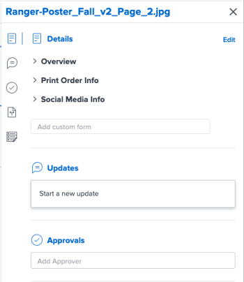
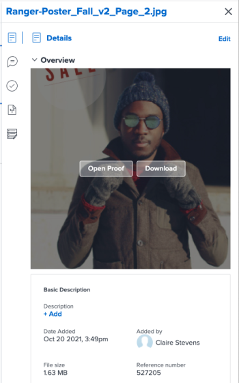

# Summary for documents overview {#summary-for-documents-overview}

The Summary allows you to interact with important information directly from the documents list.

## Access requirements {#access-requirements}

You must have the following:

<table style="width: 100%;margin-left: 0;margin-right: auto;mc-table-style: url('../../Resources/TableStyles/TableStyle-List-options-in-steps.css');" class="TableStyle-TableStyle-List-options-in-steps" cellspacing="0"> 
 <col class="TableStyle-TableStyle-List-options-in-steps-Column-Column1"> 
 </col> 
 <col class="TableStyle-TableStyle-List-options-in-steps-Column-Column2"> 
 </col> 
 <tbody> 
  <tr class="TableStyle-TableStyle-List-options-in-steps-Body-LightGray"> 
   <td class="TableStyle-TableStyle-List-options-in-steps-BodyE-Column1-LightGray" role="rowheader">Adobe Workfront plan*</td> 
   <td class="TableStyle-TableStyle-List-options-in-steps-BodyD-Column2-LightGray"> 
 Any
 </td> 
  </tr> 
  <tr class="TableStyle-TableStyle-List-options-in-steps-Body-MediumGray"> 
   <td class="TableStyle-TableStyle-List-options-in-steps-BodyE-Column1-MediumGray" role="rowheader">Adobe Workfront licenses*</td> 
   <td class="TableStyle-TableStyle-List-options-in-steps-BodyD-Column2-MediumGray"> 
Request or higher
 </td> 
  </tr> 
  <tr class="TableStyle-TableStyle-List-options-in-steps-Body-LightGray" data-mc-conditions=""> 
   <td class="TableStyle-TableStyle-List-options-in-steps-BodyE-Column1-LightGray" role="rowheader">Access level configurations*</td> 
   <td class="TableStyle-TableStyle-List-options-in-steps-BodyD-Column2-LightGray"> 
Edit access to Documents
 
Note: If you still don't have access, ask your Workfront administrator if they set additional restrictions in your access level. For information on how a Workfront administrator can modify your access level, see <a href="create-modify-access-levels.md" class="MCXref xref">Create or modify custom access levels</a>.
 </td> 
  </tr> 
  <tr class="TableStyle-TableStyle-List-options-in-steps-Body-MediumGray" data-mc-conditions=""> 
   <td class="TableStyle-TableStyle-List-options-in-steps-BodyB-Column1-MediumGray" role="rowheader">Object permissions</td> 
   <td class="TableStyle-TableStyle-List-options-in-steps-BodyA-Column2-MediumGray"> 
View access to the object associated with the document
 
For information on requesting additional access, see <a href="request-access.md" class="MCXref xref">Request access to objects in Adobe Workfront</a>.
 </td> 
  </tr> 
 </tbody> 
</table>

&#42;To find out what plan, license type, or access you have, contact your *`Workfront administrator`*.

## Open the Summary view {#open-the-summary-view}

1.  Go to the `Documents` area and select an item in the list. 
1.  Click the `Open Summary icon` . 

   After you open the Summary, it stays open as you click on other documents and remains open until you manually close it.

   

## Details {#details}

Use the Details section to view high-level details like Proofing state, Proof progress, Proof state, Added by, and more. Click `Details` at the top of the section to go to the full Document Details page.

## Details in Preview environment {#details-in-preview-environment}

`Use the Details section to view high-level overview information and interact with custom forms. Click `Details`at the top of the section to go to the full Document Details page.` 

*  [Overview](#overview) 
*  [Custom Forms](#custom2) 

### Overview {#overview}

Expand the Overview section to view or download a image thumbnail, open a proof, update the basic description, check the document out and more.

### Custom Forms {#custom-forms}

Use the Custom Forms section to add, edit, or view any custom forms associated with the document. Begin typing the name of the custom form to add it to the document. For more information, see [Add or edit a custom form to a document](add-custom-form-documents.md).

## Updates {#updates}

Use the Updates section to read an update someone made on the document or proof. The summary shows the first 2 comments made. For more information on updates, see [Create and manage proof comments](create-manage-proof-comments.md).

## Approvals {#approvals}

Use the Approvals section to ask for a document approval. You can also remind someone about an approval, resubmit the approval and cancel the previous decision, or delete the approval. Document approvers can use the Summary to make a decision.

Proof approvals must be added in the Proof Workflow. For more information on approvals, see

* [Approving work](approving-work.md) 
* [Request document approvals](request-document-approvals.md) 

## Versions {#versions}

Use the Versions section to view the number of versions created for a specific document. Click the `More menu` to

* Open a proof
* Download a proof or document
* Preview a proof or document
* Go to the Document Details
* Delete a proof or document

## Custom Forms {#custom-forms-1}

Use the Custom Forms section to view any custom forms associated with the document. Click `Add one here` to go to the Document Details, then select `Custom Forms` in the left panel. For more information, see [Create or edit a custom form](create-or-edit-a-custom-form.md).
