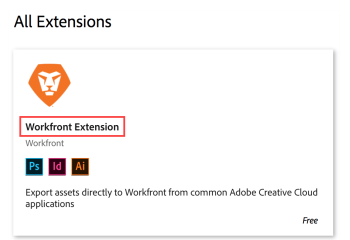
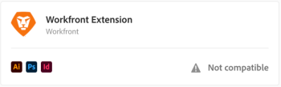

# Install `Adobe Workfront` for Adobe Creative Cloud

The following sections describe how to download and install `Adobe Workfront` for Adobe Creative Cloud. For information about how to use the extension, see [Use Adobe Workfront for Adobe Creative Cloud](../../documents/workfront-for-adobe-creative-cloud/use-wf-adobe-cc.md).

## Supported applications

The `Workfront` extension is supported for the 2017 versions (and newer) of the following Adobe Creative Cloud applications:

* InDesign
* Illustrator
* Photoshop

The extension is supported for both Adobe Cloud and desktop applications.

## Access requirements

You must have the following access to perform the steps in this article:

<table cellspacing="0"> 
 <col> 
 <col> 
 <tbody> 
  <tr> 
   <td role="rowheader">Adobe Workfront plan*</td> 
   <td> 
Pro or higher
 </td> 
  </tr> Adobe Workfront license* Work or higher 
  <tr> 
   <td role="rowheader">Product</td> 
   <td>You must have an Adobe Creative Cloud license in addition to a Workfront license.</td> 
  </tr> 
 </tbody> 
</table>

&#42;To find out what plan, license type, or access you have, contact your `Workfront administrator`.

## Install `Workfront` for Adobe Creative Cloud

<ol> 
 <li value="1">Open your Adobe Creative Cloud application and make sure that your apps are up to date.</li> 
 <li value="2"> 
In the preferences for your Adobe Creative Cloud application, make sure that syncing is enabled (this is the default). 
 </li> 
 <li value="3">In a web browser, log in to your Adobe account, then go to the Adobe Exchange Creative Cloud website.</li> 
 <li value="4"> 
In the Search Marketplace box (near the bottom of the screen), search for Workfront. 
 </li> 
 <li value="5"> 
In the box that appears below the search box, click Workfront Extension.
 
  
 </li> 
 <li value="6">Click Install.</li> 
 <li value="7"> 
When the installation completes, restart your computer and Workfront for Adobe Creative Cloud is added to your list of extensions for the supported applications. 
 
For information about verifying that the extension is installed, see the <a href="#ensuring-the-addon-installed-successfully" class="MCXref xref">Ensure Workfront for Adobe Creative Cloud installed successfully</a> section in this article.
 </li> 
</ol>

## Ensure `Workfront` for Adobe Creative Cloud installed successfully

1. Open one of the following supported applications on your computer:

  * Adobe Illustrator
  * Adobe InDesign
  * Adobe Photoshop

1. Click `Window` > `Extensions` > `Workfront`.

   If you don't see the `Workfront` extension, make sure that syncing is enabled in Adobe Creative Cloud. See Adobe Help documentation if you need help

## Troubleshooting `Workfront` for Adobe Creative Cloud installation

### Problem: Workfront extension shows "Not Compatible" message

#### Solution:

You may have an existing, older version of the `Workfront` extension for Adobe Creative Cloud. Locate and uninstall the existing `Workfront` extension, then install the new Workfront extension as described in [Install Workfront for Adobe Creative Cloud](#downloading-and-configuring-the-workfront-extension) in this article.
