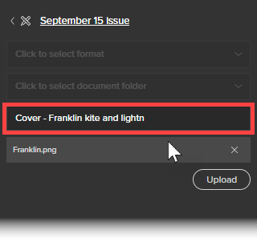
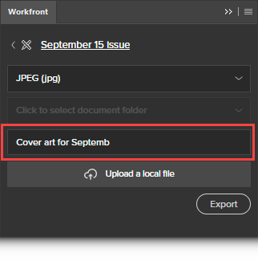

# Use Adobe Workfront for Adobe Creative Cloud

You can use the Adobe Workfront for Adobe Creative Cloud extension to export digital content you save and create in an Adobe Creative Cloud application to Workfront. This speeds up the document review and approval process.

The Workfront&nbsp;extension is supported for Adobe Creative Cloud 2017 and newer in the following applications:

* InDesign
* Illustrator
* Photoshop

The following sections describe how to use the Workfront for Adobe Creative Cloud extension after you have installed it. For information about how to install the extension, see [Install Adobe Workfront for Adobe Creative Cloud](../../documents/workfront-for-adobe-creative-cloud/installl-wf-adobe-cc.md).

## Access requirements

You must have the following access to perform the steps in this article:

<table cellspacing="0"> 
 <col> 
 <col> 
 <tbody> 
  <tr> 
   <td role="rowheader">Adobe Workfront plan*</td> 
   <td> 
Pro or higher
 </td> 
  </tr> Adobe Workfront license* Work or higher 
  <tr> 
   <td role="rowheader">Product</td> 
   <td>You must have an Adobe Creative Cloud license in addition to a Workfront license.</td> 
  </tr> 
  <tr> 
   <td role="rowheader">Object permissions</td> 
   <td> 
Edit access to the object you want to interact with.
 
For information on requesting additional access, see <a href="../../workfront-basics/grant-and-request-access-to-objects/request-access.md" class="MCXref xref">Request access to objects in Adobe Workfront</a>.
 </td> 
  </tr> 
 </tbody> 
</table>

&#42;To find out what plan, license type, or access you have, contact your Workfront administrator.

## Log in to Workfront from an Adobe Creative Cloud application&nbsp;

When you log in to Workfront from one of the supported Adobe applications, you are logged in to all supported Adobe applications.

<ol> 
 <li value="1"> 
Go to the Adobe application where you want to use the Workfront extension. 
 
For information about installing the extension, see <a href="../../documents/workfront-for-adobe-creative-cloud/installl-wf-adobe-cc.md" class="MCXref xref">Install Adobe Workfront for Adobe Creative Cloud</a>. 
 
For a list of supported formats for each supported application, see <a href="#supported-exported-file-formats" target="_blank" rel="noopener" class="MCXref xref">Supported exported file formats</a> in this article.
 </li> 
 <li value="2">Click Window > Extensions > Workfront.</li> 
 <li value="3">(Optional) Drag the Workfront panel to the position where&nbsp;you want it displayed in the Adobe application.</li> 
 <li value="4"> 
Follow the prompts to log in to Workfront using Enhanced Authentication, OAuth 2.0, or your Security Assertion Markup Language (SAML) URL.
 <note type="note"> 
   <ul> 
    <li>When you are prompted to enter the domain of your Workfront account, type it using this format: <em>yourCompany'sDomain.my.workfront.com</em>. Your company's domain is usually the name of your company.</li> 
    <li>Enhanced Authentication is not available until a Workfront administrator enables it for this integration. </li> 
   </ul> 
  </note> <!--
   Follow the prompts to log in to Workfront. Note: Workfront connects to Adobe Creative Cloud using OAuth 2.0, a secure standard used by most web-based integrations for the authentication and authorization of users. When you are prompted to enter the [domain or host] of your Workfront account, type it using this format: yourCompany'sDomain.my.workfront.com. Your company's domain is usually the name of your company.
  --> 
A&nbsp;list of work items assigned to you displays, grouped by project. If a list does not display, log in to Workfront. 
 
Your personal tasks are listed under No Project.
 </li> 
</ol>

## Upload a file to a Workfront project, task, or issue

You can upload a file from your computer file system or export a file currently open in an Adobe Creative Cloud application to a Workfront project, task, or issue.&nbsp;

Consider the following when uploading or exporting a file from Adobe Creative Cloud:

* Your Access Level must permit uploading documents to Workfront. For more information, see [Grant access to documents](../../administration-and-setup/add-users/configure-and-grant-access/grant-access-documents.md).
* You must have permissions to upload documents to the item where you want it. For more information, see [Overview of sharing permissions on objects in Adobe Workfront](../../workfront-basics/grant-and-request-access-to-objects/sharing-permissions-on-objects-overview.md).
* The file uploads to the Documents area for the Workfront object that you select.

This section explains the following:

* [Upload a file](#upload) 
* [Export a file currently open in an Adobe application](#exporting-a-file) 
* [Upload a new version of a file from an Adobe application](#uploading-a-new-version)

### Upload a file

You can upload your files to a project, task, or issue without leaving your Adobe Creative Cloud application.

<ol> 
 <li value="1"> 
If you do not see the Workfront extension when you open your Adobe Creative Cloud application, click&nbsp;Window > Extensions > Workfront. 
 
A&nbsp;list of work items assigned to you displays, grouped by project. If a list does not display, log in to Workfront. 
 
Your personal tasks are listed under No Project.
 </li> 
 <li value="2"> 
Click the name of the project, task, or issue to which you want to upload the file.
 
You can search for this by typing the name in the Search box and selecting Project, Task, or Issue from the drop-down menu to the right of the Search box. If the name of the work item doesn't appear in the list, press Enter to search all Workfront items that you have access to view. 
 </li> 
 <li value="3">Click Select in the lower-right corner of the Workfront extension.</li> 
 <li value="4"> 
In the Click to select format drop-down menu, click the format in which you want to save the file in Workfront. 
 
For a list of supported formats for each supported application, see <a href="#supported-exported-file-formats" target="_blank" rel="noopener" class="MCXref xref">Supported exported file formats</a> in this article.
 </li> 
 <li value="5">(Conditional) If the work item where you want to upload the file has document folders, select a document folder in the Click to select a document folder field, then click Select.</li> 
 <li value="6">Click Upload a local file.</li> 
 <li value="7">In the Open File box that appears, find the file in your file system, then click Open.&nbsp;</li> 
 <li value="8"> 
(Optional) Type a new name for the file.&nbsp;
 
  
 </li> 
 <li value="9"> 
Click Upload. 
 
In Workfront, the document is now listed in the Documents area for the project, task, or issue you specified. &nbsp;
 </li> 
 <li value="10"> 
(Optional) Click the name of the document to open its Document Details page in Workfront. 
 
Workfront opens in a new browser tab.
 </li> 
</ol>

### Export a file currently open in an Adobe application

<ol> 
 <li value="1">In a supported Adobe Creative Cloud application, open a file that you would like to export to Workfront.&nbsp;</li> 
 <li value="2"> 
If the Workfront extension is not displayed, click Window > Extensions > Workfront. 
 
A&nbsp;list of work items assigned to you displays, grouped by project. If a list does not display, log in to Workfront. 
 
Your personal tasks are listed under No Project.
 </li> 
 <li value="3"> 
Click the name of the project, task, or issue to which you want to export the file.
 
You can search for this by typing the name in the Search box and selecting Project, Task, or Issue from the drop-down menu to the right of the Search box. If the name of the work item doesn't appear in the list, press Enter to search all Workfront items that you have access to view. 
 </li> 
 <li value="4"> 
Click Select in the lower-right corner of the Workfront extension. 
 </li> 
 <li value="5"> 
In the Click to select format drop-down menu, click the format in which you want to save the file in Workfront. 
 
For a list of supported formats for each supported application, see <a href="#supported-exported-file-formats" target="_blank" rel="noopener" class="MCXref xref">Supported exported file formats</a> in this article.
 </li> 
 <li value="6"> 
(Conditional) If the work item where you want to upload the file has document folders, select a document folder in the Click to select a document folder field, then click Select.
 </li> 
 <li value="7"> 
(Optional) To rename the document, click the document name and type a new name.
 
  
 </li> 
 <li value="8"> 
Click Export.&nbsp;
 
A message displays to confirm that the document successfully exported to Workfront. 
 
In Workfront, the document is listed in the Documents area of the object you specified in Workfront.
 </li> 
 <li value="9"> 
(Optional) Click the name of the document to access it in Workfront. 
 
  
 
Workfront opens in a new browser tab. 
 </li> 
</ol>

### Upload a new version of a file from an Adobe application

<ol> 
 <li value="1">If you want to export a file you are working on in a supported Adobe application as a new version of a file in Workfront, open the file in the Adobe application.&nbsp;</li> 
 <li value="2"> 
If the Workfront extension is not displayed, click Window > Extensions > Workfront. 
 
A&nbsp;list of work items assigned to you displays, grouped by project. If a list does not display, log in to Workfront. 
 
Your personal tasks are listed under No Project.
 </li> 
 <li value="3"> 
Click the name of the project, task, or issue where the existing document is listed.
 
You can search for this by typing the name in the Search box and selecting Project, Task, or Issue from the drop-down menu to the right of the Search box. If the name of the work item doesn't appear in the list, press Enter to search all Workfront items that you have access to view. 
 
All documents uploaded to projects, tasks, or issues display in a list, regardless of whether they were uploaded from the Adobe application.
 </li> 
 <li value="4">Click the name of the existing document, then click Select in the lower-right corner of the Workfront extension.</li> 
 <li value="5"> 
In the Click to select format drop-down menu, click the format in which you want to save the file in Workfront. 
 
This is required if you are exporting a file you have open in the Adobe application. For a list of supported formats for each supported application, see <a href="#supported-exported-file-formats" target="_blank" rel="noopener" class="MCXref xref">Supported exported file formats</a> in this article.
 </li> 
 <li value="6"> 
If you are exporting a file you have open in the Adobe application as a new version of the Workfront document you selected, click Export.
 
Or
 
If you want to upload a file from your computer file system as a new version of the Workfront document you selected, click Upload a local file, find the file in the box that appears, click Open, then click Upload. 
 </li> 
 <li value="7"> 
(Optional) Click the name of the document to see its new version in Workfront.&nbsp;
 <note type="note"> 
   
The name of the document in Workfront is populated by default and cannot be edited. Nor does it change to the name of the file you upload or export as a new version.
 
   
    
 
  </note> </li> 
</ol>

## Comment&nbsp;on a Workfront document from an Adobe application

You can add comments directly to a Workfront document within an Adobe application. In Workfront, your comments display in the document's Updates area and the Updates area for the Workfront item where the document is saved.&nbsp;

1. Open one of the supported Adobe applications.
1. If the Workfront extension is not displayed, click `Window` > `Extensions` > Workfront.

   A&nbsp;list of work items assigned to you displays, grouped by project. If a list does not display, log in to Workfront.

   Your personal tasks are listed under `No Project`.

1. Click the project, task, or issue where the existing document is listed.

   You can search for this by typing the name in the `Search` box and selecting `Project`, `Task`, or `Issue` from the drop-down menu to the right of the `Search` box. If the name of the work item doesn't appear in the list, press `Enter` to search all Workfront items that you have access to view.

1. Click the name of the existing document, then click `Select` in the lower-right corner of the Workfront extension.
1. Click the `Comment` tab, then type your update in the box that appears.  

1. (Optional) To include other Workfront users or teams on the comment, start typing the name of a user or a team in the `Notify people or teams` box, then click the name when it appears in the drop-down list.
1. (Optional) To request approval on the document, select  `Make an approval request`.
1. Click `Update`.

   An update is posted in the Updates tab of the document. Workfront users who you include in the comment&nbsp;receive an in-app notification, and, depending on how Workfront is configured, might also receive an email notification.

   For more information about notifications within Workfront, see [View and manage in-app notifications](../../workfront-basics/using-notifications/view-and-manage-in-app-notifications.md).&nbsp;

   For more information about receiving email notifications, see [Adobe Workfront notifications](../../workfront-basics/using-notifications/wf-notifications.md).

## Request a document approval from an Adobe application

You can request a Workfront document approval directly from an Adobe application.

You can request a document approval from the following entities:

* A Workfront user
* An external user without a Workfront account

You can request an approval on a document from an Adobe application in the following ways:

* By attaching an approver to the document.
* By commenting on a document, notifying the person when you make a comment. and attaching them as an approver to the document.

  For information about requesting an approval when commenting on a document, see [Comment on a Workfront document from an Adobe application](#commenting-on-a-workfront-document) in this article.

To request an approval on a document from an Adobe application:

<ol> 
 <li value="1">Open one of the supported Adobe applications.</li> 
 <li value="2"> 
If the Workfront extension is not displayed, click Window > Extensions > Workfront. 
 
A&nbsp;list of work items assigned to you displays, grouped by project. If a list does not display, log in to Workfront. 
 
Your personal tasks are listed under No Project.
 </li> 
 <li value="3"> 
Click the project, task, or issue where the existing document is listed, then click the name of the existing document.
 
You can search for this by typing the name in the Search box and selecting Project, Task, or Issue from the drop-down menu to the right of the Search box. If the name of the work item doesn't appear in the list, press Enter to search all Workfront items that you have access to view. 
 </li> 
 <li value="4">Click the name of the existing document, then click Select in the lower-right corner of the Workfront extension.</li> 
 <li value="5">Click the Approval tab.</li> 
 <li value="6">To add an approver, in the Start typing a name box do one of the following: 
  <ul>
   <li>
Type the name of an approver, then select it when it displays in the list. 

</li>
   <li>Type the email address of an external user. </li>
  </ul></li> 
 <li value="7"> 
Click Request Approval. 
 
Workfront users who you include in the comment&nbsp;or add as an approver receive an in-app notification, and, depending on how Workfront is configured, might also receive an email notification.  External Users receive an email notification from where they can make a decision on the approval. 
 
For information about notifications in Workfront, see <a href="../../workfront-basics/using-notifications/view-and-manage-in-app-notifications.md" class="MCXref xref">View and manage in-app notifications</a>. For information about receiving email notifications, see <a href="../../workfront-basics/using-notifications/wf-notifications.md" class="MCXref xref">Adobe Workfront notifications</a>.
 </li> 
</ol>

## Generate a proof from an Adobe application

If your organization uses Automated Workflow templates, you can generate a proof for a document you create in an Adobe application without leaving the application. For information about generating proofs, see [Generate a proof](../../review-and-approve-work/proofing/creating-proofs-within-workfront/generate-proof.md). For information about Automated Workflow templates, see [Automated Workflow templates](../../review-and-approve-work/proofing/proofing-overview/automated-workflow.md#automate) in [Automated Workflow overview](../../review-and-approve-work/proofing/proofing-overview/automated-workflow.md).

1. Open one of the supported Adobe applications.
1. If the Workfront extension is not displayed, click `Window` > `Extensions` > Workfront.

   A&nbsp;list of work items assigned to you displays, grouped by project. If a list does not display, log in to Workfront.

   Your personal tasks are listed under `No Project`.

1. If the document is already uploaded to Workfront, select the project, task, or issue in the Workfront extension where the document is listed, then click the name of the document.

   Or

   Upload an Abobe document to a Workfront object, as described in the section [Upload a file to a Workfront project, task, or issue](#sending-a-file-to-workfront) in this article, then click the name of the document.

1. In the `Click to select format` drop-down menu, click the format in which you want to save the file in Workfront.

   Some formats are not available after you enable proofing functionality in the step following this one. For more information, see [Supported exported file formats](#supported-exported-file-formats) in this article.

1. Click `Upload as a new proof` to enable it.
1. Select the `Workflow Template` you want people to use as they review the document.

   Your Workfront administrator sets up Automated Workflow templates, as described in [Create and manage Automated Workflow templates](../../administration-and-setup/manage-workfront/configure-proofing/create-manage-automated-workflow-templates.md). See the administrator if you have questions.

  1. Add at least one `New recipient` to every stage in the Workflow Template.

     You can start typing a name and select it when you see it in the drop-down list that appears.
  
  1. Specify the `Proof role` and frequency of `Email alerts` for each recipient you add.

  1. (Optional) In the `Email notification` section, select whether to send an email notification with an optional custom message about the proof to&nbsp;all the proof recipients you added.

1. Click `Create proof`.

   You can view the progress of the proof creation process. An alert appears when it has finished generating. You can open the task where you created the proof and it is listed there.

## Upload a new version of a proof without leaving your Adobe application

1. Click an existing document that has a proof, then click `Select` in the lower-right corner.
1. Click `Upload as a new proof version` to enable it.
1. (Optional) Select the `Workflow Template` you want people to use as they review the new version.

   If you don't select a different template, the template selected for the earlier version remains in effect. Also, if you have modified the template for the earlier version, the changes are in effect for the new version.

   Your Workfront administrator sets up Automated Workflow templates, as described in [Create and manage Automated Workflow templates](../../administration-and-setup/manage-workfront/configure-proofing/create-manage-automated-workflow-templates.md). See the administrator if you have questions.

  1. Add at least one `New recipient` to every stage in the Workflow Template.

     You can start typing a name and select it when you see it in the drop-down list that appears.
  
  1. Specify the `Proof role` and frequency of `Email alerts` for each recipient you add. 
  1. (Optional) In the `Email notification` section, select whether to send an email notification with an optional custom message about the proof to&nbsp;all the proof recipients you added.

1. Click `Create new proof version`.

   You can view the progress of the proof creation process. An alert appears when it has finished generating. You can open the task where you created the proof and it is listed there.

## Log out of Workfront for Adobe Creative Cloud

<ol> 
 <li value="1">From the Adobe application, click&nbsp;Window > Extensions > Workfront.</li> 
 <li value="2"> 
Click the More menu  in the upper-right corner of the panel. 
 </li> 
 <li value="3">(Optional) Click Feedback to open a brief survey and send Workfront your feedback about Workfront for Adobe Creative Cloud.&nbsp;</li> 
 <li value="4">Click Logout. The Login screen displays. For information about logging in, see <a href="#logging-in" class="MCXref xref">Log in to Workfront from an Adobe Creative Cloud application&nbsp;</a> in this article.</li> 
</ol>

## Supported exported file formats

* [Supported Exported File Formats for Adobe InDesign](#supported-exported-file-formats-indesign) 
* [Supported exported file formats for Adobe Illustrator](#supported-exported-file-formats-illustrator) 
* [Supported exported file formats for Adobe Photoshop](#supported-exported-file-formats-photoshop)

### Supported Exported File Formats for Adobe InDesign&nbsp;

Workfront supports the following file formats for exporting a file from InDesign to Workfront:

* EPS - Encapsulated PostScript
* EPUB - Fixed layout electronic publication
* EPUB - Reflowable electronic publication &#42;
* HTML - HyperText Markup Language
* IDML - InDesign Markup Language &#42;
* JPG, JPEG - Joint Photographic Experts Group
* PDF - Adobe Portable Document File
* PNG - Portable Network Graphics
* SWF - Flash Player &#42;
* XML - Extensible Markup Language &#42;

&#42; This file format is not available when `Upload a new proof` is enabled (for information about this option, see [Generate a proof from an Adobe application](#generate) in this article). If this file format is already selected before you enable `Upload a new proof`, the system changes the file format to PDF. You can select a different format from the list.

### Supported exported file formats for Adobe Illustrator&nbsp;

Workfront supports the following file formats for exporting a file from Illustrator to Workfront:

* DWG - AutoCAD Drawing, AutoCAD Interchange File &#42;
* JPG, JPEG - Joint Photographic Experts Group
* PNG - Portable Network Graphics
* PSD - Photoshop Document
* SWF - Flash Player &#42;
* TIFF - Tagged Image File Format

&#42; This file format is not available when `Upload a new proof` is enabled (for information about this option, see [Generate a proof from an Adobe application](#generate) in this article). If this file format is already selected before you enable `Upload a new proof`, the system changes the file format to PNG. You can select a different format from the list.

### Supported exported file formats for Adobe Photoshop&nbsp;

Workfront supports the following file formats for exporting a file from from Adobe Photoshop&nbsp;to Workfront:&nbsp;

* JPG, JPEG - Joint Photographic Experts Group
* GIF - Graphics Interchange Format
* PNG - Portable Network Graphics
* PNG-8 - Portable Network Graphics palette variant

