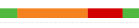
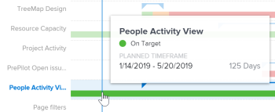

# View the Flight plan visualization in Enhanced analytics

The Flight plan visualization shows how many projects (within the applied filter criteria) were in flight, what condition changes happened throughout the life of these projects, and how closely these projects adhered to their planned completion deadlines.

In the actual duration of a project, you can see only the following project conditions:

* On Target
* At Risk
* In Trouble

To learn about project conditions, see [Overview of Project Condition and Condition Type](../manage-work/projects/manage-projects/project-condition-and-condition-type.md).

The Flight plan visualization shows the following project details:

<ul> 
 <li> 
<b>Planned duration</b>: The horizontal blue line represents the planned length of the project, with the triangles at either end of the line indicating the start date and end date.
 
  
 </li> 
 <li> 
<b>Actual duration</b>: The thick, colored line below the planned duration represents the actual length of the project. The color of the line changes depending on the condition of the project at that particular time in the life of the project.
 
  
 </li> 
 <li> 
<b>Actual condition</b>: The thick, colored line also shows the condition of a project at different moments in time. The color of the line changes depending on the condition of the project:
 
  <ul> 
   <li> 
Green: On Target
 </li> 
   <li> 
Orange: At Risk
 </li> 
   <li> 
Red: In&nbsp;Trouble
 </li> 
  </ul> 
  
 </li> 
</ul>

By hovering over a project row in the Flight Plan visualization, you can see information about the project's planned timeframe, the current project condition, and—if applicable—the custom condition. To get a more in-depth view of what may have affected the duration or condition, you can look at the other visualizations in the Enhanced analytics area.

Seeing this information helps you determine:

* What events extend a project past the original planned completion date.
* When a project starts to run into issues.
* How many projects are open over the same time period.
* How many projects are active.
* Which projects need extra attention or support.

For information on how to get the best data for this visualization, see [Enhanced analytics overview](../enhanced-analytics/enhanced-analytics-overview.md).

## Access requirements

You must have the following:

<table cellspacing="0"> 
 <col> 
 <col> 
 <tbody> 
  <tr> 
   <td role="rowheader"><a href="https://www.workfront.com/plans" target="_blank">Adobe Workfront plan</a>*</td> 
   <td> 
Business or higher
 </td> 
  </tr> 
  <tr> 
   <td role="rowheader"><a href="../administration-and-setup/add-users/access-levels-and-object-permissions/wf-licenses.md" class="MCXref xref">Adobe Workfront licenses overview</a>*</td> 
   <td> 
Review or higher
 </td> 
  </tr> 
  <tr> 
   <td role="rowheader">Access level configurations*</td> 
   <td> 
View access to Projects
 
Note: If you still don't have access, ask your Workfront administrator if they set additional restrictions in your access level. For information on how a Workfront administrator can change your access level, see <a href="../administration-and-setup/add-users/configure-and-grant-access/create-modify-access-levels.md" class="MCXref xref">Create or modify custom access levels</a>.
 </td> 
  </tr> 
  <tr> 
   <td role="rowheader">Object permissions</td> 
   <td> 
View access to the project
 
For information on requesting additional access, see <a href="../workfront-basics/grant-and-request-access-to-objects/request-access.md" class="MCXref xref">Request access to objects in Adobe Workfront</a>.
 </td> 
  </tr> 
 </tbody> 
</table>

&#42;To find out what plan, license type, or access you have, contact your Workfront administrator.

## Prerequisites

For prerequisites to using Enhanced Analytics, see [Prerequisites](../enhanced-analytics/enhanced-analytics-overview.md#prerequi) in [Enhanced analytics overview](../enhanced-analytics/enhanced-analytics-overview.md).

## View the Flight plan visualization

<ol> 
 <li value="1"> 
 Click the Main Menu icon , thenselect <b>Analytics</b>.
 </li> 
 <li value="2"> 
(Optional) To use a different date range, select new start and end dates from the date range filter.
 
  
 
For information on using the date range filter, see <a href="../enhanced-analytics/use-enhanced-analytics-filters.md" class="MCXref xref">Apply filters in Enhanced analytics</a>.
 </li> 
 <li value="3"> 
(Conditional) If you need to limit the project data set, select and apply the filters that you want to use.
 
For more information on adding filters in Enhanced analytics, see <a href="../enhanced-analytics/use-enhanced-analytics-filters.md" class="MCXref xref">Apply filters in Enhanced analytics</a>.
 
After you add filters, data for up to 50 projects displays and the filters remain active even after you leave the page or log out of Workfront.
 </li> 
 <li value="4"> 
(Optional) To zoom in on a date range, select a point on the visualization for the start of your date range and drag to the end of your date range.
 
All other visualizations update to the same date range and a timeframe filter is created.
 
  
 </li> 
 <li value="5"> 
(Optional) To change how the projects are sorted, click the <b class="bold">Sort by</b> menu in the upper-right corner of the Flight plan visualization, then select a new sorting option:
 
  <ul> 
   <li> 
A - Z 
 </li> 
   <li> 
Z - A 
 </li> 
   <li> 
Planned completion date 
 </li> 
   <li> 
Planned start date 
 </li> 
  </ul> 
All other visualizations on the page update to match your sorting selection.
 </li> 
 <li value="6"> 
(Conditional) If there are more than 50 projects in your data set, use the arrows in the bottom-left corner of the visualization to navigate from one group of 50 projects to the next.
 
All other visualizations on the page update to match your page selection.
 
  
 </li> 
 <li value="7"> 
Hover over the project bar graph to see the blue date line, as well as the following details:
 
  <ul> 
   <li> 
Planned timeline
 </li> 
   <li> 
Current condition
 </li> 
   <li> 
Custom condition (if applicable)
 </li> 
  </ul> 
  
 </li> 
 <li value="8"> 
(Optional) To export the visualization data, click the <b>Export</b> icon  in the top-right corner of the visualization, then select the export format:
 
  <ul> 
   <li> 
<b>Chart (PNG)</b> 
 </li> 
   <li> 
<b>Data Table (XSLX)</b> 
 </li> 
  </ul> </li> 
 <li value="9"> 
To see more project information, click a project on the visualization to open the Burndown and Tasks in flight visualizations.
 
These visualizations can help you gain deeper insight into what caused the project to get off track. They also make it easy to check in on an in-progress project. For more information on the Burndown visualization, see <a href="../enhanced-analytics/burndown-overview.md" class="MCXref xref">View the Burndown visualization in Enhanced analytics</a>. For more information on the Tasks in flight visualization, see <a href="../enhanced-analytics/tasks-in-flight-overview.md" class="MCXref xref">View the Tasks in flight visualization in Enhanced analytics</a>.
 </li> 
</ol>

## Video walk-through

View the following video to learn more about the Flight plan visualization. This video was recorded in the new Workfront experience. However, the content also applies to Workfront Classic.

 
