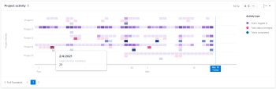
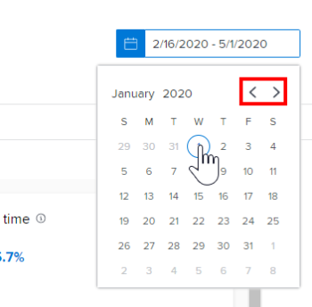
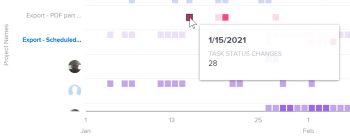

# View the Project activity visualization in *Enhanced analytics*

The Project activity visualization shows an aggregate view of activities on the project level—the activities of each person assigned to the project—that happened during a specific time frame. You can narrow your focus to understand the activities within a project, or you can compare project activities against other projects in *Adobe Workfront*.

>[!NOTE]
>
>The Activity by team visualization behaves similarly to this visualization, but the Activity by team visualization shows home team activity for all projects.  
>For information on the Activity by team visualization, see [View the Activity by team visualization in Enhanced analytics](../enhanced-analytics/activity-by-team-overview.md).

Project activities display in different colors to summarize specific events in a project over a period of time:

<ul> 
 <li> 
Users logged in: Purple boxes show that people assigned to the project logged in on that day. A darker shade indicates a higher number of people logging in.
 
  
 </li> 
 <li> 
Task status change: Pink boxes show that people changed the status of a task for the project on that day. A darker shade indicates a higher number of task statuses changing.
 
  
 </li> 
 <li> 
Tasks completed: Blue boxes show that people completed a task for the project. A darker shade indicates a higher number of tasks being completed.
 
  
 </li> 
</ul>

Hovering over a box shows the exact number of times the action was completed in a given day. You can select a project to see a breakdown of these activities by each individual contributor on the project.

Seeing this information helps you determine:

* The activity on a specific project.
* The activity of one project compared to other projects.
* Which users are working on a project and at what frequency.

To learn how to get the best data for this visualization, see [Enhanced analytics overview](../enhanced-analytics/enhanced-analytics-overview.md).

## Access requirements

You must have the following:

<table cellspacing="0"> 
 <col> 
 <col> 
 <tbody> 
  <tr> 
   <td role="rowheader"><a href="https://www.workfront.com/plans" target="_blank"><em>Workfront</em> plan</a>*</td> 
   <td> 
Business or higher
 </td> 
  </tr> 
  <tr> 
   <td role="rowheader"><a href="../administration-and-setup/add-users/access-levels-and-object-permissions/wf-licenses.md" class="MCXref xref">Adobe Workfront licenses overview</a>*</td> 
   <td> 
Review or higher
 </td> 
  </tr> 
  <tr> 
   <td role="rowheader">Access level configurations*</td> 
   <td> 
View access to Projects
 
Note: If you still don't have access, ask your <em>Workfront administrator</em> if they set additional restrictions in your access level. For information on how a <em>Workfront administrator</em> can change your access level, see <a href="../administration-and-setup/add-users/configure-and-grant-access/create-modify-access-levels.md" class="MCXref xref">Create or modify custom access levels</a>.
 </td> 
  </tr> 
  <tr> 
   <td role="rowheader">Object permissions</td> 
   <td> 
View
 
For information on requesting additional access, see <a href="../workfront-basics/grant-and-request-access-to-objects/request-access.md" class="MCXref xref">Request access to objects in Adobe Workfront</a>.
 </td> 
  </tr> 
 </tbody> 
</table>

&#42;To find out what plan, license type, or access you have, contact your *Workfront administrator*.

## Prerequisites

For prerequisites to using Enhanced Analytics, see [Prerequisites](../enhanced-analytics/enhanced-analytics-overview.md#prerequi) in [Enhanced analytics overview](../enhanced-analytics/enhanced-analytics-overview.md).

## View the Project activity visualization

<ol> 
 <li value="1"> 
 <draft-comment>
    <MadCap:conditionalText data-mc-conditions="QuicksilverOrClassic.Quicksilver">
     Click the Main Menu icon 
     , then 
    </MadCap:conditionalText>
   </draft-comment><MadCap:conditionalText data-mc-conditions="QuicksilverOrClassic.Quicksilver">
    Click the Main Menu icon 
    , then 
   </MadCap:conditionalText>select <b>Analytics</b>.
 </li> 
 <li value="2"> 
(Optional) To use a different date range, select new start and end dates from the date range filter.
 
  
 
For information on using the date range filter, see <a href="../enhanced-analytics/use-enhanced-analytics-filters.md" class="MCXref xref">Apply filters in Enhanced analytics</a>.
 <note type="note">
   If you select a date range for a period greater than 3 months, the Project activity visualization does not display any data.
  </note> </li> 
 <li value="3"> 
(Conditional) If you need to limit the project data set, select and apply the filters that you want to use.
 
For more information on adding filters in <em>Enhanced analytics</em>, see <a href="../enhanced-analytics/use-enhanced-analytics-filters.md" class="MCXref xref">Apply filters in Enhanced analytics</a>.
 
After you add filters, data for up to 50 projects displays and the filters remain active even after you leave the page or log out of <em>Workfront</em>.
 </li> 
 <li value="4"> 
(Optional) To zoom in on a date range, select a point on the visualization for the start of your date range and drag to the end of your date range.
 
All other visualizations update to the same date range and a timeframe filter is created.
 
  
 </li> 
 <li value="5"> 
(Optional) To change how the projects are sorted, click the <b class="bold">Sort by</b> menu, then select a new sorting option:
 
  <ul> 
   <li> 
A - Z 
 </li> 
   <li> 
Z - A 
 </li> 
   <li> 
Planned completion date 
 </li> 
   <li> 
Planned start date 
 </li> 
  </ul> 
All other visualizations on the page update to match your sorting selection.
 </li> 
 <li value="6"> 
(Conditional) If there are more than 50 projects in your data set, use the arrows in the bottom-left corner of the visualization to navigate from one group of 50 projects to the next.
 
All other visualizations on the page update to match your page selection.
 
  
 </li> 
 <li value="7"> 
Click a project in the visualization to see more details for the project.
 
The list expands to display the activities of each individual contributor on the project.
 </li> 
 <li value="8"> 
Mouse over a box to see the date that users completed an action, as well as the number of times the action was completed for that day.
 
  
 </li> 
 <li value="9"> 
(Optional) To export the visualization data, click the <b>Export icon</b>  in the top-right corner of the visualization, then select the export format:
 
  <ul> 
   <li> 
<b>Chart (PNG)</b> 
 </li> 
   <li> 
<b>Data Table (XSLX)</b> 
 </li> 
  </ul> </li> 
</ol>

## Video walk-through

View the following video to learn more about the Project activity visualization. This video was recorded in *the new Workfront experience*. However, the content also applies to *Workfront Classic*.

 
