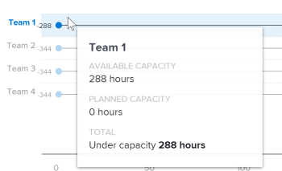

# View the Resource capacity visualization in *Enhanced analytics*

The Resource capacity visualization shows whether a team is over, under, or at capacity. This calculation is based on:

<ul> 
 <li> 
 <b>Available capacity</b>: The total amount of hours a home team has available to work in the filtered period of time
 <note type="note">
   If you are looking at a future time period, the available capacity is calculated based on the team's capacity for the last 7 days. For this reason, any scheduled PTO is not taken into account.
  </note> </li> 
 <li> 
 <b>Planned capacity</b>: The total amount of planned hours of work expected from the home team in the filtered period of time
 </li> 
</ul>

This comparison of a home team's planned hours and actual scheduled hours can help you determine if you're not assigning enough work to the home team or if they may be experiencing burnout from a heavy workload.

On the Resource capacity visualization, you can see the following details:

<ul> 
 <li> 
Planned capacity: Inline with a home team name, the blue circle represents the number of planned hours assigned to the home team.
 
  
 </li> 
 <li> 
Actual capacity: Inline with a home team name, the vertical line represents the number of hours available for the home team.
 
  
 </li> 
 <li> 
Over capacity: When the horizontal line and the blue circle display to the right of the vertical line, the home team was assigned more work than they can complete in the number of available hours. This means that the team may be over capacity for the filtered time period. The remaining number of hours the team needs to complete displays to the right of the blue circle.
 
  
 </li> 
 <li> 
Under capacity: When the horizontal line and the blue circle display to the left of the vertical line, the home team has more available hours than the number of planned hours of work they were assigned. This means that the team may be under capacity for the filtered time period. The additional number of available hours for the home team to complete work displays to the left of the blue circle.
 
  
 </li> 
</ul>

Hovering over a row shows the exact number of hours for planned capacity and available capacity, as well as the number of hours the home team is over or under capacity.

Seeing this information helps you determine:

* If the home team was overallocated or underallocated.
* What the largest projects were that the home team was focused on.
* Which home teams are available for work.

To learn how to get the best data for this visualization, see [Enhanced analytics overview](../enhanced-analytics/enhanced-analytics-overview.md).

## Access requirements

You must have the following:

<table cellspacing="0"> 
 <col> 
 <col> 
 <tbody> 
  <tr> 
   <td role="rowheader"><a href="https://www.workfront.com/plans" target="_blank"><em>Adobe Workfront</em> plan</a>*</td> 
   <td> 
Business or higher
 </td> 
  </tr> 
  <tr> 
   <td role="rowheader"><a href="../administration-and-setup/add-users/access-levels-and-object-permissions/wf-licenses.md" class="MCXref xref">Adobe Workfront licenses overview</a>*</td> 
   <td> 
Review or higher
 </td> 
  </tr> 
  <tr> 
   <td role="rowheader">Access level configurations*</td> 
   <td> 
View access to Projects
 
Note: If you still don't have access, ask your <em>Workfront administrator</em> if they set additional restrictions in your access level. For information on how a <em>Workfront administrator</em> can change your access level, see <a href="../administration-and-setup/add-users/configure-and-grant-access/create-modify-access-levels.md" class="MCXref xref">Create or modify custom access levels</a>.
 </td> 
  </tr> 
  <tr> 
   <td role="rowheader">Object permissions</td> 
   <td> 
View
 
For information on requesting additional access, see <a href="../workfront-basics/grant-and-request-access-to-objects/request-access.md" class="MCXref xref">Request access to objects in Adobe Workfront</a>.
 </td> 
  </tr> 
 </tbody> 
</table>

&#42;To find out what plan, license type, or access you have, contact your *Workfront administrator*.

## Prerequisites

For prerequisites to using Enhanced Analytics, see [Prerequisites](../enhanced-analytics/enhanced-analytics-overview.md#prerequi) in [Enhanced analytics overview](../enhanced-analytics/enhanced-analytics-overview.md).

## View the Resource capacity visualization

<ol> 
 <li value="1"> 
 <draft-comment>
    <MadCap:conditionalText data-mc-conditions="QuicksilverOrClassic.Quicksilver">
     Click the Main Menu icon 
     , then 
    </MadCap:conditionalText>
   </draft-comment><MadCap:conditionalText data-mc-conditions="QuicksilverOrClassic.Quicksilver">
    Click the Main Menu icon 
    , then 
   </MadCap:conditionalText>select <b>Analytics</b>.
 </li> 
 <li value="2"> 
In the left panel, select People.
 
 <draft-comment>
    
   </draft-comment> 
 </li> 
 <li value="3"> 
(Optional) To use a different date range, select new start and end dates from the date range filter.
 
  </img> 
 
For information on using the date range filter, see <a href="../enhanced-analytics/use-enhanced-analytics-filters.md" class="MCXref xref">Apply filters in Enhanced analytics</a>.
 </li> 
 <li value="4"> 
(Conditional) If you haven't set your Team filter, add the Team filter and select each team that you want to see data for.
 
For more information on adding filters in <em>Enhanced analytics</em>, see <a href="../enhanced-analytics/use-enhanced-analytics-filters.md" class="MCXref xref">Apply filters in Enhanced analytics</a>.
 
After you add filters, data for up to 50 projects displays and the filters remain active even after you leave the page or log out of <em>Workfront</em>.
 </li> 
 <li value="5"> 
(Optional) To zoom in on a date range, select a point on the visualization for the start of your date range and drag to the end of your date range.
 
All other visualizations update to the same date range and a timeframe filter is created.
 
  </img> 
 </li> 
 <li value="6"> 
Hover over the home team line to see how many hours are still available to be scheduled, the amount of hours planned for the home team to complete, and the total number of hours worked, which is labeled as over, under, or at capacity.
 
  
 </li> 
 <li value="7"> 
(Optional) To export the visualization data, click the <b>Export icon</b>  in the top-right corner of the visualization, then select the export format:
 
  <ul> 
   <li> 
<b>Chart (PNG)</b> 
 </li> 
   <li> 
<b>Data Table (XSLX)</b> 
 </li> 
  </ul> </li> 
 <li value="8"> 
Click a home team name to see more information in the Team capacity visualization.
 
To learn more about the Team capacity visualization, see <a href="../enhanced-analytics/team-capacity-overview.md" class="MCXref xref">View the Team capacity visualization in Enhanced analytics</a>.
 </li> 
</ol>

## Video walk-through

View the following video to learn more about the Resource capacity visualization. This video was recorded in *Workfront Classic*. However, the content also applies to *the new Workfront experience*.

 
