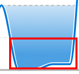
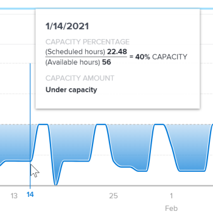

# View the Team capacity visualization in *Enhanced analytics*

The Team capacity visualization shows the total amount of capacity a home team has, whether they are overallocated or underallocated, and how dynamic the capacity is over time.

The Team capacity visualization displays the volume of work assigned to the home team on a given day.

<ul> 
 <li> 
Burnout: When the darker blue fill color is above the dotted line, the home team has more work hours assigned to them than they can complete in the number of hours the team is available to work. This indicates that the team is overallocated and may be approaching burnout.
 
  
 </li> 
 <li> 
Unchallenged: When the darker blue fill color is below the dotted line, the home team has more hours available to work than the amount of work assigned to them. This indicates that the team is underallocated and may be unchallenged.
 
  
 </li> 
 <li> 
Balance: When the lighter or more transparent blue fill color is just above, just below, or at the dotted line, the home team has an amount of work hours assigned to them that they should be able to complete within their available work hours. This indicates that the team's workload is more balanced.
 
  
 </li> 
</ul>

Hovering over any point on the visualization shows the following details for a given day:

* `Scheduled hours`: This is the number of planned hours of work the team needs to complete.
* `Available hours`: This is the number of work hours the team is available to work.
* `Capacity`: In addition to a capacity percentage, the designations At capacity, Under capacity, or Over capacity also display.

Seeing this information helps you determine:

* When the home team was overallocated or underallocated.
* If the home team is overallocated or underallocated on a daily basis.
* How consistent a home team's workload is from day to day.
* If you're creating capacity issues with new work.

To learn how to get the best data for this visualization, see [Enhanced analytics overview](../enhanced-analytics/enhanced-analytics-overview.md).

## Access requirements

You must have the following:

<table cellspacing="0"> 
 <col> 
 <col> 
 <tbody> 
  <tr> 
   <td role="rowheader"><a href="https://www.workfront.com/plans" target="_blank"><em>Adobe Workfront</em> plan</a>*</td> 
   <td> 
Business or higher
 </td> 
  </tr> 
  <tr> 
   <td role="rowheader"><a href="../administration-and-setup/add-users/access-levels-and-object-permissions/wf-licenses.md" class="MCXref xref">Adobe Workfront licenses overview</a>*</td> 
   <td> 
Review or higher
 </td> 
  </tr> 
  <tr> 
   <td role="rowheader">Access level configurations*</td> 
   <td> 
View access to Projects
 
Note: If you still don't have access, ask your <em>Workfront administrator</em> if they set additional restrictions in your access level. For information on how a <em>Workfront administrator</em> can change your access level, see <a href="../administration-and-setup/add-users/configure-and-grant-access/create-modify-access-levels.md" class="MCXref xref">Create or modify custom access levels</a>.
 </td> 
  </tr> 
  <tr> 
   <td role="rowheader">Object permissions</td> 
   <td> 
View
 
For information on requesting additional access, see <a href="../workfront-basics/grant-and-request-access-to-objects/request-access.md" class="MCXref xref">Request access to objects in Adobe Workfront</a>.
 </td> 
  </tr> 
 </tbody> 
</table>

&#42;To find out what plan, license type, or access you have, contact your *Workfront administrator*.

## Prerequisites

For prerequisites to using Enhanced Analytics, see [Prerequisites](../enhanced-analytics/enhanced-analytics-overview.md#prerequi) in [Enhanced analytics overview](../enhanced-analytics/enhanced-analytics-overview.md).

## View the Team capacity visualization

<ol> 
 <li value="1"> 
 <draft-comment>
    <MadCap:conditionalText data-mc-conditions="QuicksilverOrClassic.Quicksilver">
     Click the Main Menu icon 
     , then 
    </MadCap:conditionalText>
   </draft-comment><MadCap:conditionalText data-mc-conditions="QuicksilverOrClassic.Quicksilver">
    Click the Main Menu icon 
    , then 
   </MadCap:conditionalText>select <b>Analytics</b>.
 </li> 
 <li value="2"> 
In the left panel, select People.
 
 <draft-comment>
    
   </draft-comment> 
 </li> 
 <li value="3"> 
(Optional) To use a different date range, select new start and end dates from the date range filter.
 
  </img> 
 
For information on using the date range filter, see <a href="../enhanced-analytics/use-enhanced-analytics-filters.md" class="MCXref xref">Apply filters in Enhanced analytics</a>.
 </li> 
 <li value="4"> 
(Conditional) If you haven't set your Team filter, add the Team filter and select each team that you want to see data for.
 
For more information on adding filters in <em>Enhanced analytics</em>, see <a href="../enhanced-analytics/use-enhanced-analytics-filters.md" class="MCXref xref">Apply filters in Enhanced analytics</a>.
 
After you add filters, data for up to 50 projects displays and the filters remain active even after you leave the page or log out of <em>Workfront</em>.
 </li> 
 <li value="5"> 
On the Resource capacity visualization, click a team to see more information.
 
The Team capacity visualization displays.
 
For more information on the Resource capacity visualization, see <a href="../enhanced-analytics/resource-capacity-overview.md" class="MCXref xref">View the Resource capacity visualization in Enhanced analytics</a>.
 </li> 
 <li value="6"> 
(Optional) To zoom in on a date range, select a point on the visualization for the start of your date range and drag to the end of your date range.
 
All other visualizations update to the same date range and a timeframe filter is created.
 
  </img> 
 </li> 
 <li value="7"> 
Hover over a point on the graphed line to see the scheduled hours and planned hours for the given date, as well as the capacity percentage and whether the home team was over, under, or at capacity at the time.
 
  
 </li> 
 <li value="8"> 
(Optional) To export the visualization data, click the <b>Export icon</b>  in the top-right corner of the visualization, then select the export format:
 
  <ul> 
   <li> 
<b>Chart (PNG)</b> 
 </li> 
   <li> 
<b>Data Table (XSLX)</b> 
 </li> 
  </ul> </li> 
</ol>

## Video walk-through

View the following video to learn more about the Team capacity visualization. This video was recorded in *Workfront Classic*. However, the content also applies to *the new Workfront experience*.

 
