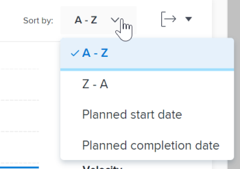
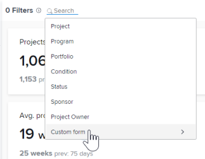
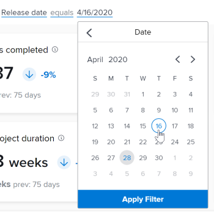

# Apply filters in Enhanced analytics

The filters in the Enhanced analytics area help you focus on specific projects or specific types of data. The types of filters that you use can give you insight on:

* Projects you own
* Specific portfolio or program views
* Key performance indicators for a specific time frame (week, quarter, fiscal year)

You can add and remove filters as needed and Adobe Workfront retains the filters that you apply even if you log out.

## Access requirements

To complete this task, you must have the following:

<table cellspacing="15"> 
 <caption style="text-align: left;">
  *To find out what plan, license type, or access you have, contact your Workfront administrator.
 </caption> 
 <col> 
 <col> 
 <tbody> 
  <tr> 
   <td> 
<a href="https://www.workfront.com/plans" target="_blank">Workfront plan</a>*
 </td> 
   <td>Business or higher</td> 
  </tr> 
  <tr> 
   <td> 
<a href="../administration-and-setup/add-users/access-levels-and-object-permissions/wf-licenses.md" class="MCXref xref">Adobe Workfront licenses overview</a>*
 </td> 
   <td> 
Review or higher
 </td> 
  </tr> 
  <tr> 
   <td><b>Access level*</b> </td> 
   <td> 
View access to Projects
 
You must also have View access to Tasks, Portfolios, and Users to see specific project field filter options.
 
Note: If restrictions are selected in the Set additional restrictions section of the Edit Access Level dialog, you may not see all information in the filters or on the Enhanced analytics page after the filter is applied. For information on how a Workfront administrator can change your access level, see <a href="../administration-and-setup/add-users/configure-and-grant-access/create-modify-access-levels.md" class="MCXref xref">Create or modify custom access levels</a>.
 </td> 
  </tr> 
  <tr> 
   <td> 
<b>Object permissions</b> 
 </td> 
   <td> 
View
 
For information on requesting additional access, see <a href="../workfront-basics/grant-and-request-access-to-objects/request-access.md" class="MCXref xref">Request access to objects in Adobe Workfront</a>.
 </td> 
  </tr> 
 </tbody> 
</table>

## Prerequisites

For prerequisites to using Enhanced Analytics, see [Prerequisites](../enhanced-analytics/enhanced-analytics-overview.md#prerequi) in [Enhanced analytics overview](../enhanced-analytics/enhanced-analytics-overview.md).

## Video walk-through

View the following video to learn more about the filters in the Enhanced analytics area:

`<iframe class="vimeo-player_0" src="assets/441153490?" frameborder="0" allowfullscreen="1" width="560px" height="315px"></iframe>`

[View this video in full-screen mode.](https://vimeo.com/441153490/8d5303704c)

## Change the date range filter

By default, the visualizations in the Enhanced analytics area show data for the last 60 days and the next 15 days. You can select a new date range and apply it to all visualizations in the Enhanced analytics area. If you navigate away from the page, the default date range is applied the next time you navigate back.

>[!TIP]
>
>You can also use keys on your keyboard to navigate to, open, and select a date range from the calendar widget.  
>For more information, see the [Keyboard shortcuts](../enhanced-analytics/enhanced-analytics-overview.md#keyboard) section in the article [Enhanced analytics overview](../enhanced-analytics/enhanced-analytics-overview.md).

To select a new date range:

<ol> 
 <li value="1"> 
 Click the Main Menu icon , thenselect <b>Analytics</b>.
 </li> 
 <li value="2"> 
In the top-right corner of the screen, click the date range field to open the calendar view.
 </li> 
 <li value="3"> 
Use the arrows above the calendar to locate the month of your start date, then select the start date.
 
  
 </li> 
 <li value="4"> 
Use the arrows above the calendar to locate the month of your end date, then select the end date.
 </li> 
 <li value="5"> 
(Optional) To zoom in on a smaller date range, drag the mouse from one specific date to another on one of the visualizations.
 
All visualizations on the screen update to match the selected timeframe and a Timeframe filter appears next to any existing filters. This filter is not retained if you log out or navigate away from the Enhanced analytics area.
 
  
 </li> 
</ol>

## Add a filter

You can add filters based on default project fields, Custom Form fields, and home teams assigned to projects.

>[!TIP]
>
>You can also use keys on your keyboard to navigate to and add a new filter.  
>For more information, see the [Keyboard shortcuts](../enhanced-analytics/enhanced-analytics-overview.md#keyboard) section in the article [Enhanced analytics overview](../enhanced-analytics/enhanced-analytics-overview.md).

* [Add a project field filter](#add) 
* [Add a project field filter](#add) 
* [Add a Team filter](#add2)

  <!--
  Add job roles filter link
  -->

### Add a project field filter

Project field filters allow you to filter data for projects and tasks based on the values entered in fields that are included on projects by default.

The following project field filter types are available:

| **Project** |Displays data for only the selected project(s) |
|---|---|
| **Program** |Displays data for only projects in the selected program(s) |
| **Portfolio** |Displays data for only projects in the selected portfolio(s) |
| **Condition** |Displays data for only projects that most recently had the selected condition(s) (on target, at risk, or in trouble) |
| **Status** |Displays data for only projects that most recently had the selected statuses (complete, current, on hold, cancelled, etc.) |
| **Sponsor** |Displays data for only projects with the selected sponsor(s) |
| **Project Owner** |Displays data for only projects with the selected project owner(s) |

Custom Form filters work differently. For more information, see [Add a project field filter](#add).

To add a project field filter:

<ol> 
 <li value="1"> 
 Click the Main Menu icon , thenselect <b>Analytics</b>.
 </li> 
 <li value="2"> 
In the top-left corner of the screen, click <b>Add Filter</b>, then select the desired filter type.
 <note type="note">
   Different filter types display different data. You can use only one filter type in a filter. After selected, a filter type isn't available to use in another project field filter.
  </note> </li> 
 <li value="3"> 
Locate the values you want to see data for by entering at least 3 characters of text in the <b>Search</b> field, then select each value you want to include in the filter.
 
To select all current values, click <b>Select All</b>.
 
  
 </li> 
 <li value="4"> 
After you select all desired values, click <b>Apply Filter</b>. The project count in the top-right corner of the page updates to reflect your applied filters.
 </li> 
 <li value="5"> 
Repeat these steps for each filter you want to add.
 
As you add filters, data displays in the visualizations below for up to 50 projects.
 
  
Tip: </b>">
   <b>Tip: </b>To see data for more than the 50 projects that display by default, you can: 
    
   <ul>
    <li>Use the arrows in the bottom-left corner to display the next 50 projects in that visualization.  </li>
    <li>Use the Sort by drop-down menu on a visualization to view the projects in a different order.  </li>
   </ul>
  
 
To adjust the date range, see <a href="#change" class="MCXref xref">Change the date range filter</a>.
 </li> 
</ol>

### Add a project Custom Form filter

The Custom Form filter type allows you to filter data for projects and tasks based on the values entered in Custom Form fields on projects. Unlike with other Enhanced analytics filter types, you can add more than one Custom Form filter. Each Custom Form filter contains values entered only within the selected field on a specific custom form.

To add a Custom Form filter:

<ol> 
 <li value="1"> 
 Click the Main Menu icon , thenselect <b>Analytics</b>.
 </li> 
 <li value="2"> 
In the top-left corner of the screen, click <b>Add Filter</b>, then select <b>Custom form</b>.
 
  
 </li> 
 <li value="3"> 
Locate the Custom Form you want by entering at least 3 characters of text in the <b>Search</b> field, then select the custom form.
 </li> 
 <li value="4"> 
Select the field you want, then complete one of the following actions based on the type of field you are adding to the filter:
 <note type="note">
   Not all Custom Form field types can be added to a filter. Currently, Enhanced analytics supports only the field types listed above.
    
  </note> 
  <ul> 
   <li><b>Checkbox</b>, <b>drop-down</b>, or <b>radio button</b>: Select each value in the selected field that you want to include in your filter or click the <b>Select All</b> checkbox.  </li> 
   <li><b>Date</b>: Use the arrows to navigate to a specific month, then select the date in the selected field that you want to include in your filter.  </li> 
   <li><b>Text</b>: Enter the text within the selected field that you want to include in your filter. </li> 
   <li><b>Number</b>: Enter the number within the selected field that you want to include in your filter. </li> 
  </ul> </li> 
 <li value="5"> 
After you enter or select the values you want to filter for, click <b>Apply Filter</b>.
 
The project count in the top-right corner of the page updates to reflect your applied filters.
 </li> 
 <li value="6"> 
Repeat these steps for each filter you want to add.
 
As you add filters, data displays in the visualizations below for up to 50 projects.
 
  
Tip: </b>">
   <b>Tip: </b>To see data for more than the 50 projects that display by default, you can: 
    
   <ul>
    <li>Use the arrows in the bottom-left corner to display the next 50 projects in that visualization.  </li>
    <li>Use the Sort by drop-down menu on a visualization to view the projects in a different order.  </li>
   </ul>
  
 
To adjust the date range, see <a href="#change" class="MCXref xref">Change the date range filter</a>.
 </li> 
</ol>

### Add a Team filter

<ol> 
 <li value="1"> 
 Click the Main Menu icon , thenselect <b>Analytics</b>.
 </li> 
 <li value="2"> 
In the left panel, click <b>People</b>.
  </li> 
 <li value="3"> 
In the top-left corner of the screen, click <b>Add Filter</b>, then select the <b>Team</b> filter.
 </li> 
 <li value="4"> 
Locate the teams you want to see data for by entering at least 3 characters of text in the <b>Search</b> field, then select each team you want to include in the filter. To select all teams, click <b>Select All</b>.
 
  
 </li> 
 <li value="5"> 
After you select all desired teams, click <b>Apply Filter</b>.
 
As you add filters, data displays in the visualizations below.
 
To adjust the date range, see <a href="#change" class="MCXref xref">Change the date range filter</a>.
 </li> 
</ol>

Add a Job roles filter Click the Main Menu icon , thenselect Analytics. In the left panel, click People. In the top-left corner of the screen, click Add Filter, then select the Job roles filter. Locate the job roles you want to see data for by entering at least 3 characters of text in the Search field, then select each job role you want to include in the filter. To select all job roles, click Select All. [Insert image here] After you select all desired teams, click Apply Filter. As you add filters, data displays in the visualizations below. To adjust the date range, see Change the date range filter. 

## Remove a filter

You can remove a filter at any time. If you remove a filter, it doesn't display the next time you visit the Enhanced analytics area.

>[!TIP]
>
>You can also use keys on your keyboard to navigate to and remove an existing filter.  
>For more information, see the [Keyboard shortcuts](../enhanced-analytics/enhanced-analytics-overview.md#keyboard) section in the article [Enhanced analytics overview](../enhanced-analytics/enhanced-analytics-overview.md).

To remove a filter:

<ol> 
 <li value="1"> 
 Click the Main Menu icon , thenselect <b>Analytics</b>.
 </li> 
 <li value="2"> 
If you want to remove a Work filter, remain in the <b>Work</b> area.
 
Or
 
If you want to remove a People filter, select <b>People</b> in the left panel.
 </li> 
 <li value="3"> 
Locate the desired filter and click the <b>X</b> to remove it. 
 
  
 
The filter is no longer active and doesn't display unless you add it again.
 </li> 
</ol>

