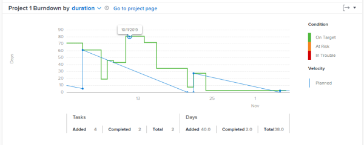
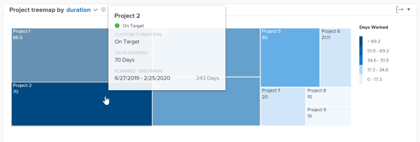

# View `Enhanced analytics` charts by duration {#view-enhanced-analytics-charts-by-duration}

The information on this page refers to functionality not yet generally available. It is available only in the Preview Sandbox environment.

If your teams do not use Planned Hours, you can look at data for projects based on duration, which shows you the time spent on projects based on the amount of days planned to complete a project (Planned Duration) and the actual amount of days it took to complete a project (Actual Duration).

For more information, see [Overview of project Duration](project-duration.md).

You can select a duration view for the following charts:

* Burndown chart  
  To learn more about the Burndown chart, see [Burndown overview for Enhanced analytics](burndown-overview.md).

* Project treemap chart  
  To learn more about the Project treemap chart, see [Project treemap overview](project-treemap-overview.md).

## View Burndown chart by duration {#view-burndown-chart-by-duration}

1.   `<MadCap:conditionalText data-mc-conditions="QuicksilverOrClassic.Quicksilver"> Click the Main Menu icon  , then </MadCap:conditionalText>`select **Analytics**.

   >[!NOTE]
   >
   >If you don't see Analytics in the `<MadCap:conditionalText data-mc-conditions="QuicksilverOrClassic.Quicksilver"> Main Menu</MadCap:conditionalText>` and you know you have the appropriate access, modify the URL by adding "analytics" to it.  
   >For example, the URL changes to "company.my.workfront `.com`/analytics" in the address bar.

1.  In the **Flight plan** or **Project treemap** chart, select a project.

   The **Burndown** chart for that project opens.

1.  In the Burndown chart, click the drop-down arrow, then select **duration**.

   

   The Y axis changes from Hours to Days.

1.  Select any point on the chart to display information for that day.

   This displays the columns Tasks and Days, which contain information about changes to tasks and their duration (in Days) for the selected day.

## View Project treemap chart by duration {#view-project-treemap-chart-by-duration}

1.   `<MadCap:conditionalText data-mc-conditions="QuicksilverOrClassic.Quicksilver"> Click the Main Menu icon  , then </MadCap:conditionalText>`select **Analytics**.

   >[!NOTE]
   >
   >If you don't see Analytics in the `<MadCap:conditionalText data-mc-conditions="QuicksilverOrClassic.Quicksilver"> Main Menu</MadCap:conditionalText>` and you know you have the appropriate access, modify the URL by adding "analytics" to it.  
   >For example, the URL changes to "company.my.workfront `.com`/analytics" in the address bar.

1.  In the **Project treemap** chart, click the drop-down arrow, then select **duration**.

   

   The numbers listed in the boxes change from hours to days.

1.  (Optional) Hover over a project to see more details, such as the Planned Timeframe—or number of days planned to complete the project.

   

1.  (Optional) Select a project on the chart to open the **Burndown** chart.

   To learn about the duration view for the Burndown chart, see [View Burndown chart by duration](#view).

