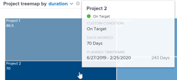

# View `Enhanced analytics` visualizations by duration

If your teams do not use planned hours, you can select a duration view of the project data for the following visualizations:

* Burndown  
  To learn more about the Burndown visualization, see [View the Burndown visualization in Enhanced analytics](../enhanced-analytics/burndown-overview.md).

* Project treemap  
  To learn more about the Project treemap visualization, see [View the Project treemap visualization in Enhanced analytics](../enhanced-analytics/project-treemap-overview.md).

In `Enhanced analytics`, the duration of a project is calculated by the following formulas:

<ul> 
 <li> 
Planned Timeframe: <code>Planned Completion Date of the project - Start Date of the project</code>
 </li> 
 <li> 
Days Worked: <code>Planned Duration for tasks completed in the selected date range / Typical hours per work day</code>
 <note type="note">
   8 hours is the default number for 
   <b>Typical hours per work day</b>. An 
   Adobe Workfront administrator can update the 
   <b>Typical hours per work day</b> setting under 
   <b>Setup</b> > 
   <b>Project Preferences</b> > 
   <b>Projects</b> > 
   <b>Timelines</b>.
    To learn more, see 
   <a href="../administration-and-setup/set-up-workfront/configure-system-defaults/set-project-preferences.md" class="MCXref xref">Configure system-wide project preferences</a>.
  </note> </li> 
</ul>

For information on Planned Duration, see [Overview of project Duration](../manage-work/projects/planning-a-project/project-duration.md).

## Access requirements

You must have the following:

<table cellspacing="0"> 
 <col> 
 <col> 
 <tbody> 
  <tr> 
   <td role="rowheader"><a href="https://www.workfront.com/plans" target="_blank">Workfront plan</a>*</td> 
   <td> 
Business or higher
 </td> 
  </tr> 
  <tr> 
   <td role="rowheader"><a href="../administration-and-setup/add-users/access-levels-and-object-permissions/wf-licenses.md" class="MCXref xref">Adobe Workfront licenses overview</a>*</td> 
   <td> 
Review or higher
 </td> 
  </tr> 
  <tr> 
   <td role="rowheader">Access level*</td> 
   <td> 
View access to Projects
 
Note: If you still don't have access, ask your Workfront administrator if they set additional restrictions in your access level. For information on how a Workfront administrator can change your access level, see <a href="../administration-and-setup/add-users/configure-and-grant-access/create-modify-access-levels.md" class="MCXref xref">Create or modify custom access levels</a>.
 </td> 
  </tr> 
  <tr> 
   <td role="rowheader">Object permissions</td> 
   <td> 
View
 
For information on requesting additional access, see <a href="../workfront-basics/grant-and-request-access-to-objects/request-access.md" class="MCXref xref">Request access to objects in Adobe Workfront</a>.
 </td> 
  </tr> 
 </tbody> 
</table>

&#42;To find out what plan, license type, or access you have, contact your `Workfront administrator`.

## Prerequisites

For prerequisites to using Enhanced Analytics, see [Prerequisites](../enhanced-analytics/enhanced-analytics-overview.md#prerequi) in [Enhanced analytics overview](../enhanced-analytics/enhanced-analytics-overview.md).

## View the Burndown visualization by duration

<ol> 
 <li value="1"> 
 Click the Main Menu icon , thenselect <b>Analytics</b>.
 <note type="tip">
   If you don't see Analytics in the Main Menu and you know you have the appropriate access, modify the URL by adding "analytics" to it.
    For example, the URL changes to "company.my.workfront.com/analytics" in the address bar.
  </note> </li> 
 <li value="2"> 
In the <b>Flight plan</b> or <b>Project treemap</b> visualization, select a project.
 
The <b>Burndown</b> visualization for that project opens.
 </li> 
 <li value="3"> 
In the Burndown visualization, click the drop-down arrow, then select <b>duration</b>.
 
  
 
The Y axis changes from Hours to Days.
 </li> 
 <li value="4"> 
Select any point on the visualization to display information for that day.
 
This displays the columns Tasks and Days, which contain information about changes to tasks and their duration (in days) for the selected day.
 </li> 
</ol>

## View the Project treemap visualization by duration

<ol> 
 <li value="1"> 
 Click the Main Menu icon , thenselect <b>Analytics</b>.
 <note type="tip">
   If you don't see Analytics in the Main Menu and you know you have the appropriate access, modify the URL by adding "analytics" to it.
    For example, the URL changes to "company.my.workfront
   .com/analytics" in the address bar.
  </note> </li> 
 <li value="2"> 
In the <b>Project treemap</b> visualization, click the drop-down arrow, then select <b>duration</b>.
 
  
 
The numbers listed in the boxes change from hours to days.
 </li> 
 <li value="3"> 
(Optional) Hover over a project to see more details, including this duration-specific information:
 
  <ul> 
   <li> 
<b>Planned Timeframe</b>: The number of days planned to complete the project.
 </li> 
   <li> 
<b>Days Worked</b>: The planned duration for each task that was completed within the date range selected at the top, divided by the number of hours in a day.
 </li> 
  </ul> 
  
 </li> 
 <li value="4"> 
(Optional) Select a project to open the <b>Burndown</b> visualization.
 
To learn about the duration view for the Burndown visualization, see <a href="#view" class="MCXref xref">View the Burndown visualization by duration</a>.
 </li> 
</ol>

